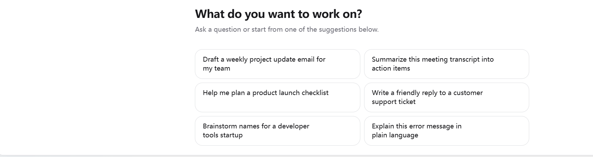

# Omni-Edu Agent

面向 K-12 独立教师与小微教研团队的本地优先 AI 教学工作台。

Omni-Edu Agent 不是学校级平台，也不是完整 LMS。当前目标是把教师本机的学生档案、学习记录、错题图片、题库、知识库和 AI 分析组织成一个可验证、可确认、可导出的桌面端闭环。

```text
本地题库索引 -> 错题图片解析 -> 脱敏上云分析 -> 本地相似题召回 -> 三元题组输出
```

## UI 预览



当前桌面端使用 Electron + React + Vite + SQLite，AI 中控台 UI 复用了本地 HeroUI Pro 源码组件，而不是占位组件。

## 已落地能力

| 模块 | 当前能力 | 状态 |
| --- | --- | --- |
| AI 中控台 | 对话、历史消息、文件夹分组、拖拽归类、右键重命名/归档 | 已落地 |
| Agent Runtime | `route -> plan -> tool_call -> observe -> reflect -> finalize` 事件流，落库到 SQLite | 已落地 |
| Tool Calling | route allowlist、参数 schema、只读工具执行、bounded tool result | 已落地 |
| Confirmation Queue | AI 写入先生成待确认项，老师确认后才写入报告或题组 | 已落地 |
| Structured Reply | DeepSeek 输出走 `xiazhi.reply.v2` 本地校验，失败受控 repair | 已落地 |
| Education Grader | 拦截空泛上传建议、标签化语言、证据缺口、隐私泄露等高风险回复 | 已落地 |
| Usability Grader | 按 route 控制回复长度和结构，拦截“请手动切学生数据”等退化话术；25 条 proxy 样本进入回归门禁 | v1.1 已落地 |
| 三元题组 | 本地题库检索、相似题召回、题组草稿确认保存 | v1 已落地 |
| 错题图片 | 本地图片托管、`needs_ocr` 状态、脱敏文本、老师修正后重新脱敏 | v1 已落地 |
| 知识库/图谱 | 资源切片、质量分、证据强度、个人信息隐藏、图谱背景边界 | v1 已落地 |
| 文档导出 | Markdown / PDF / DOCX 真实写文件、hash、状态 readback | v1 已落地 |
| Observability / Regression | AI run/event/tool/artifact/confirmation 统一快照、回归 gate 和报告 readback | v1 已落地 |

## UI 页面展示

| 页面 | 入口 | 主要功能 |
| --- | --- | --- |
| 今日 | 左侧导航 `今日` | 总览学生、记录、知识库和待办状态 |
| AI | 左侧导航 `AI` | 小智中控台、对话库、文档产物预览、待老师确认队列 |
| 知识库 | 左侧导航 `知识库` | 本地资料导入、资源切片、图谱摘要和解析状态 |
| 学生 | 左侧导航 `学生` | 学生档案、阶段目标、当前问题、家长关注点和标签 |
| 录入 | 左侧导航 `录入` | 学习记录、附件元数据和本地证据采集 |
| 错题 | 左侧导航 `错题` | 错题记录、错因证据和后续图片/OCR 工作流入口 |
| 复盘 | 左侧导航 `复盘` | 复盘报告草稿、质量检查、老师确认后保存 |
| 搜索 | 左侧导航 `搜索` | 学生、学习记录、本地证据的统一搜索 |
| 团队 | 左侧导航 `团队` | 小微教研团队协作占位与边界展示 |
| 看板 | 左侧导航 `看板` | 本地数据统计、知识库/AI 可调用状态 |
| 设置 | 左侧导航 `设置` | DeepSeek 配置、本地数据目录、归档 AI 对话 |

## AI 中控台交互

- 左侧是对话库，支持文件夹分组、拖拽移动、右键重命名和归档。
- 中间是对话区，AI 回复内展示可验证的思考过程摘要，不展示模型隐藏推理链。
- 输入框下方合并展示学生档案、学习记录、附件元数据、老师知识库、知识图谱 5 类上下文状态。
- 右侧只在点击 `PDF 文件`、`Word 文件`、`Markdown 文件` 等产物入口后展开。
- 文档预览面板支持拖拽调整宽度，Markdown 任务列表复选框已隔离全局输入框样式。
- 文档导出必须由主进程真实写出文件并记录 `document_artifacts`，失败不会显示为成功。
- 回归报告从本地 SQLite 的 run/event/tool/artifact/confirmation/task usage 生成，不能用口头结论替代真实 readback。
- 小智回复会经过 Usability Grader：普通问答/工作台帮助优先短答，学生诊断等任务按需展示依据、教学判断、下一步、老师确认和产物入口。
- 待确认队列默认只展示最近关键项，剩余项折叠提示；折叠不会自动确认，老师确认前仍不写入业务表。
- 可用性回归包含 25 条代表性 proxy 样本，并在 Observability 报告中生成 `usability_quality_gate` 与 `usability_eval_baseline`。

## 本地优先与安全边界

- 学生档案、学习记录、题库、错题图片、附件和 AI 对话默认保存在本机 SQLite 与本地数据目录中。
- renderer 不直接访问 Node API；所有文件系统和数据库能力通过 Electron preload IPC 暴露。
- 错题图片原始文件不自动上传；云端模型只能接收脱敏后的题目文本和必要摘要。
- 知识库 chunk 如检测到个人信息，工具结果只返回必要元数据，不返回正文预览。
- AI 发起的写入动作必须先进确认队列，老师确认前不得写入业务表。

## 技术栈

| 层 | 技术 |
| --- | --- |
| 桌面端 | Electron 43 |
| 前端 | React 19、Vite、TypeScript |
| 本地数据库 | SQLite `sqlite3`，启用 WAL |
| AI | DeepSeek API、结构化 JSON 输出、本地 schema 校验 |
| UI 组件 | HeroUI / 本地 HeroUI Pro 源码复用、lucide-react |
| 验收 | TypeScript、Electron smoke、AI harness/eval smoke |

## 快速开始

```powershell
cd D:\WorkProject\EduProject\apps\desktop
npm install
npm run dev
```

构建生产产物：

```powershell
cd D:\WorkProject\EduProject\apps\desktop
npm run build
```

DeepSeek 配置可以在应用设置页保存，也可以在本地环境中提供 `DEEPSEEK_API_KEY` 用于 live smoke。不要把 API Key 写进代码或提交到仓库。

## 验证命令

常用门禁：

```powershell
cd D:\WorkProject\EduProject\apps\desktop
npm run test:ai-harness
npm run test:ai-agent-runtime
npm run test:ai-tool-calling
npm run test:ai-confirmation
npm run test:ai-structured-reply
npm run test:ai-education-grader
npm run test:ai-exercise-set
npm run test:ai-mistake-image
npm run test:ai-knowledge-graph
npm run test:ai-document-export
npm run test:ai-observability
npm run test:ai-usability
npm run test:ai-human-review
npm run test:ai-replay
npm run test:ai-model-grader
npm run test:ai-human-review-ui
npm run test:ai-live-usability
npm run build
```

完整 Electron smoke：

```powershell
cd D:\WorkProject\EduProject\apps\desktop
npm run test:smoke
```

仓库检查：

```powershell
cd D:\WorkProject\EduProject
git diff --check
```

## 重要目录

```text
apps/desktop/src/main/              Electron 主进程、SQLite store、AI harness
apps/desktop/src/preload/           renderer 可调用的安全 IPC API
apps/desktop/src/renderer/          React UI
apps/desktop/src/shared/            主进程 / renderer 共享契约
apps/desktop/scripts/               smoke、eval 和本地门禁脚本
apps/desktop/src/renderer/heroui-pro/ 本地复用的 HeroUI Pro 源码组件
docs/                               UI、知识库、小智 harness 方案文档
docs/23_XIAOZHI_USABILITY_EVAL_RUBRIC.md 小智教师可用性人工评分口径
1.Agent.md                          Agent 工作规则
2.Memory.md                         当前进度记录
3.Learning.md                       复盘和踩坑记录
4.Wiki.md                           长期项目常识库
```

## 当前边界

- PDF / DOCX v1 已能生成真实文件，但复杂排版、中文字体、表格、图片和公式仍需后续增强。
- 错题图片链路已完成本地托管、状态和脱敏，真实 OCR 引擎尚未接入。
- 知识库/图谱增强是规则版 v1，不是 Graph RAG，也不是完整知识抽取系统。
- 三元题组已打通本地召回和确认保存第一段，完整题库导入 UI、embedding 召回和题组编辑器仍在后续阶段。
- Observability / Regression v1 已完成数据层、IPC/preload 和本地 smoke；专门 UI 仪表盘、Markdown/HTML 报告导出和失败样本自动回放仍在后续阶段。
- Usability Grader v1.5 已完成确定性规则、25 条 proxy 样本、人工评分 SQLite/IPC 基础设施、设置页人工评分 UI、CSV/TSV 导入、失败样本回放入口、before/after replay experiment 落库、模型 grader proxy 样本表、年级适切评分维度、`teacher_review_score_gate`、`usability_replay_improvement_gate`、`model_grader_quality_gate` 和 live replay 脚本；尚未完成外部真实老师样本平均分 >= 4/5、真实返工量下降统计、live DeepSeek 输出绑定人工二次评分和真实 LLM-as-judge 裁判。
- `npm run test:ai-live-usability` 依赖 `DEEPSEEK_API_KEY`；无 key 时会明确 skipped，不代表真实 DeepSeek live 已通过。
- 当前产品边界仍是独立教师与小微教研团队，不扩展为学校级平台、学生端、家长端或完整 LMS。
