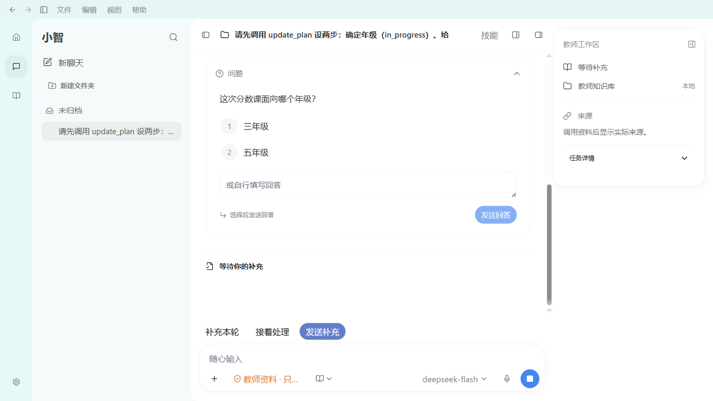
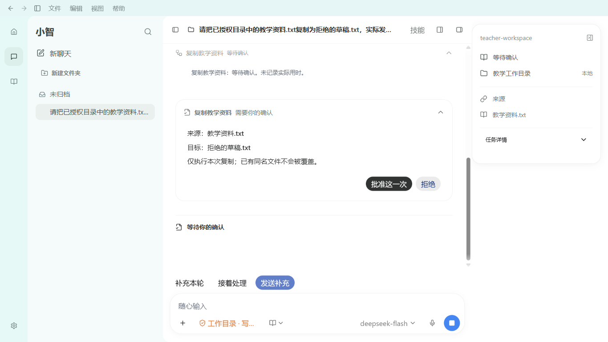

# P06d-B 控制卡、权限模型菜单与设置往返验收

日期：2026-10-03；M10/M01；合同 docs/99。本轮切片通过，完整 D1–D7/P06 与整体智能体目标仍未完成。设计真源仍为 docs/67 和其中原 R1/R2。三元题组暂停，当前只接真实 DeepSeek。

## 1. 实际交付与组件来源

| 表面 | 已实现的真实行为 | 复用与边界 |
| --- | --- | --- |
| 问题卡 | 灰色问题标题、纵向编号选项、单行起步自由回答、明确发送；点选不发送；提交失败/回答/中断与实际控制事实对应 | 原 Pro ChatTool + 已安装 HeroUI Button/TextArea，office 局部 CSS；没有图中未实现的“跳过”动作 |
| 审批 | 来源/目标/本次复制可审查；实际批准、拒绝和核验；完成/拒绝收成可展开回执 | 原 Pro ApprovalActions；main 原 copy 事务/readback 不变，拒绝零写、确认一次；失败/不确定保持展开 |
| 补充队列 | 仍可编辑、改模式、撤回；交付开始锁定；已送达/撤回回执收起；流式执行及等待中均实际可用 | 原 revision/CAS/durable delivery；不把排队当送达、不撤销已执行 |
| 权限菜单 | 显示实际资料范围和逐次教师确认规则；接原目录选择器及统一设置入口 | 原 HeroUI Dropdown；以前未收到 onPermissions 的按钮一直 disabled，现有真实入口已接通；没有虚构完全访问开关 |
| 模型菜单 | 原官方目录、实际选中项、全名与真实历史切换；运行期间锁定 | 原 Dropdown/CAS/Pi setModel；当前 Flash/Pro 来自本次真实官方目录，不假写 GPT 或推理档位 |
| 侧栏 | 局部标题 21px、会话标题 15px；实际搜索隐藏/恢复当前行 | 原侧栏与会话事实保持；只证明该局部尺度，未称整个侧栏完全一致 |
| 未发输入 | 文件分栏开关保留问题答案和队列编辑文本/模式；AI↔设置往返保留同会话 composer 草稿 | OfficeComposerState 会话 key 临时状态与互斥 ref；main 才是执行/消息/授权真源，未新增 SQLite/localStorage/IPC |
| 停止 | 运行/待答时按钮内真实可见 12×12px 白方块 | 原 PromptInput utility span 缺少已复制样式，由 office adapter 补充，不改原 Pro 源 |

Finesse 的实际进度、可审阅动作、失败展开原则沿用，用户截图优先。MCP 已查 ChatTool/ChainOfThought/Button/Dropdown/RadioGroup/TextArea 文档；Dropdown 原源成功，TextArea source 接口未返回源码，使用安装包原 primitive。Pro 32 文件、182153 bytes 来源校验通过。无新依赖/许可/安装体积变化；这些来源不是 Codex 官方组件同源证明。

修改范围：OfficeComposerState、PiControlCards、PiCopyApproval、OfficeComposer、PiEducationWorkspace、PiWorkspaceShell、office 局部 CSS、App 的 Pi AI/settings 编排，以及对应专项脚本。主进程、共享 schema、typed IPC、native Pi JSONL、SQLite 和授权规则不改。

## 2. 状态保留的明确边界

设置返回丢草稿是实际实例发现的问题。App 只在 Pi AI 与 settings 之间保留同一个工作区容器；进入其他教师业务页仍卸载。隐藏时关闭 Skills Modal/composer Popover，工作区与 Shell 命令 handler 返回 false；后台接收真实运行回执。首次仅进入设置尚未访问 AI 时不启动隐藏的新会话。

返回 AI 时读原活动列表并 hydrate 当前 main snapshot/模型/权限，读取原展示偏好；刷新期间输入禁用。当前会话不再活动时沿原 open/fresh 路径选择，不能凭草稿复活归档或权限。控制草稿按 control.id 分隔，有限数量缓存和互斥锁；换会话清空。问题回答接收与 Pi 消费、队列 queued/dispatching/applied 继续由宿主判断。

真实 C26 已验证 prefs 读回/未知 schema、归档只读、目录绑定锁定、备份治理，以及 active run 中原生 Settings→Back 后同 run 不丢失。菜单 M10 验证空闲两种设置入口的未发草稿保留。隐藏快捷命令的 false guard 有源码证据，本轮没有另做全部系统快捷键专项。

## 3. 精确命令与结果

以下 cwd 为 `D:\WorkProject\EduProject\apps\desktop`。所有测试拥有独立 data/profile，使用合成教研资料；没有正式教师库/学生原图/系统网络修改。最终应用入口 `index-Og7f867L.js`，最后 test:smoke 重建相同源码，入口 hash 名保持。

| 命令 | 最终结果与报告 | 证明范围 |
| --- | --- | --- |
| `npm run build` | exit 0，p06db-build-final3.log | TypeScript/main/preload/renderer 构建 |
| `npm run test:renderer-components` | 79/79，exit 0，p06db-renderer-final2.log | 原组件状态门禁 |
| `node scripts/xiaozhi-agent/reuse-workspace-components.mjs --verify` | 32 文件/182153 bytes，exit 0，p06db-pro-source.log | 静态原源闭包，不代替运行证明 |
| `node scripts/xiaozhi-agent/pi-control-ui-smoke.mjs` | 20/20，exit 0，PXoiay | 真 DeepSeek 计划/问题→点选不发→明确发送/自由答，真实 SDK steer/followUp 消费、幂等/跨会话拒绝、16 上限、停止、实际 kill/restart，不重放；两窗问题控件、15px/400 字体和停止方块 |
| `node scripts/xiaozhi-agent/pi-queue-ui-smoke.mjs` | 16/16，exit 0，KwUErj | 编辑/模式/撤回/CAS/流式中可编辑，文件开关问题与队列草稿不丢；实际 dispatch gap kill/restart 不重放 |
| `node scripts/xiaozhi-agent/pi-control-menus-ui-smoke.mjs` | 10/10，exit 0，1eDv07 | 两窗真实 Popover/选中项/标题字号/搜索；chooser 取消零授权/零 run；权限设置与原生 Settings 返回草稿不丢 |
| `node scripts/xiaozhi-agent/pi-settings-workspace-ui-smoke.mjs` | 26/26，exit 0，QcXMZd | 原六页/偏好/归档/备份/Skills/模型配置完整设置路径，两窗关键动作可达；真官方 DeepSeek 完整回复/发送清空、active Settings→Back 同 run、重启与失败 |
| `node scripts/xiaozhi-agent/pi-public-process-approval-ui-smoke.mjs` | 5/5，exit 0，DTwvhU | 真 provider 发起待确认，两窗批准/拒绝按钮完整可达，拒绝零写/确认一次/重启不重放；保存实际审批截图 |
| `node scripts/xiaozhi-agent/pi-history-model-switch-ui-smoke.mjs` | 12/12，exit 0，3I0Jce | 实际 Flash→Pro→Flash、同 native identity/历史、active 拒绝、两窗菜单、重启后真实 provider 回忆原历史，无 renderer exception |
| `npm run test:smoke` | 207/207，ok=true，exit 0，p06db-smoke-final.log | 仓库要求的主冒烟；build 通过不替代上述真实 provider/UI 路径 |
| `git diff --check` | 收尾 exit 0，见设计证据目录收尾日志 | 现有大量脏改动保留，未提交/推送 |

最终上述套件没有失败或 skipped；此前失败记录保留如下。本次选择器返回受控，不称操作系统人工选择；设置记忆范围仅原空 scope 保存/清空，不称新的含资料撤权专项。queue 的 dispatch gap 延迟是 main-only E2E seam，模型流式、真实进程 kill/restart 和文件 readback 独立真实。Control/queue 原报告尾部 P04-A/B3a 文案是历史套件标签，不用它声明本项目记忆/整理尚未实现，也不借本次套件替代那些独立验收。

## 4. 发现、修复与截图证据

1. OCEMDo：菜单已出现，但 HeroUI Menu 是 display-contents，没有 visible box；改测原 Popover，未 force click。
2. cXb9NR：旧 Popover data-exiting 与新 data-entering 短暂共存，strict locator 失败；排除退出项并等待实际动画稳定。
3. 7Wa6KB：前 6 项通过，Settings/back 后未发草稿确实为空。完成第2节生命周期修复，最终两种入口均通过；没有把文件开关结果冒充设置结果。
4. scoqC5：局部 sidebar h2 被旧全局更高 specificity 覆盖，实际 19px 而非合同 21px；仅增强 office sidebar selector，两窗实际 DOM 21/15px 通过。
5. YVXoTE：前 6 项通过，稳定隐藏 AI 与活动 settings 都有 memory 控件 test ID。夹具按真实活动 pi-settings-main scope 操作，C26 全通过；不强制点击隐藏控件。
6. 问题 TextArea 曾继承 bold label，Stop utility span 没有可见尺寸；显式 rows1/400 与局部 12px 白方块修复，实际 DOM/矩形通过。
7. 本轮续接时脚本路径短写 scripts/ 导致三次 module-not-found 启动失败；确认实际目录 scripts/xiaozhi-agent 后运行上述正式套件。不是产品运行失败，也不把失败启动计为验收。

73 份原字节截图、DOM/DPR/zoom/window metrics、报告、成功/失败日志、合同与源码快照在 `docs/design/codex-2026-10-03/p06-control-surfaces/artifacts.json`；保存时逐项读回 bytes/SHA256 校验。没有复制 DB、Key、native 私有摘要/消息。主 diff 收尾日志另存不改变原 manifest。两张本轮代表图：

原 R1/R2 SHA、位图与设计表仍在67；原 DPI/字体未知，不声称同 DPI 全页≤2px。早期问题卡临时附件已不存在，依据会话可见图描述其编号/排版，不能伪造原像素证明。当前截图使用合成资料名/测试请求，不代表正式办公任务的全部文案。

## 5. 下一项与完成边界

下一 **P06d-C**：四根→67第1/2/5/8/9节→35最新→本节，先冻结 docs/101 交付合同。按实际 R1/R2 和本轮最终图核剩余 D4/D5：公开计划/目标区域、文件 tabs/tree/预览与资料卡的边线层级、等待/失败与明确重试的文案/布局、极窄分栏输入可达。先 trace 现有真实计划/文件/错误恢复事实与原 Pro/Hana 组件，不新造持续目标或虚构变化摘要。逐状态正常 UI 实例，1366先1920后；原已通过控制/授权/设置路径不重写，原 Pro32保持。

办公正文/PDF/图片缩略图、真实变更/产物与工具能力归 P07 纵向切片；实际无 VPN 的 DeepSeek/联网、Windows 安装与最终八组归 P08。D1原图同 DPI 校准和所有参考缺失状态仍有独立限制。完整 D1–D7/P06 和总目标保持 active，不能因这一轮控制卡/菜单专项通过称“与 Codex 完全一致”。两条教育业务闭环、本地优先/脱敏上云/教师确认/来源谱系规则保持。
