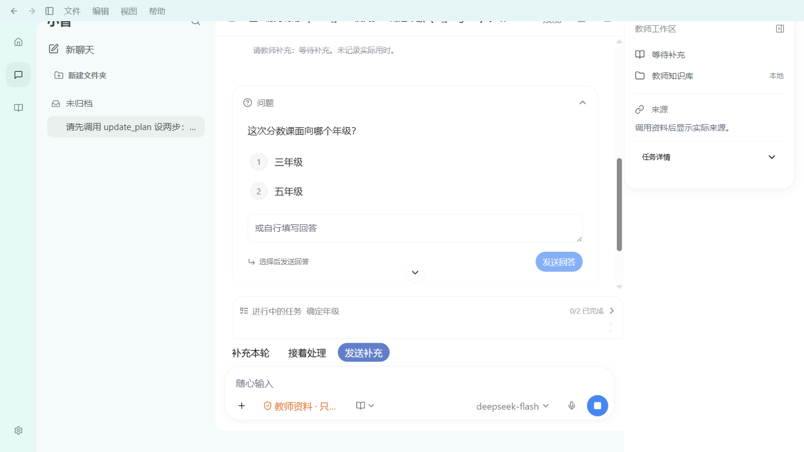
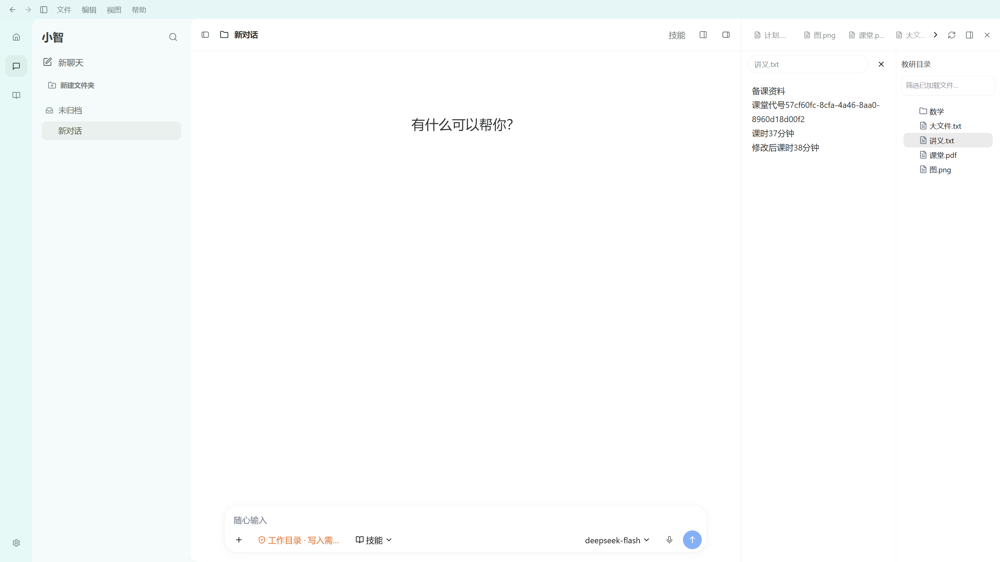

# P06d-C 真实计划、文件工作区和失败恢复验收

日期2026-10-03；合同101，M10/M01。本切片通过，完整D1–D7/P06和整体目标仍active。三元题组暂停；嵌入Pi/Hana唯一执行链、DeepSeek、自有国内API方向不变。

## 1. 实际交付

| 表面 | 实际教师行为与真源 | 组件来源/兼容 |
| --- | --- | --- |
| 公开任务计划 | 原snapshot.controls.steps/status直接显示进行中/待处理/已完成和完成数；历史可展开；当前run运行/待答时输入附近有同计划摘要 | 原Pro ChainOfThought；新PiTaskPlan适配，旧字符串投影fallback保留。不是私有思考或持久goal，不伪造计时/百分比 |
| 失败/部分结果 | 已完成工具/公开段落保留；“重新整理任务”把该失败轮次任务放回输入框；新草稿不覆盖，教师修改后明确发送 | 原OfficeConversation/Button/会话Context；PiConversationSurface只修改未发draft，不启动/重放run或文件操作 |
| 文件工作区 | 原Tabs移动到横贯右面板的顶栏；下方文件路径、阅读和树；真实树可收起扩大阅读，再打开时预览保留 | 已安装HeroUI3.2.2原Tabs、Pro FileTree/Markdown；MCP Tabs源码/文档查验，无新依赖 |
| 预览失败 | 文件版本变更/超限/不存在仍明确提示，增加刷新目录入口，教师重选最新文件后读取新版本 | 原typed preview/list/cancel和版本/权限约束不变，不直接使用旧tab版本冒充刷新 |
| 窄分栏/恢复 | 最小文件面板360px，树隐藏时实际读取宽度≥330px，刷新/关闭/树开关/聊天发送可达，重启后实际360px | 原Pro AppLayout/Resizable公开preserve-pixel-size模式；主聊天消费剩余相对宽度，原存储格式保持 |

新增PiTaskPlan/PiConversationSurface/pi-plan-failure.css；OfficeConversation增加可选renderPlan/retryLabel但保留其他消费者默认；OfficeComposer新增taskSummary slot，PiEducationWorkspace接现有snapshot/typed回调；PiWorkspaceFiles/CSS重排现成组件和增加树/失败刷新入口；PiWorkspaceShell使用原公开resize模式。无新表/迁移/共享schema/IPC/数据根/授权/云上传或第二智能体循环。

Finesse实际进度/可审阅动作/失败展开原则与67原R1/R2继续为真源，原Pro32文件不改；来源校验32/182153bytes通过。这不是Codex官方同一份组件源码或全页像素一致证明。

## 2. 精确实例与门禁

cwd均为 `D:\WorkProject\EduProject\apps\desktop`。最终应用入口 `index-CM_ZZWMG.js`，最后主smoke同源码重建相同入口，未在实例期间改应用源码。所有套件使用独立data/profile与合成资料。

| 命令 | 结果/报告 | 证明范围 |
| --- | --- | --- |
| `npm run build` | exit0，p06dc-build-final2.log | main/preload/renderer/typecheck |
| `npm run test:renderer-components` | 79/79，exit0，p06dc-renderer-final.log | 原组件状态门禁 |
| `node scripts/xiaozhi-agent/reuse-workspace-components.mjs --verify` | 32文件/182153bytes，exit0 | 静态原源，不代替UI |
| `node scripts/xiaozhi-agent/pi-control-ui-smoke.mjs` | 21/21，PlN0zo，exit0 | 真DeepSeek计划/问题等待，实际DOM步骤与native状态相符；输入附近任务摘要展开；原回答/queue消费/幂等/边界/停止/真实kill与重启 |
| `node scripts/xiaozhi-agent/pi-workspace-files-ui-smoke.mjs` | 25/25，Q5P82h，exit0 | 真实typed/Hana文件树、文本/Markdown/图像/不支持PDF metadata、旧版本拒绝/刷新/超限/删除、正常与最小面板、原pointer resize/重启360px、归档撤权/非法与未知会话拒绝 |
| `node scripts/xiaozhi-agent/pi-failure-recovery-ui-smoke.mjs` | 7/7，y3CQ82，exit0 | 真provider工具完成后原native下一请求预算失败；已完成回执保留，两窗恢复动作可达，不覆盖新草稿/不自动run，文件开关草稿保留；教师编辑后正常发送真provider成功，原failed不改/零重放写入 |
| `node scripts/xiaozhi-agent/pi-public-process-ui-smoke.mjs` | 17/17，QEPFHQ，exit0 | 自然教研请求，真实读取与分段公开文本先于完成；来源/耗时/失败展开/原生整理/待答停止/重启，以及双窗正文和输入几何 |
| `node scripts/xiaozhi-agent/pi-control-menus-ui-smoke.mjs` | 10/10，hzdKGx，exit0 | 双窗原权限/模型Popover/侧栏搜索；原chooser取消，权限及原生设置返回未发草稿保留 |
| `npm run test:smoke` | 207/207，ok=true，exit0，p06dc-smoke-final.log | 当前源码主冒烟，build不代替真实provider/UI |
| `git diff --check` | 收尾exit0 | 保留现有脏改动；没有commit/push |

最终套件无失败/skipped；此前文件四次失败见第3节。80项UI专项不是整体Codex/教育验收总数。真实计划状态来自既有main control，旧投影text保留；没有新后台持久goal。失败专项是实际预算拒绝，不冒充断网/TypeError故障；chooser由所属测试main受控，provider与native循环是真实调用。文件专项本身没有provider请求，没有Office/PDF正文；1px合成PNG证明本地signature/dataURL解码，不是图片分析。文件两窗使用实际BrowserWindow.setContentSize并等待innerWidth/Height，原过程/控制采用现有CSS viewport，参考DPI未知。控制/文件报告尾部历史P04-A/native-frame pending标签保留，不据此推断整体当前进度。

## 3. 文件实例发现与修复

1. 5nsBgH前15通过：拖至窗口最右边，原Pro collapsible主动收起文件面板。夹具改到真实min附近，不force、不阻止原收起行为。
2. CvIS2O/zc4C3p前22通过：365.5px在重启后放大563.02px。native content resize也复现，不能归因于CSS viewport。窗口启动仍1360宽，相对layout碰到min约束后，后续扩窗又按修改后的比例增大。
3. 使用原AppLayout公开asideResizeBehavior=preserve-pixel-size，vfdtAO重启已保持在360px，但夹具拖到365.5附近却要求误差<5，差5.5仍失败。验收目标是实际最小360px；正常pointer拖进min约束区（350px，远大于collapse阈值）到真实360px，最后两窗口与重启均360px，通过Q5P82h。未放宽断言或删掉恢复检查。
4. 保留旧文本/Markdown/image/versions/权限/取消/归档路径；未知/归档remembered id仍回到实际活动会话，不造授权。最终无renderer exception、外部Markdown请求为0。

这只证明本次最小阅读面板/当前resize模式，不证明所有任意宽度或原生窗口上次尺寸恢复。BrowserWindow固定1360×900启动仍是后续D4/桌面生命周期审计的明确待办。

## 4. 原字节证据与设计状态

81份最终截图、DOM/DPR/zoom/window metrics、报告、成功/失败log、源与脚本快照、合同在 `docs/design/codex-2026-10-03/p06-plan-files-failure/artifacts.json`，逐文件bytes/SHA256读回验证。未复制DB/Key/native私有摘要；gitdiff收尾日志另存。

当前公开说明/工具动作/回执仍按真实顺序流式显示，失败/等待不伪终态。组件名ChainOfThought仅公开计划，不显示provider hidden reasoning。D2.3/D4.4/D5.3局部通过，D1原图未知DPI与完整D1–D7/P06仍未勾；不能用这一轮PNG冒充全页精准对齐。

## 5. 下一执行位置

下一 **P06d-D 综合差距审计**：四根→67第1/2/5/8/9→35最新→本节，冻结103合同。按用户R1/R2和最终80项UI实例逐项清点完整D1–D7，不继续用小切片替代整体验：壳/资料卡与实际文件分栏尺寸、长任务和全部等待/失败/输入状态、原生窗口恢复、中文文案/焦点与滚动、Skills/模型/settings缺失参照状态。先用现成Pro/Hana和现有实际数据补可验差距；对未知原DPI只做有参数的相对测量，不伪造≤2px证明。

独立持续goal、真实变更摘要/图片产物须有主进程持久事实与工具，不拿本次run计划当已具备；在完整能力清单中保留，并进入对应P07工具/harness切片。随后P07实际办公文本/Office/PDF/联网/图片/产物与P08无VPN国内API/Windows安装/最终八组，逐合同→代码→真实实例。三元题组暂停，教师两闭环、本地优先/脱敏上云/逐次确认/来源谱系规则保持，总目标active。
