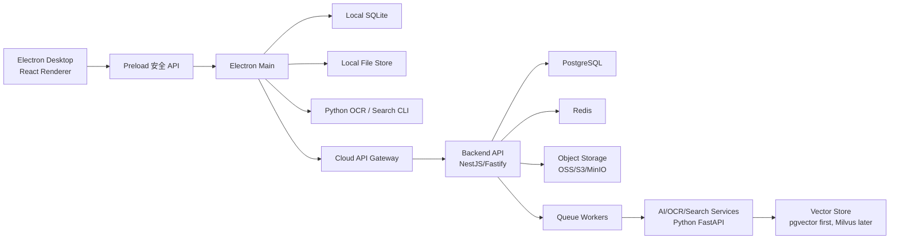

# 技术选型总纲：千万级商业项目可演进架构

版本：v0.1  
日期：2026-07-28  
适用范围：Omni-Edu Agent 从个人老师桌面 MVP 到中小教辅团队商业化版本

## 1. 技术战略结论

Omni-Edu Agent 的技术路线必须同时满足两件事：

1. MVP 阶段足够快：个人老师本地可用，2-4 周能跑通核心闭环。
2. 商业化阶段不推倒重来：能自然演进到团队协作、AI 错题资产、千万级数据规模。

最终技术战略：

> 本地优先桌面端 + 云端协作服务 + AI 处理管线 + 分层数据架构。

不要一开始做纯云 SaaS。原因：

- 老师和小机构资料量大，原始附件云端化成本高。
- 学生资料隐私敏感，本地优先更容易建立信任。
- 个人老师使用场景经常是单机、弱网、碎片化录入。
- 后续团队版可以用“选择性同步”，而不是强制所有数据云端化。

## 2. 总体架构

## 3. 阶段化技术路线

### 阶段 1：个人老师 MVP

目标：

- 单机可用。
- 核心流程不依赖网络。
- 数据存在本地。

技术：

- Electron + Vite + React + TypeScript。
- SQLite。
- 本地文件系统。
- 规则模板生成复盘。
- 暂不接云端同步。

### 阶段 2：小团队协作版

目标：

- 支持 3-30 人小团队。
- 统一模板、标签、学生分配、报告审核。
- 支持可选云同步或局域网协作。

技术：

- Backend API：Node.js TypeScript，推荐 NestJS 或 Fastify。
- PostgreSQL 作为云端主库。
- Redis 做缓存、会话、限流、任务状态。
- 对象存储保存云端附件副本。
- Electron 客户端增加同步模块。

### 阶段 3：AI 错题资产版

目标：

- OCR 错题识别。
- 错因分析。
- 相似题召回。
- 三元题组。

技术：

- Python FastAPI / CLI 处理 OCR、文本抽取、向量化。
- 本地 SQLite FTS + 云端 PostgreSQL FTS。
- pgvector 作为第一版向量库。
- 数据规模增大后评估 Milvus、Qdrant 或 Elasticsearch/OpenSearch。

### 阶段 4：千万级数据商业化架构

目标：

- 支撑大规模学生档案、学习记录、附件、报告和 AI 任务。
- 支持多租户和团队协作。
- 支持审计、备份、灾备、灰度发布。

技术：

- PostgreSQL 分区表。
- Redis Cluster。
- 对象存储冷热分层。
- 消息队列升级：BullMQ/RabbitMQ 到 Kafka/Pulsar。
- 搜索服务独立。
- AI 服务异步任务化。
- 全链路观测和审计日志。

## 4. 核心技术选型表

| 层级 | MVP 选择 | 商业化选择 | 选择原因 |
|---|---|---|---|
| 桌面端 | Electron + Vite + React + TypeScript | 保持 | 本地文件、SQLite、Python 集成成熟 |
| 前端组件 | HeroUI v3 + HeroUI Pro | 保持并沉淀内部 UI 封装 | 可访问性、工作台组件、AI 组件和高级数据组件成熟 |
| 前端样式 | Tailwind CSS v4 + 设计 tokens | 保持 | 与 HeroUI v3 体系一致，适合主题化 |
| 本地数据库 | SQLite | SQLite + Sync Log | 单机可靠，部署简单 |
| 云端主库 | 暂不需要 | PostgreSQL | 事务、JSON、分区、全文检索、生态成熟 |
| 缓存 | 暂不需要 | Redis | 缓存、限流、任务状态、短期会话 |
| 对象存储 | 本地文件目录 | OSS/S3/MinIO | 大附件不进数据库 |
| 后端 API | 暂不需要 | NestJS/Fastify | TypeScript 全栈一致，适合业务 API |
| AI/OCR | Python CLI 预留 | Python FastAPI Workers | AI 与 OCR 生态成熟 |
| 队列 | 本地任务队列 | BullMQ/RabbitMQ，后续 Kafka | 异步 OCR、报告、同步任务 |
| 搜索 | SQLite LIKE/FTS | PostgreSQL FTS，后续 OpenSearch | 先简单可控，后续独立扩展 |
| 向量库 | 暂不需要 | pgvector，后续 Milvus/Qdrant | 从低复杂度到高规模演进 |
| 部署 | 本地安装包 | Docker/K8s/私有化 | 商业化交付需要可运维 |

## 5. 架构原则

### 5.1 本地优先，不等于永远单机

本地优先是商业切入策略，不是架构终点。

要求：

- 本地数据模型和云端数据模型保持兼容。
- 每条核心数据必须有稳定 id、created_at、updated_at。
- 后续同步需要 change log 或 operation log。
- 附件必须能从本地路径映射到云端 object key。

### 5.2 大文件永远不进数据库

数据库只存：

- 文件名。
- 文件路径。
- 文件大小。
- MIME 类型。
- hash。
- 提取文本。
- 元数据。

原始文件存：

- 本地学生目录。
- 后续对象存储。

### 5.3 AI 必须异步化、可追踪、可重试

任何 OCR、AI 复盘、错因分析、相似题召回都不能阻塞主界面。

要求：

- 每个 AI 任务都有 task_id。
- 任务状态可查询。
- 失败可重试。
- 输入输出可审计。
- 敏感数据脱敏后进入 AI。

### 5.4 Redis 不做主数据库

Redis 只用于：

- 热点缓存。
- API 限流。
- 短期任务状态。
- 分布式锁。
- 队列。
- WebSocket 在线状态。

禁止：

- 把学生档案、学习记录、报告正文只存在 Redis。
- 用 Redis 替代 PostgreSQL 的事务数据。

### 5.5 所有业务能力要有降级路径

离线或云端异常时：

- 老师仍能创建学生。
- 老师仍能添加学习记录。
- 老师仍能查看本地时间线。
- 老师仍能生成规则模板复盘。

AI、同步、云端搜索可以降级。

## 6. 开发顺序建议

1. Electron 桌面骨架。
2. HeroUI Pro 工作台布局接入。
3. 应用级 UI 封装。
4. 本地 SQLite。
5. 本地文件目录。
6. 学生档案 CRUD。
7. 学习记录 CRUD。
8. 附件管理。
9. 阶段复盘模板。
10. 本地搜索。
11. 同步协议设计。
12. 云端 PostgreSQL API。
13. Redis 缓存与队列。
14. AI/OCR worker。
15. 团队协作。
16. 经营看板。

## 7. 技术红线

- Renderer 不直接访问 Node fs。
- 原始学生附件不自动上传云端。
- API Key 不写入明文配置。
- Redis 不做长期真实数据源。
- 附件不写入 SQLite/PostgreSQL bytea。
- AI 输出不直接定稿。
- 没有审计日志前不做团队权限。
- 没有同步冲突策略前不做多人同时编辑。

## 8. 前端组件与设计系统原则

前端统一采用 HeroUI v3 + HeroUI Pro。

优先直接复用：

- `app-layout`：主工作台布局。
- `sidebar`：学生导航。
- `data-grid`：团队版学生管理、附件管理、报告列表。
- `timeline`：学习记录时间线。
- `drop-zone`：附件导入。
- `rich-text-editor` / `markdown`：复盘报告编辑。
- `kpi` / `kpi-group` / charts：团队经营看板。
- `chain-of-thought` / `chat-tool` / `chat-source`：AI 任务透明化展示。
- `command`：全局搜索和快捷命令。

工程要求：

- 业务页面不直接深度绑定 HeroUI Pro 组件，必须经过 `shared/ui` 应用级封装。
- 官方或 MCP 不可用时，使用本地 HeroUI Pro 源码 fallback。
- 不引入第二套大型 UI 组件库。
- 所有关键页面必须通过桌面和移动宽度视觉验收。

详细前端方案见：

- `docs/17_FRONTEND_HEROUI_PRO_DESIGN_ARCHITECTURE.md`
