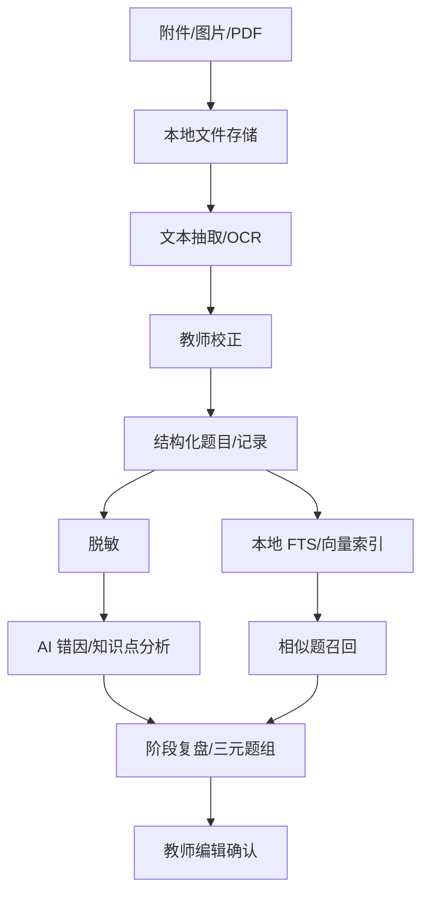

# AI、OCR 与检索管线技术方案

版本：v0.1  
日期：2026-07-28  
目标：指导错题识别、复盘生成、相似题召回和 AI 服务落地

## 1. AI 产品原则

Omni-Edu Agent 的 AI 不是聊天机器人，而是教学资产处理管线。

AI 主要任务：

- 把学习记录归纳成阶段复盘。
- 把错题图片转成可编辑文本。
- 把题目映射到知识点和错因。
- 从本地题库召回相似题。
- 生成教师版和家长沟通版表达。

AI 不做：

- 直接给学生最终诊断。
- 无证据生成报告。
- 绕过老师确认。
- 自动上传原始学生资料。

## 2. 管线总览



## 3. MVP AI 策略

MVP 不依赖大模型。

第一版复盘使用：

- 标签频次统计。
- 记录类型统计。
- 最近记录摘要。
- 模板生成 Markdown。

优点：

- 离线可用。
- 可解释。
- 不受模型稳定性影响。
- 便于验证产品价值。

## 4. OCR 技术路线

### 4.1 第一阶段

暂不做复杂 OCR。

只支持：

- 附件导入。
- 手动记录错题文本。
- 后续预留 extracted_text 字段。

### 4.2 第二阶段

本地 OCR：

- Python pipeline。
- 可选 PaddleOCR。
- 图片预处理：去阴影、矫正、裁剪、压缩。
- 结果进入教师校正界面。

### 4.3 OCR 处理步骤

```text
读取图片
-> 方向检测
-> 文档矫正
-> 去阴影
-> 文本检测
-> 文本识别
-> 题目区域切分
-> 输出 OCR JSON
-> 教师校正
-> 保存 extracted_text
```

### 4.4 OCR 输出结构

```json
{
  "attachment_id": "attachment_xxx",
  "pages": [
    {
      "page": 1,
      "blocks": [
        {
          "type": "question",
          "text": "一次函数 y=kx+b ...",
          "bbox": [10, 20, 300, 160],
          "confidence": 0.91
        }
      ]
    }
  ]
}
```

## 5. AI 复盘生成

### 5.1 输入

只允许输入脱敏后的结构化摘要：

```json
{
  "student_alias": "学生A",
  "grade": "初二",
  "subject": "数学",
  "date_range": {
    "start": "2026-07-01",
    "end": "2026-07-31"
  },
  "records": [
    {
      "type": "mistake",
      "title": "一次函数图像与参数关系",
      "summary": "多次混淆 k 值正负与图像走向",
      "tags": ["一次函数", "概念混淆"],
      "evidence_id": "record_001"
    }
  ]
}
```

禁止输入：

- 真实姓名。
- 学校。
- 家长手机号。
- 原始聊天记录全文。
- 原始附件。

### 5.2 输出

输出 Markdown + 结构化引用：

```json
{
  "teacher_report_md": "...",
  "parent_summary": "...",
  "evidence_refs": [
    {
      "section": "高频薄弱点",
      "record_ids": ["record_001"]
    }
  ]
}
```

### 5.3 质量校验

生成后必须检查：

- 是否包含整体表现。
- 是否包含进步点。
- 是否包含高频薄弱点。
- 是否包含典型错因。
- 是否包含下阶段建议。
- 是否包含家长版摘要。
- 是否引用源记录。

不通过则：

- 重新生成。
- 或提示老师手动补充。

## 6. 错因与知识点分析

### 6.1 错因标签

建议内置：

- 概念混淆。
- 审题遗漏。
- 计算粗心。
- 步骤不完整。
- 表达不规范。
- 公式记忆不牢。
- 单位转换错误。
- 图像理解不足。

### 6.2 知识点标签

第一版：

- 老师手动标签。

第二版：

- AI 建议标签。
- 老师确认。

第三版：

- 团队统一知识点库。

### 6.3 输出要求

AI 不直接覆盖老师标签，只提供建议：

```json
{
  "suggested_knowledge_points": ["一次函数", "函数图像"],
  "suggested_error_reasons": ["概念混淆", "图像理解不足"],
  "confidence": 0.83,
  "explanation": "题目记录中多次出现 k 值正负与图像走向判断错误"
}
```

## 7. 检索方案

### 7.1 本地全文检索

MVP：

- SQLite LIKE。

升级：

- SQLite FTS5。

索引内容：

- 学生显示名。
- 记录标题。
- 记录正文。
- 标签。
- extracted_text。
- 报告标题和正文。

### 7.2 云端全文检索

第一版：

- PostgreSQL full-text search。

升级：

- Meilisearch。
- OpenSearch。

### 7.3 向量检索

第一版：

- pgvector。

向量对象：

- 错题文本。
- 学习记录摘要。
- 题库题目。
- 复盘段落。

召回流程：

```text
错题文本
-> embedding
-> vector search topK
-> metadata filter by subject/grade
-> rerank
-> 返回相似题
```

### 7.4 三元题组

定义：

- 原题：学生当前错题。
- 相似题：同知识点、同错因。
- 巩固题：稍低或同等难度，确保掌握。

输出：

```json
{
  "source_question_id": "question_001",
  "similar_question_ids": ["question_102", "question_118"],
  "practice_question_ids": ["question_201", "question_208"],
  "reason": "同属一次函数图像与参数关系，重点训练 k 值正负判断"
}
```

## 8. AI 任务系统

### 8.1 任务类型

- report_generate。
- report_polish。
- ocr_extract。
- mistake_analyze。
- embedding_build。
- similar_question_search。

### 8.2 任务状态

```text
pending -> running -> succeeded
pending -> running -> failed -> retrying
failed -> dead_letter
```

### 8.3 任务审计

记录：

- 输入 hash。
- 脱敏状态。
- 模型名称。
- token 用量。
- 输出 hash。
- 操作用户。
- 时间。

不要记录：

- 原始学生隐私全文。
- 原始附件内容。
- API Key。

## 9. 模型选择策略

### 9.1 MVP

不强依赖模型。

### 9.2 商业第一版

可接：

- DeepSeek。
- 通义千问。
- OpenAI API。
- 私有模型。

模型调用通过统一 AI Gateway：

```text
app -> ai-task-service -> provider adapter -> model
```

禁止业务代码直接散落调用模型 API。

### 9.3 模型输出稳定性

要求：

- JSON Schema 校验。
- Markdown 模板约束。
- 超时重试。
- fallback 到规则模板。

## 10. 性能目标

| 任务 | MVP 目标 | 商业化目标 |
|---|---|---|
| 规则复盘生成 | < 3 秒 | < 3 秒 |
| AI 复盘生成 | 暂不做 | P95 < 30 秒 |
| 单页 OCR | 暂不做 | P95 < 15 秒 |
| 相似题召回 | 暂不做 | P95 < 2 秒 |
| 本地关键词搜索 | P95 < 500ms | P95 < 300ms |

## 11. 红线

- AI 输出必须可编辑。
- AI 建议必须可追溯。
- 原始附件不直接发给第三方模型。
- OCR 结果必须允许老师校正。
- 相似题推荐不能替代老师最终选择。
- 模型提供商必须可替换。

