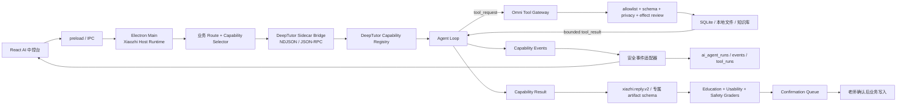

# DeepTutor × Omni-Edu 核心能力融合设计方案

> 文档状态：设计基线，可进入实施拆解  
> 调研日期：2026-08-10  
> DeepTutor 本地源码：`D:\WorkProject\DeepTutor`  
> DeepTutor 基线：`v1.5.11` / commit `456f9c24226e008f1ff07a7e3455d7b4d39f6221`  
> Omni-Edu 本地源码：`D:\WorkProject\EduProject`  
> 适用范围：小智 Agent Runtime、深度解题、出题、研究、可视化、掌握练习与相关数据闭环

配套功能台账与逐项生产验收要求见 `docs/25_DEEPTUTOR_FEATURE_INVENTORY_AND_PRODUCTION_MATRIX.md`。本文负责总体架构、接口和数据流；文档 25 负责 77 项功能的集成/改造/裁剪/延后结论、SLO、安全、部署与测试 DoD。两者共同构成后续开发基线。

## 1. 结论先行

DeepTutor 最值得迁移的不是整套 Web 产品，而是以下五个内核：

1. `Capability + Tool` 两层能力模型：Capability 接管整轮复杂任务，Tool 完成单步受控动作。
2. 真正的 agent loop：模型可根据每轮工具观察继续规划，直到完成、暂停、达到预算或确定失败。
3. 统一流式事件协议：stage、tool call、tool result、source、result、error、done 使用同一种事件信封。
4. 深度任务能力：`deep_solve`、`deep_question`、`deep_research`、`visualize`、`mastery_path`。
5. 确定性教育引擎：掌握度门槛、错题优先、间隔复习、计划步骤门禁与有限重规划。

推荐采用：

```text
Electron / TypeScript 继续作为唯一宿主控制面和数据真源
                    +
DeepTutor Python 核心作为本地 sidecar 能力引擎
                    +
双向 NDJSON / JSON-RPC bridge 传递事件和受控工具请求
```

不建议：

- 不把 DeepTutor 的 Next.js 前端整体嵌入 Electron。
- 不引入 PocketBase、多用户、Partners、IM 渠道或另一套会话数据库。
- 不让 Python sidecar 直接读取 Omni-Edu SQLite、学生目录或原始错题图片。
- 不让 DeepTutor 工具注册表绕过 Omni-Edu 的 route allowlist、隐私策略和确认队列。
- 不把 DeepTutor 的 `THINKING` 原始文本当成可展示思维链。

这不是“在现有页面上增加几个 DeepTutor 按钮”，而是把小智从“固定流程问答器”升级为“受宿主治理的教育 Capability Runtime”。

## 2. 调研范围与可信证据

### 2.1 本地源码证据

本次直接检查了两个本地仓库的真实代码路径，并建立了代码图谱索引。

DeepTutor 关键路径：

- `deeptutor/runtime/orchestrator.py:36`：`ChatOrchestrator.handle()` 选择 Capability、建立 StreamBus、保证失败与完成终态。
- `deeptutor/agents/chat/agent_loop.py:259`：`AgentLoop._run_loop()` 执行多轮 LLM → tool → observation → continue/finish。
- `deeptutor/agents/chat/agentic_pipeline.py:589`：按 KB、Memory、Notebook、Skill、sandbox 等条件挂载工具。
- `deeptutor/core/capability_protocol.py:21`：`CapabilityManifest` 与 `BaseCapability` 协议。
- `deeptutor/core/tool_protocol.py`：Tool schema、ToolResult、暂停与终止语义。
- `deeptutor/core/context.py:34`：`UnifiedContext`。
- `deeptutor/core/stream.py`：统一 `StreamEvent` 协议。
- `deeptutor/services/session/turn_runtime.py:674`：持久化 turn、订阅、取消、恢复和终态管理。
- `deeptutor/app/facade.py`：稳定 SDK facade，包含 start/stream/cancel/reply/regenerate。
- `deeptutor/capabilities/solve/capability.py`：Deep Solve 已收敛到统一 chat loop，并叠加确定性计划门禁。
- `deeptutor/agents/question/capability.py`：custom/mimic/followup 三类出题路径。
- `deeptutor/agents/research/capability.py:37`：研究提纲预览、确认后恢复、迭代研究和报告生成。
- `deeptutor/agents/visualize/capability.py:50`：SVG、Chart.js、Mermaid、HTML、Manim 路由与审查。
- `deeptutor/capabilities/mastery/capability.py:57`：精通学习使用同一 agent loop。
- `deeptutor/learning/*`：知识类型、掌握度、错题、复习队列、间隔复习和下一目标选择。

Omni-Edu 关键路径：

- `apps/desktop/src/main/ai-harness/agent-loop.ts`：当前 route 后会预执行本轮全部允许工具。
- `apps/desktop/src/main/deepseek.ts:286`：当前只处理一次模型工具请求，最多 4 个调用，然后要求模型不再请求工具。
- `apps/desktop/src/main/ai-harness/router.ts:301`：八类业务 route、subIntent、风险、上下文与工具 allowlist。
- `apps/desktop/src/main/ai-harness/tool-registry.ts`：工具审核、参数校验、隐私等级、bounded result 和本地只读执行。
- `apps/desktop/src/main/db.ts`：学生、记录、对话、run/event/tool、确认队列、题组、知识库、文档产物、质量评审和回归证据。
- `apps/desktop/src/shared/contracts.ts`：主进程、preload、renderer 的强类型契约。
- `docs/22_XIAOZHI_EDU_AI_HARNESS_PLAN.md`：现有小智总路线与长期底线。

### 2.2 官方材料核对

- DeepTutor 官方仓库把 Chat、Quiz、Research、Visualize、Solve、Mastery Path 描述为共享同一 runtime 的能力，并把知识库、Notebook、Question Bank、Memory 作为跨工作流上下文。
- v1.5.11 对 agent loop 增加了截断续写、探索预算、有限 settlement 和最终无工具硬终止，说明循环可靠性是其当前重点。
- DeepTutor 论文提出“静态知识 grounding + 动态学习者记忆”的混合个性化方向，但论文仍标注为 work in progress；论文结果可以作为方向参考，不能直接当作 Omni-Edu 已验证效果。
- 源码采用 Apache License 2.0，可以修改和分发，但必须保留许可证/归属说明，并对修改文件作显著说明；第三方 notices 也要一并审查。

官方链接：

- [DeepTutor GitHub](https://github.com/HKUDS/DeepTutor)
- [DeepTutor v1.5.11](https://github.com/HKUDS/DeepTutor/releases/tag/v1.5.11)
- [DeepTutor 论文](https://arxiv.org/abs/2604.26962)
- [Apache-2.0 License](https://github.com/HKUDS/DeepTutor/blob/main/LICENSE)

## 3. 当前项目背景已从源码恢复

这次不需要用户重新补充一份项目介绍，因为本地项目已经提供足够明确的真实背景：

| 维度 | Omni-Edu 当前事实 |
| --- | --- |
| 目标用户 | K-12 独立教师、小微教研团队 |
| 产品形态 | Electron 43 + React 19 + TypeScript 桌面客户端 |
| 数据架构 | 本地 SQLite/WAL + 本地托管文件目录 |
| AI 入口 | 小智 AI 中控台，DeepSeek API |
| 核心业务 | 学生档案、学习记录、错题、题库、知识库、三元题组、复盘与文档导出 |
| 安全边界 | 原始错题图片不上云、含个人信息 chunk 隐藏、写入前老师确认 |
| Agent 基线 | route、context policy、工具审核、结构校验、教育/可用性 grader、事件落库 |
| 已知缺口 | agent loop 仍是固定预取 + 单次工具回合，不能根据观察自主迭代 |
| 产品禁区 | 不做学校级平台、学生端、家长端、完整 LMS |

因此本方案以“教师工作台中的超级教育 Agent”为目标，不照搬 DeepTutor 面向学习者的完整产品外壳。

## 4. 第一性原则

### 4.1 智能来自闭环，不来自更多固定步骤

当前流程的本质是：

```text
关键词路由 → 预执行该 route 全部工具 → 一次模型回答 → schema/grader
```

目标流程应是：

```text
任务路由 → 选择 Capability → 模型提出下一动作
→ 宿主审核工具 → 执行 → 观察
→ 模型依据新证据继续规划或结束
→ 结构化结果 → 教育门禁 → 老师确认 → 持久化
```

“允许工具”只是能力边界，不代表“必须全部执行”。只有模型明确请求且主进程审核通过的工具才能成为 `used`。

### 4.2 自主性与权限必须分离

- DeepTutor loop 决定“下一步想做什么”。
- Omni-Edu 主进程决定“这一步是否允许、能看到什么、能否写入”。
- 老师决定“草稿是否成为永久业务数据”。

任何 Capability 都不得拥有绕过宿主治理的数据库或文件写权限。

### 4.3 一个数据真源，两个执行语言

DeepTutor 是 Python 3.11-3.13 生态，Omni-Edu 是 Electron/TypeScript。为了最大化复用且避免双向大规模重写：

- DeepTutor Python 负责 agent loop 与复杂 Capability 算法。
- Electron main 负责用户身份、本地数据、工具权限、脱敏、确认、审计和文档落盘。
- React renderer 只订阅安全事件和展示结果，不直接访问 sidecar。
- SQLite 仍是唯一业务事实库；sidecar 不维护第二套学生/对话/题库事实。

### 4.4 教育结论必须由证据和确定性门禁共同约束

- 模型可以决定讲解方式、提问方式和探索路径。
- 掌握度阈值、复习到期、计划步骤完成、重规划次数、确认状态必须由确定性代码计算。
- 不把一次答对当成“已掌握”；不把模型印象当成永久学生标签。

### 4.5 可展示轨迹不等于隐藏思维链

DeepTutor `StreamEventType.THINKING` 可能包含模型生成过程片段。融合层必须分类：

- 可展示：stage、工具名称、参数摘要、观察摘要、引用、预算、等待老师、终止原因。
- 不展示/不持久化原文：模型内部分析、`<think>`、草稿推理、未脱敏长文本。
- 需要保留诊断价值时，只保存受控摘要和结构化 metadata。

## 5. DeepTutor 与现有模块的对应关系

| DeepTutor 能力 | 源码模块 | Omni-Edu 现有对应 | 互补空间 | 融合决策 |
| --- | --- | --- | --- | --- |
| Chat agent loop | `agents/chat/agent_loop.py` | 小智 general_qa + `runAiAgentLoop` | 从固定预取升级为观察驱动循环 | P0 直接复用核心循环，适配工具代理 |
| Capability Registry | `runtime/registry/capability_registry.py` | route/subIntent | route 是业务意图，缺少执行策略层 | P0 新增 TS manifest 镜像并由宿主选择 |
| Tool Registry | `runtime/registry/tool_registry.py` | `tool-registry.ts` | DeepTutor 支持延迟工具；Omni 有更强本地安全审核 | 保留 Omni 为权威，Python 使用远程代理 Tool |
| UnifiedContext | `core/context.py` | `CompiledAiContext` | DeepTutor 上下文统一；Omni 有更严格隐私策略 | 复用字段思想，重新定义 sanitized bridge contract |
| StreamBus / events | `core/stream*.py` | `ai_agent_events` | DeepTutor 流式丰富；Omni 可持久化审计 | 复用事件语义，适配为 `xiazhi.capability.event.v1` |
| TurnRuntime | `services/session/turn_runtime.py` | `ai_agent_runs` | pause/resume/cancel/replay 更成熟 | 复用状态机思想；业务事实仍落 Omni SQLite |
| Deep Solve | `capabilities/solve/*` | 错因分析、知识问答 | 缺少计划、步骤门禁、重规划 | P1 直接复用 Capability + solve tools |
| Deep Question | `agents/question/*` | 三元题组、相似题、作业 | 缺探索/计划/逐题生成/去重/mimic | P1 复用 pipeline，输出适配 ExerciseSetDraft |
| Deep Research | `agents/research/*` | 知识检索、教案、报告 | 缺提纲确认、分解研究、引用报告 | P2 复用 pipeline，默认教师研究模式 |
| Visualize | `agents/visualize/*` | 文档产物、知识图谱摘要 | 缺教学可视化与生成后审查 | P2 复用 SVG/Mermaid/Chart；禁用不安全 HTML |
| Math Animator | `agents/math_animator/*` | 无 | 高价值但依赖 Manim/LaTeX/ffmpeg | P3 可选能力包，不进入首版安装 |
| Mastery Path | `capabilities/mastery/*`, `learning/*` | 学生记录、错题、练习题组 | 缺掌握度门禁、复习队列、自适应追问 | P1/P2 复用纯引擎和 loop 插件，改为教师发起 |
| RAG providers | `services/rag/*` | SQLite chunk、轻量图谱 | DeepTutor 支持多引擎与版本化索引 | P3 只复用 adapter 思想；MVP 不引入 GraphRAG |
| Notebook | `services/notebook/*` | 学习记录、知识资源、AI 对话 | 可做教师研究笔记与 AI 产物收藏 | P2 映射到现有记录/产物，不建重复 Notebook 库 |
| Question Bank | question history / learning | 本地题库、exercise_sets | 可记录生成来源、使用历史、答题表现 | P1 统一 schema，老师确认后写入现有题库域 |
| Memory L1/L2/L3 | `services/memory/*`, Web Memory | run/event、会话摘要、学生档案 | 可审查个性化记忆很有价值 | 先参考分层，P3 再实现；不直接导入存储 |
| Book / Co-Writer | `book/*`, `co_writer/*` | 教案、报告、文档导出 | 可扩展成长篇教学资料工作台 | P3 参考，不纳入首轮核心迁移 |
| Skills / MCP / CLI Apps | `skills/*`, providers | 真实工具注册表 | 扩展性强但扩大攻击面 | P3 allowlist 后按需接入，默认关闭 |
| Partners / IM | `partners/*` | 无 | 与独立教师 MVP 不直接匹配 | 不迁移 |
| Multi-user / PocketBase | `multi_user/*` | 本地单机教师 | 形成第二套身份与数据系统 | 不迁移 |
| Next.js Web UI | `web/*` | Electron React UI | 组件与导航体系冲突 | 不整体迁移，只参考交互 |

## 6. 目标架构



### 6.1 Route 与 Capability 分层

业务 route 回答“老师要完成什么”，Capability 回答“这一轮用什么执行策略”。两者不能合并成同一个枚举。

建议映射：

| Omni route/subIntent | 默认 Capability | 条件升级 |
| --- | --- | --- |
| `general_qa/*` | `chat` | 明确要求逐步求解时 `deep_solve` |
| `student_diagnosis/*` | `chat` | 多记录、跨时间段、需要验证假设时 `deep_solve` |
| `error_analysis/mistake_reasoning` | `deep_solve` | 证据不足时可退回 `chat` 并明确未知 |
| `practice_design/triplet_practice` | `deep_question` | 只检索已有题时保持 `chat` + search tool |
| `practice_design/homework_plan` | `deep_question` | 涉及连续精通练习时 `mastery_path` |
| `lesson_design/*` | `chat` | 需要资料调研与引用时 `deep_research`；需要图示时 `visualize` |
| `report_draft/*` | `chat` | 跨资料综合、需要提纲确认时 `deep_research` |
| `knowledge_retrieval/*` | `chat` | 复杂研究问题升级 `deep_research` |
| `workspace_help/*` | `chat` | 永不进入高成本 Capability |

Capability Selector 使用确定性规则 + 模型建议的双层决策：

1. 确定性规则先生成候选和禁止项。
2. 简单任务直接选择，不增加一次模型调用。
3. 复杂或歧义任务允许轻量 selector 在候选集中选择。
4. 最终结果必须通过 route/capability compatibility 校验。
5. 用户手动选择深度模式时仍受安全和上下文策略约束。

## 7. 推荐代码模块

### 7.1 Omni-Edu TypeScript 宿主层

建议新增：

```text
apps/desktop/src/main/ai-capabilities/
  capability-contracts.ts
  capability-registry.ts
  capability-selector.ts
  capability-runner.ts
  capability-event-adapter.ts
  capability-result-adapter.ts
  deep-tutor-sidecar.ts
  deep-tutor-process-manager.ts
  host-tool-gateway.ts
  context-broker.ts
  privacy-filter.ts
  capability-checkpoints.ts
```

职责：

- `capability-registry.ts`：维护宿主可见 manifest、版本、route、工具和 rollout flag。
- `capability-selector.ts`：route → candidate capabilities → selected capability。
- `capability-runner.ts`：统一 start/cancel/resume/timeout/terminal。
- `deep-tutor-sidecar.ts`：双向协议、健康检查、重启、版本握手。
- `host-tool-gateway.ts`：所有 Python 工具请求重新进入 `reviewModelToolCall()` 和 `executeAiToolCall()`。
- `context-broker.ts`：按 Capability 编译最小上下文，只传引用和脱敏摘要。
- `event-adapter.ts`：过滤隐藏推理，把安全事件写入 SQLite 并推给 UI。
- `result-adapter.ts`：DeepTutor payload → `xiazhi.reply.v2` / artifact / confirmation draft。

### 7.2 Python sidecar 适配层

建议新增：

```text
python/xiazhi_deeptutor_bridge/
  __main__.py
  protocol.py
  runtime.py
  capability_adapter.py
  host_tool_proxy.py
  context_adapter.py
  result_adapter.py
  health.py
  tests/
```

DeepTutor 源码集成建议：

```text
vendor/deeptutor/
  UPSTREAM_COMMIT
  LICENSE
  THIRD_PARTY_NOTICES.md
  PATCHES.md
  deeptutor/...
```

推荐使用固定 commit 的 git subtree 或构建时 vendoring，不依赖 `D:\WorkProject\DeepTutor` 绝对路径运行。`D:\WorkProject\DeepTutor` 只作为调研和上游同步工作区。

sidecar 只负责：

- 加载允许的 Capability。
- 执行 agent loop。
- 发出事件和工具请求。
- 接收 host tool result。
- 返回 Capability result、usage 和终止原因。

sidecar 不负责：

- 直接打开 Omni-Edu SQLite。
- 直接读学生目录和原始附件。
- 直接确认或执行业务写入。
- 启动 DeepTutor Next.js 前端、多用户服务或 PocketBase。

## 8. 跨进程接口设计

### 8.1 Capability Manifest

```ts
type XiaozhiCapabilityManifest = {
  schemaVersion: 'xiazhi.capability.manifest.v1';
  name: 'chat' | 'deep_solve' | 'deep_question' | 'deep_research' | 'visualize' | 'mastery_path';
  engine: 'deeptutor_sidecar' | 'native_ts';
  upstreamVersion: string;
  stages: string[];
  compatibleRoutes: AiIntentRoute[];
  allowedTools: string[];
  contextKeys: AiContextKey[];
  requestSchema: Record<string, unknown>;
  resultSchema: string;
  maxRounds: number;
  timeoutMs: number;
  availability: 'available' | 'optional_dependency_missing' | 'disabled';
};
```

### 8.2 Turn Request

```ts
type XiaozhiCapabilityRequestV1 = {
  schemaVersion: 'xiazhi.capability.request.v1';
  runId: string;
  sessionId: string;
  capability: XiaozhiCapabilityManifest['name'];
  route: AiIntentRoute;
  subIntent: AiSubIntent;
  prompt: string;
  language: 'zh';
  audience: AiRouterDecision['audience'];
  riskLevel: AiRouterDecision['riskLevel'];
  studentRef?: { studentId: string; displayName: string; grade: string };
  contextManifest: Array<{
    key: AiContextKey;
    referenceId: string;
    summary: string;
    privacy: 'local_only' | 'sanitized_cloud';
  }>;
  allowedTools: string[];
  budgets: { maxRounds: number; maxToolCalls: number; maxTokens: number; timeoutMs: number };
  config: Record<string, unknown>;
};
```

禁止在该请求中放入：原始附件 base64、未脱敏学生记录全文、API Key、任意本地绝对路径。

### 8.3 Event

```ts
type XiaozhiCapabilityEventV1 = {
  schemaVersion: 'xiazhi.capability.event.v1';
  runId: string;
  seq: number;
  type:
    | 'stage_start' | 'stage_end'
    | 'progress'
    | 'tool_request' | 'tool_result'
    | 'sources' | 'artifact_draft'
    | 'wait_for_input'
    | 'result' | 'error' | 'done';
  source: string;
  stage: string;
  safeSummary: string;
  metadata: Record<string, unknown>;
  visibility: 'teacher' | 'diagnostic_only';
  timestamp: string;
};
```

DeepTutor 的 `thinking`、`observation`、`content` 不直接一对一落库：

- `thinking` 经过 redaction/aggregation 后转为 `progress`，否则丢弃。
- `observation` 转为 bounded `tool_result` 摘要。
- `content` 只进入临时流和最终 answer 聚合，不当作隐藏推理保存。

### 8.4 Tool Request / Result

```ts
type XiaozhiHostToolRequestV1 = {
  schemaVersion: 'xiazhi.host_tool.request.v1';
  runId: string;
  toolCallId: string;
  capability: string;
  route: AiIntentRoute;
  name: string;
  arguments: Record<string, unknown>;
};

type XiaozhiHostToolResultV1 = {
  schemaVersion: 'xiazhi.host_tool.result.v1';
  runId: string;
  toolCallId: string;
  ok: boolean;
  status: 'used' | 'blocked' | 'failed' | 'waiting_confirmation';
  content: string;
  sources: AiConsoleSource[];
  errorCode?: string;
  truncated: boolean;
};
```

Tool Result 必须由宿主生成，且经过现有 bounded payload、PII 和证据强度规则。

### 8.5 Capability Result

```ts
type XiaozhiCapabilityResultV1 = {
  schemaVersion: 'xiazhi.capability.result.v1';
  runId: string;
  capability: string;
  status: 'succeeded' | 'waiting_input' | 'waiting_confirmation' | 'failed' | 'cancelled';
  answerMarkdown: string;
  structuredPayload: Record<string, unknown>;
  sources: AiConsoleSource[];
  artifacts: Array<{
    type: string;
    title: string;
    draftPayload: Record<string, unknown>;
    requiresTeacherConfirmation: boolean;
  }>;
  usage: { promptTokens?: number; completionTokens?: number; totalTokens?: number };
  loop: { rounds: number; toolCalls: number; terminationReason: string };
};
```

## 9. 数据流

### 9.1 普通问答

```text
保存用户消息
→ route=general_qa / capability=chat
→ 无学生上下文、无工具 schema
→ sidecar 一轮回答即结束
→ xiazhi.reply.v2 + grader
→ 保存 assistant 消息与 run/event
```

问候和简单解释不会触发学生、知识库、题库工具。

### 9.2 学生错因深度分析

```text
解析学生引用
→ route=error_analysis / capability=deep_solve
→ 只发送学生引用和可用工具 schema
→ 模型请求 search_learning_records
→ Electron 审核并读取本地 SQLite
→ 返回脱敏/截断记录摘要
→ 模型判断是否还需 search_teacher_knowledge 或 search_similar_questions
→ solve plan 按步骤完成并形成结论
→ Evidence/Unknown/Next Actions
→ grader
→ 如生成题组，进入确认队列
```

### 9.3 三元题组

```text
route=practice_design / capability=deep_question
→ 本地相似题优先
→ 逐题生成与去重
→ 原题/相似题/变式题标注 sourceKind
→ 转换为 ExerciseSetDraftPayload
→ 老师预览
→ 确认后写入 exercise_sets
```

生成题必须标为 `generated`，不能冒充本地命中题。

### 9.4 精通练习

```text
老师选择学生与知识点范围
→ mastery_path 建立/读取路径
→ 确定性 next_objective
→ Agent 讲解或提问
→ wait_for_input
→ 老师录入/学生当场回答
→ 确定性评分、掌握度与复习队列更新
→ 老师确认后写入永久学习记录
```

Omni-Edu 不新增独立学生账号；这是教师发起和监督的课堂/课后辅导工作流。

## 10. 数据模型扩展

优先扩展现有表，避免复制 DeepTutor session store。

### 10.1 `ai_agent_runs` 建议新增

- `capability_name`
- `capability_version`
- `engine_name`
- `upstream_commit`
- `max_rounds`
- `iteration_count`
- `tool_call_count`
- `termination_reason`
- `checkpoint_status`

### 10.2 `ai_agent_events` 建议新增

- `seq`
- `event_type`
- `stage`
- `visibility`
- `tool_call_id`
- `parent_event_id`

建立 `(run_id, seq)` 唯一索引，保证断线恢复顺序稳定。

### 10.3 新增 `ai_capability_checkpoints`

用于 `wait_for_input`、研究提纲确认、取消和恢复：

- `id`, `run_id`, `capability_name`
- `checkpoint_type`
- `state_json`（只保存最小结构化状态）
- `status`
- `expires_at`, `created_at`, `resolved_at`

不得把完整模型上下文和隐藏推理保存到 checkpoint。

### 10.4 Mastery 数据域

建议新增：

- `student_mastery_paths`
- `student_mastery_objectives`
- `student_practice_attempts`
- `student_review_queue`

关键字段：

- objective 的 `knowledgeType`: memory/concept/procedure/design。
- `masteryScore` 与 `masteryEvidenceCount` 分开。
- `qualitativePassed` 只允许老师或受控评估确认。
- `sourceRecordIds`、`sourceQuestionIds` 可追溯。
- 所有永久写入进入 confirmation queue。

## 11. 直接复用、适配和不复用清单

### 11.1 尽量直接复用

- `CapabilityManifest` / `BaseCapability` 协议。
- `AgentLoop` 的多轮、暂停、settlement、forced finish、截断续写语义。
- `StreamEvent` 类型与顺序思想。
- `DeepSolveCapability`、solve session、步骤完成和有限 replan。
- `QuestionPipeline` 的 explore → plan → per-question generation 和 mimic 模式。
- `ResearchPipeline` 的提纲预览/确认、topic blocks、引用注册与报告生成。
- `VisualizePipeline` 的分析 → 生成 → 审查框架。
- `learning` 中掌握度、下一目标、错题优先和间隔复习的纯函数/模型。
- DeepTutor 对这些模块的单元测试和关键回归用例，改造成 vendored parity tests。

### 11.2 必须适配

- `UnifiedContext`：只接受 Omni-Edu context broker 提供的脱敏引用。
- `ToolRegistry`：DeepTutor 本地业务工具替换为 `HostToolProxy`。
- LLM 配置：复用 Omni-Edu 设置，凭证通过受控子进程环境或安全 IPC 提供，不写 DeepTutor settings 文件。
- Session/Turn：映射到 `ai_agent_runs/events`，不建立第二套对话真源。
- Result：转为 `xiazhi.reply.v2`、ExerciseSet、ReviewReport、DocumentArtifact 等现有契约。
- Event：过滤原始 thinking，工具输入输出只保留摘要。
- Attachments：默认只传附件元数据和本地解析后的脱敏文本。
- Research/Web：必须附带引用；网络工具默认关闭，需教师明确开启。
- Visualization：SVG/Mermaid 做严格 sanitization；交互 HTML 默认禁用脚本。

### 11.3 首轮不复用

- Next.js UI、WebSocket 页面协议和全套路由。
- PocketBase、多用户、admin grants、Partners、IM channels。
- DeepTutor 自己的 Notebook/Memory/Question Bank 持久化。
- 默认 MCP/CLI Apps/cron/GitHub/exec/code_execution 广泛工具面。
- GraphRAG/LightRAG/PageIndex 全量引擎。
- Math Animator 的系统级依赖。

## 12. 为什么这种融合方式适合本项目

### 12.1 解决当前最核心缺陷

现有 `runAiAgentLoop()` 把 route 的工具清单当作执行清单，造成不同问题都呈现相同流程。DeepTutor loop 把工具清单当作可选动作集，只有模型根据当前观察请求的工具才执行，天然解决“无论问什么流程都一致”。

### 12.2 保留 Omni-Edu 已经做对的部分

Omni-Edu 在学生隐私、本地 SQLite、写入确认、结构校验、教育 grader 和可用性评审上比通用 Agent 更贴近 K-12 教师场景。以 Electron 为宿主控制面，能避免迁移后安全能力倒退。

### 12.3 最大化源码复用，控制长期维护成本

把约 20 万行 Python/Next 代码重写成 TypeScript 风险过高；运行整个 DeepTutor 产品又会产生双 UI、双设置、双数据库。sidecar 方案只复用高价值 Python 内核，并用窄 bridge 隔离上游变化。

### 12.4 符合本地优先桌面产品

sidecar 与 Electron 一起在本机运行，不需要部署学校级后端；关闭外网工具时，学生数据仍只在本地工具网关中流动。

### 12.5 支持渐进式上线

每个 Capability 都有 manifest、feature flag 和独立门禁，可以从 `chat/deep_solve` 开始，不需要一次迁完所有功能。

## 13. 融合边界

### 13.1 产品边界

- 小智服务老师，不变成开放式学生聊天产品。
- Mastery Path 是教师监督下的练习，不新增学生端账号体系。
- Deep Research 服务备课、教研和报告，不发展成通用科研平台。
- Partners/社交机器人/多渠道主动推送不进入当前路线。

### 13.2 数据边界

- Omni-Edu SQLite 和托管目录是唯一业务事实源。
- sidecar 只拿到本轮最小上下文，结束后不得长期保留学生原文。
- 原始图片、PDF、DOCX 默认不通过 bridge；需要解析时先由本地解析器生成可审核文本。
- 任何包含学生个人信息的工具结果先脱敏，再进入 LLM 上下文。

### 13.3 能力边界

- 首版只开放只读工具。
- 生成题、报告、学习记录、掌握度结论均为 draft。
- `exec`、`code_execution`、MCP 和联网检索默认关闭。
- 可视化产物不能执行任意 JavaScript 或访问本地文件 URL。

### 13.4 许可证边界

- vendor 目录必须保留 DeepTutor `LICENSE` 和适用的 `THIRD_PARTY_NOTICES.md`。
- `UPSTREAM_COMMIT` 固定来源提交。
- 修改过的上游文件在文件头或 `PATCHES.md` 显著说明。
- 发布包提供可读的第三方许可入口。
- 许可证执行需在正式发布前再做一次法务/合规核对；本文不是法律意见。

## 14. 实施路线

### Phase DT-0：上游冻结与 bridge spike

目标：证明 DeepTutor 核心可在 Electron 子进程中启动、流式返回、取消并退出。

任务：

- 固定 v1.5.11 commit、许可证和 notices。
- 建立 Python 3.11 开发环境和最小依赖集合。
- 实现 `hello/health/start_turn/event/cancel/done` NDJSON 协议。
- 用 mock LLM 跑通一轮 chat 和两轮 tool loop。
- 验证 sidecar 崩溃时 `ai_agent_runs` 正确进入 failed。

验收：

- 无 API Key 也能以 mock 完成协议测试。
- Electron 主进程可启动、超时、取消、重启 sidecar。
- renderer 无 Node/child-process 访问能力。

### Phase DT-1：真正的 Chat Agent Loop

目标：替换固定工具预取，建立模型按需调用工具的多轮闭环。

任务：

- 新增 Capability Registry/Selector/Runner。
- 接入 `HostToolProxy`。
- `allowedTools` 只注册，不预执行。
- 工具结果返回后允许模型继续下一轮。
- 接入 round/tool/token/time budget 和 forced finish。
- 完整映射事件到 SQLite。

验收：

- “你好”零工具、单轮终止。
- “查小A进度”只调用需要的学生解析/记录工具。
- 模型能根据第一次结果决定是否调用第二个工具。
- 工具失败后可换路径或明确未知。
- 不出现无限工具循环。

### Phase DT-2：Deep Solve + Deep Question

目标：优先落地与当前教师闭环最匹配的两个能力。

任务：

- 复用 solve plan/session/tools，映射错因分析与复杂诊断。
- 复用 QuestionPipeline，映射相似题、变式题和三元题组。
- Question 输出适配 `ExerciseSetDraftPayload`。
- 题目来源、难度、知识点、生成/本地命中标记强制校验。
- 保存继续走 `save_exercise_set` confirmation。

验收：

- solve 不跳步骤，replan 有上限。
- 三元题组本地召回优先，生成题不冒充本地题。
- DeepTutor 题目和 Omni schema 双重校验。

### Phase DT-3：Mastery Path 教师监督版

目标：把单次题组升级为可持续的精通练习和复习队列。

任务：

- 建立 mastery 数据表和 teacher-confirmed write adapter。
- 复用知识类型、掌握度、next objective、spaced repetition。
- `ask_user` 映射到中控台等待输入卡片。
- 答题结果先生成待确认学习记录。
- 在学生档案显示“证据支持的掌握度”，不是永久标签。

验收：

- 一次答对不能直接达到掌握。
- 错题和到期复习优先。
- 暂停、恢复、取消后状态一致。
- 老师拒绝时不写入学习记录。

### Phase DT-4：Deep Research + Visualize

目标：提升备课、教研、报告与教学可视化。

任务：

- 研究提纲先预览确认，再执行长任务。
- 工具来源必须进入引用表。
- 研究结果适配 Markdown/PDF/DOCX artifact。
- Visualize 首版只开放 Mermaid、静态 SVG 和安全 Chart 数据。
- 生成产物进入现有文档预览和导出链路。

验收：

- 未确认提纲不启动高成本研究。
- 无来源结论不能伪装为证据。
- SVG/HTML 通过安全清洗，无脚本执行。

### Phase DT-5：知识/记忆与可选能力

目标：在 P0-P2 稳定后逐步吸收长期能力。

候选：

- L1 run trace、L2 会话/业务摘要、L3 教师确认的长期记忆。
- 版本化索引和 embedding adapter。
- Book/Co-Writer 作为长篇教学资料工作台。
- Math Animator 独立可选安装包。
- 经过 allowlist 与安全审查的 MCP/Skill。

## 15. Eval 与验收方案

现有 100 条 route/tool eval 作为硬门禁，新增至少 48 条 Capability eval：

| 类别 | 数量 | 验证重点 |
| --- | ---: | --- |
| Capability 选择 | 12 | route 与执行策略分层、简单任务不升级 |
| Loop 转移 | 10 | tool → observe → replan/finish、预算终止 |
| Tool 权限 | 8 | 未注册、越 route、参数错误、写入拦截 |
| 隐私与思维链 | 6 | 原始附件、PII、raw thinking 不外泄 |
| 教育质量 | 6 | 掌握度、错因、年级适切、证据边界 |
| 故障恢复 | 6 | sidecar 崩溃、LLM 截断、超时、取消、恢复 |
| 合计 | 48 | 首版 release baseline |

必须新增的测试层：

1. Contract tests：TS/Python 同一组 JSON fixtures 双向校验。
2. Parity tests：DeepTutor 上游 agent loop/solve/mastery 关键测试在 vendored 版本继续通过。
3. Host tool tests：每个 proxy 工具仍走 Omni 审核和 bounded result。
4. Persistence tests：run/event/tool/checkpoint/result 全部 SQLite readback。
5. Electron smoke：真实 main/preload/renderer、sidecar 生命周期和流式 UI。
6. Adversarial tests：提示注入、越权工具、循环、超大结果、恶意 SVG/HTML、伪造来源。
7. Live tests：有显式 API Key 才运行；无 Key 必须 skipped，不能写成 live 通过。
8. Teacher eval：真实老师样本继续写入现有 usability/replay/model-grade 证据链。

首版发布门槛：

- 现有 `test:ai-harness` 104/104。
- 新 Capability eval 48/48。
- 所有 run 有明确终态。
- 非简单任务平均 tool calls 不是固定常数；问候为 0。
- 100% 工具请求经过主进程审核。
- 100% 业务写入经过 confirmation。
- 0 条 raw thinking/原始附件进入事件库或云端请求。
- 关键 Capability mock/parity/integration 全通过。
- live、外部老师与 LLM judge 仍按真实证据单独报告。

## 16. 对抗性审查

### 16.1 “直接复用”可能导致双系统

风险：直接调用 `DeepTutorApp.start_turn()` 会同时使用 DeepTutor session store、notebook、settings，形成双会话和双数据真源。

控制：只复用 Capability/loop 内核；session、context、tools、result 通过 adapter 注入或桥接。

### 16.2 DeepTutor 工具面过宽

风险：`exec`、MCP、CLI Apps、GitHub、cron、write_memory 等通用工具不符合 K-12 本地教师首版权限模型。

控制：sidecar 启动时只注册 manifest allowlist 中的 HostToolProxy；未知工具 fail-closed。

### 16.3 THINKING 事件泄露推理或隐私

风险：DeepTutor 部分 pipeline 会把 LLM chunk 发到 thinking channel。

控制：event adapter 默认丢弃 raw thinking，只保留批准的 stage/progress metadata；增加数据库扫描测试。

### 16.4 Python 打包体积和运行稳定性

风险：完整 DeepTutor 默认依赖 LlamaIndex、FAISS、Office 解析器和多种 SDK，桌面包会显著增大。

控制：首版建立最小 capability 依赖集合；重型 RAG/Manim 拆为可选能力包；启动时 capability availability 可回读。

### 16.5 上游快速迭代造成 patch 漂移

风险：DeepTutor 当前发布频繁，直接跟随 main 会破坏 bridge。

控制：固定 commit；每次升级先跑 parity/contract/adversarial；`PATCHES.md` 记录差异；不自动升级。

### 16.6 模型自主循环增加成本和延迟

风险：多轮 loop 比单次调用更贵，可能对简单问题过度执行。

控制：Capability Selector、route 预算、最大 round/tool/token/time、缓存和 forced finish；所有预算进入 telemetry。

### 16.7 Mastery 可能制造错误确定性

风险：简单准确率不能代表真实掌握，且不同知识类型门槛不同。

控制：掌握分与证据数分开；定量/定性门禁分开；老师可修正；不形成医学/人格标签；后续用教师样本校准。

### 16.8 Visualize 可能成为代码执行入口

风险：interactive HTML、Chart.js callback、SVG 外部引用或 Manim 代码可能执行不可信内容。

控制：首版静态渲染、严格 CSP/sanitizer、禁用脚本和外部 URL；Manim 仅在隔离 runner 中可选启用。

## 17. 实施前需要确认但不阻塞设计的三项产品选择

采用以下默认值可直接开始 DT-0：

1. 安装体积：首版接受独立 Python 3.11 sidecar，但只带 chat/solve/question 最小依赖；重型能力后装。
2. 联网能力：web/paper search 默认关闭，由老师在任务中显式开启。
3. Mastery 交互：首版由老师在同一桌面端发起和录入回答，不建设学生端。

如果后续改变这三项，主要影响打包、工具策略和 UI，不改变本方案的宿主控制面架构。

## 18. 下一步开发顺序

严格按以下顺序进入实现：

1. 建立 `xiazhi.capability.*.v1` contracts 与双语言 fixture 校验。
2. 建立 sidecar 进程、health/version handshake、start/cancel/done mock。
3. 建立 HostToolProxy，证明所有请求仍经过现有工具审核。
4. 把 `allowedTools` 从“预执行清单”改为“可选注册表”。
5. 迁移 chat loop，并完成 48 条 Capability eval 的第一批 loop cases。
6. 接入 SQLite event/checkpoint/readback。
7. 接入 Deep Solve。
8. 接入 Deep Question 和 ExerciseSet adapter。
9. 完成 Electron smoke、live 边界和对抗性审查。
10. 再进入 Mastery、Research、Visualize。

DT-0 完成前不复制 DeepTutor Web UI、不改造多用户、不引入 GraphRAG、不打开 exec/MCP；这样能让第一轮开发直接验证最核心假设：小智能否从固定流程升级为受控、可恢复、按观察继续工作的真正 Agent。

## 19. DT-0 实施回写（2026-08-11）

已落地的第一段：

- `python/vendor/deeptutor` 已机械复用 v1.5.11 固定 commit 的上游源码，并保留 Apache-2.0 LICENSE、第三方声明和上游说明。
- `python/omni_edu_deeptutor_bridge/bridge.py` 已接入上游 `CapabilityRegistry.get_manifests()`、`AgentLoop`、`UnifiedContext`、`StreamBus`；chat dry-run 实际运行上游 AgentLoop，deep_solve/mastery_path dry-run 实际运行上游 Capability 创建的 AgenticChatPipeline + AgentLoop。
- `apps/desktop/src/main/ai-harness/sidecar-client.ts`、Electron main/preload IPC 和 `deeptutor-bridge-contract-smoke.mjs` 已完成 handshake/start/cancel/terminal/sequence 验收；Electron smoke 已真实启动 sidecar。
- `persistDeepTutorEvent()` 已把安全适配后的 sidecar event 按 turn 串行写入现有 `ai_agent_events`，在 `done` 事件闭合 `ai_agent_runs`，并通过 `ai:deepTutorEvent` 推送 renderer；新增 run/event readback IPC 可从 SQLite 重放。
- HostToolProxy 的 blocked result 已在 Electron smoke 中验证为可审计的 `observe` 事件；事件序列连续、终态存在、隐藏思维标记和 secret-like 文本不会进入事件 detail。
- `hostToolAuto` parity fixture 已让上游 AgentLoop 真实解析原生 `tool_calls`，经 `dispatch_tool_calls` 调用受控 `_HostProxyTool`，再等待 Electron 返回 blocked result；`deeptutor-agent-tool-call-smoke.mjs` 已验证 `tool → tool_request → tool_result → result → done`。
- 新增 `xiazhi.model.request.v1` / `xiazhi.model.result.v1` ModelProxy：DeepTutor AgentLoop 的模型请求由 sidecar 发出，Electron main 读取本地 DeepSeek 设置并调用 provider，API Key 永不进入 Python 或 renderer；无凭证时返回 blocked 并闭合 failed run。
- `deeptutor-model-proxy-smoke.mjs` 已验证 host model round-trip、completion 被 AgentLoop 消费、序列连续和 credential redaction；Electron smoke 已验证缺少凭证的 fail-closed readback。

尚未宣称完成的部分：

- 当前 Fake OpenAI stream 只用于隔离网络的 deterministic smoke；ModelProxy 的真实 provider 请求路径已接通，但本机没有 `DEEPSEEK_API_KEY`，因此尚未执行 live completion。真实业务工具仍待接入；HostToolProxy 双向 request/result 第一段已接通，工具结果已进入 SQLite 审计链路。
- deep_question/deep_research/visualize 的上游 pipeline 尚未接入；manifest 声明只代表可发现，不代表生产可用。
- renderer 已能订阅安全事件并展示运行时间线；普通 AI 页的默认提交入口已切到 `runDeepTutorConsole`，但真实 provider、业务工具和其它 Capability 仍未完成。

下一段实施顺序调整为：

1. 配置真实 provider 后执行 live completion，并把 provider wait、token、超时和错误码写入 run 证据。
2. 把 `resolve_student_reference` 等真实只读工具接入 HostToolProxy allowlist，逐项补权限与数据脱敏测试。
3. 再接 deep_question、deep_research、visualize，并分别做生产 DoD 与对抗测试。

### DT-0 增量回写：普通问答入口（2026-08-11）

- `runDeepTutorConsole` 已接入 renderer → preload → Electron main → DeepTutor sidecar → ModelProxy 的默认普通问答路径；router、按需上下文、system prompt、HostTool schema 和结构化 reply 解析均在该路径执行。
- console 失败结果会从持久化事件中优先提取具体 failed event，避免 sidecar 的通用 `done` 摘要覆盖凭证或 provider 错误。
- Electron smoke 已覆盖无 API Key 的 console 入口：返回可行动错误并持久化 run/event；这只证明本地 fail-closed，不代表 live provider、真实工具或其它 Capability 已生产完成。
- 下一步改为：真实只读业务工具注册与审核回路、live provider 受控验收、逐 Capability 的 48-case eval，以及断线恢复和性能测量。
- 本轮新增的工具边界验收覆盖 `get_student_profile` 的真实 `used` 结果和不存在学生的 `blocked` 结果；同时修复 DeepSolve/Mastery 注入的并发 monkey-patch 竞争。当前互斥是安全适配措施，尚不代表深任务并发性能已达标。

### R09 可暂停—恢复协议（2026-08-11）

- `ask_user` 通过 `xiazhi.user_input.request.v1` 把等待点交给宿主；Electron main 创建 `ai_capability_checkpoints` 并将 run 置为 `waiting_input`，renderer 通过 preload 事件展示补充信息卡片。
- 老师提交走 `deepTutorSubmitUserInput`，主进程与 bridge 双层校验 requestId、turnId、schema/status、长度和答案数量；成功后 checkpoint `resolved`、run `running`，AgentLoop 继续并最终写入 `done`。
- Electron smoke 已验证 pending/answered/succeeded、重复答案拒绝、连续事件序列和 SQLite readback。该能力是第一段可运行协议，不等于所有 DeepTutor Capability 都已接入。
- 当前恢复边界：checkpoint 数据持久化，但 sidecar 等待 Promise 尚未跨进程重建；进程重启后的安全过期/重新建 turn 将在断线恢复阶段完成。
### 2026-08-11：Deep Question 上游适配与教师确认边界

- 已直接复用 vendored `DeepQuestionCapability`、question pipeline、模板解析和结果汇总；bridge 只在 provider seam 注入 deterministic dry-run 或 Electron main-owned ModelProxy。
- `data/user/settings/main.yaml` 与 `agents.yaml` 提供非秘密最小运行配置，API key 仍只由 Electron main 持有。
- 有效 `qa_pair` 会转换为 `save_exercise_set` pending confirmation，关联 `runId/sessionId/studentId`；不会自动写入题库，renderer 通过 preload 事件实时刷新确认队列。
- 已验证 `npm run build`、`node scripts/electron-smoke.mjs` 及四个 DeepTutor bridge/tool/model smoke；非法 `num_questions` 会产生 failed run 与 failed guardrail。
- 尚未宣称生产完成：live provider、断线恢复、性能基线和真实教师样本评测仍未完成；48-case capability eval 已于 2026-08-11 通过 48/48。
- DeepResearch 与 Visualize 现在也通过同一 capability adapter 运行 upstream pipeline：research 先输出可确认 outline/config，visualize dry-run 默认使用可校验 Mermaid，禁止把 HTML/SVG 执行当作 smoke 成功。
- E07/E08 main-process 宿主首片（2026-08-11）：`research_workspace` 通过 `generate_research_outline` 读取 bounded 本地教师知识切片，返回 `omni.research.outline.v1` 的 sourceRefs/unknowns；`visualization` 通过 `render_learning_mermaid` 读取 bounded 知识图谱，返回 `omni.visualization.mermaid.v1`。两者均 no-student/no-write，拒绝脚本与外链，仍不等同于 live web research、引用核验或高级渲染生产能力。
- Mastery Path first vertical slice now reads bounded evidence from Omni `learning_records`, constructs the vendored DeepTutor learning models in the sidecar, and reuses `compute_mastery` + `next_objective` + `map_summary`; it does not write a second learner database.
- Mastery 的第一条 HostTool 已接入：`mastery_status` 由 Electron main 注册与审核，复用 `mastery-snapshot.ts`，只读返回 knowledge-point accuracy/evidence 摘要；sidecar event 只保留 `resultKeys` 与 `rawRecordsIncluded`，不复制原始记录正文。
- 本轮真实 Electron smoke 已覆盖 `mastery_path` → `mastery_status` → `used observation` round-trip，并验证 `rawRecordsIncluded=false`；后续仍需实现 quiz/grade/assess/build 的 checkpoint 与写回边界。
- `mastery_quiz`/`mastery_grade` 第一条互动闭环已实现：题目私有状态进入 `ai_mastery_questions`，bridge 在宿主显式 tool request 与 upstream tool-call 两条路径均能进入 `ask_user` checkpoint；expectedAnswer 不进入 public state，grade 通过状态/答案一致性校验后才写回 `mastery_attempt`。
- duplicate grade、answer mismatch 和无显式知识点均 fail-closed；该闭环仍是 deterministic local fixture，不代表 live model 自主选题质量或全量 Mastery 能力生产完成。
- `mastery_assess` 与 `mastery_build` 已完成第二段本地 vertical slice：assess 对 concept/design 生成待确认显式证据并拒绝 procedure/memory；build 生成待确认路径变更，确认后才写入 `ai_mastery_paths`，replace/append 版本化且严格拒绝部分非法输入；Electron smoke 覆盖确认、拒绝、路径回读、append ID 无碰撞和路径点 assess。生产闸门仍包括 live provider、真实模型自主调度、跨进程恢复、性能与教师质量评审。

### DT-0 增量修正：Mastery 写入必须经过教师确认（2026-08-11）

- `mastery_assess` 与 `mastery_build` 现在只返回 bounded pending mutation，不再直接写入 SQLite；Electron main 将结果转换为 `save_mastery_state` confirmation。
- 只有教师确认后才执行 `mastery_attempt` 或 `ai_mastery_paths` 写入；拒绝、过期、重复确认和 payload 不完整均 fail-closed，确认结果必须带 SQLite readback。
- 评测命令：`npm run test:deeptutor-capability-evals`，固定 48 个用例，分为 control-plane 12、context-governance 10、education-loop 8、practice-loop 6、mastery-boundary 6、reply-contract 6。

### DT-0 增量修正：sidecar 断线与性能闸门（2026-08-11）

- sidecar 异常退出现在通过 `onExit` 回调收敛所有活动 run：写入失败 guardrail、完成 SQLite run、取消挂起的用户输入 checkpoint，并清理内存 binding；正常 stop 不重复触发该回调。
- 每个 turn 按 `maxWallMs` 设置 watchdog，超时会记录 bounded 失败证据、尝试取消 sidecar turn，禁止留下永久 `running`。
- `npm run test:deeptutor-recovery` 已通过“强制杀死 sidecar → not-ready → 重新 handshake”对抗测试；`npm run test:deeptutor-performance` 已通过 10 次顺序和 6 次并发 dry-run，但不代表真实 provider 延迟 SLO。

### E13/E15 增量：下一目标与间隔复习策略（2026-08-11）

- 新增 `mastery-policy.ts`，在 Electron main 读取的同一份 Omni `learning_records` 快照上复用 DeepTutor 的 recency weighting、confidence cap、定量/定性掌握门禁和 interval scheduler 思路；不会引入第二份学生数据源。
- `mastery_status` 现在返回受限 `policy`：版本、下一动作（review/probe/practice/assess/complete）和最多 20 条到期复习；sidecar 事件只保留策略版本、下一动作、下一知识点 ID 和到期数量，不持久化原始记录。
- 质性边界已收紧：concept/design 只有 `mastery_assess` 产生并经教师确认的 `evidenceKind=assess` 正确证据才能达到 mastered；quiz 正确不会自动越过教师门禁。
- `npm run test:deeptutor-mastery-policy` 已通过 8 个数值/边界/确定性用例；Electron smoke 已验证真实 `mastery_status` HostTool round-trip 能读回策略元数据。
- 该策略目前是本地确定性 policy evidence；真实 provider 选择质量、跨进程 AgentLoop 恢复和发布硬件复测仍未完成，不能把本地性能当作网络 provider SLO。

### E15 复习 scheduler 与 review queue 宿主增量（2026-08-11）

- 复用 vendored DeepTutor `learning/scheduler.py` 的间隔序列和正确/错误状态机，抽为 Omni `review-scheduler.ts` 纯函数；`mastery-policy.ts` 与新 `get_review_queue` HostTool 共用同一实现，避免不同入口产生不同 due 结果。
- `get_review_queue` 只在 `student_diagnosis/practice_design` route 且 `learning_records` context 下可用，输出 `omni.review.queue.v1`；只返回知识点 ID/名称/模块/类型/dueAt，`rawRecordsIncluded=false`，不写学习记录。
- due 比较使用 epoch seconds，timezone 只记录为 bounded 展示元数据；UTC、Asia/Shanghai、America/New_York 回放必须得到相同 queue。
- `npm run test:deeptutor-review-scheduler` 20/20、`npm run test:deeptutor-review-queue` 14/14、`npm run test:deeptutor-review-recovery` 12/12、`npm run test:deeptutor-mastery-policy` 8/8、AI harness 125/125、observability 和 build 均通过。重启重算、应用内提醒和本地高负载已验证；外部通知、发布硬件复测和 live provider 仍未完成。
- 普通记录标题/摘要不会创建知识点；snapshot 只接受显式结构化知识点或受控 mastery 标签，避免无关备注改变复习顺序。
- Electron smoke 发现并修复 quiz grade 将 procedure 点误写为 concept 的边界：grade 现在从同一 snapshot 保留显式 `knowledgeType`，保证 procedure/memory 不会绕过 `mastery_assess` gate。
- E15 提醒切片：新增 `review-reminder.ts` 和 `review:getReminder` typed preload IPC；main 在应用打开/学生切换时从同一 SQLite snapshot 重算 due/upcoming 摘要，今日工作台只展示 bounded 卡片并跳转证据。没有后台 cron、提醒业务表或 renderer 写入路径。
- E15 高负载证据：8 学生×200 记录、16 并发的 native SQLite benchmark pass^3，真实 Electron IPC close/reopen 两轮均低于 2 秒；仍需在发布硬件和 live provider 条件下单独复测。

### E10/E12 增量：Mastery 待作答题恢复（2026-08-11）

- `mastery_status` 现在从 Omni SQLite `ai_mastery_questions` 读取最近 `pending/answered` 题目，返回 `pendingQuestion` 的白名单投影；`expectedAnswer` 和学生答案仅留在 main-process 私有行，不进入 renderer、checkpoint 或 sidecar event。
- `mastery_grade` 的 `questionId` 在已绑定学生的“回答当前题目”场景下可省略，main 只回退当前学生最近题目；跨学生题目先做 scope check 再做状态检查，越权统一 `student_scope_mismatch` blocked。grade 后状态在 SQLite 中收敛，重启后可恢复。
- `npm run test:deeptutor-mastery-pending` 14/14 覆盖 pending 可见、close/reopen、无题号 grade、答案不泄露和跨学生攻击；该证据仍只覆盖单题恢复，不宣称多题 quiz、跨进程 AgentLoop 自动续跑、live provider 或教师质量完成。

### E10/E12 增量：连续掌握度小测队列（2026-08-11）

- `mastery_quiz.questionCount` 支持 1-5 道题。主进程以 SQLite `BEGIN IMMEDIATE/COMMIT` 原子写入同一轮题目；sidecar/user-input 只展示第一题，grade 后通过 `mastery_status.pendingQuestion` 继续推进下一题。
- 同一学生已有 pending/answered 题时，第二组请求返回 `pending_question_exists`；题目按 `created_at ASC, id ASC` oldest-first，避免重启或并发回退到错误题目。所有公开题目投影继续排除 `expectedAnswer` 和提交答案。
- `npm run test:deeptutor-mastery-quiz-queue` 23/23 覆盖数量上限、重复队列、逐题评分、queue-head 跳题阻断、close/reopen、答案脱敏；该本地队列仍不代表真实模型自主出题质量、跨进程 AgentLoop 自动续跑或 live provider 生产完成。

### R13 增量：Attached-source ExploreContext（2026-08-11）

- 复用 DeepTutor `UnifiedContext.source_manifest` 与 `read_source` 的“先展示来源、再按需读取”原则，新增 `attached_source_exploration` 子意图和 `explore_attached_sources` HostTool。
- 附件分析请求只保留学生绑定、学生档案和附件来源 context，不自动加载学习记录全文或教师知识库；main 从授权记录构造 source handle，并只读取 `mistake_image_analyses.sanitized_text` 的 bounded 片段。
- 输出 `omni.attached.sources.exploration.v1`，包含 sourceHandle/recordId/fileName/score/snippet 等最小字段，明确 `rawFilesIncluded=false`、`localPathsIncluded=false`；指定越权附件、无学生、无 OCR 和无匹配均 blocked/unknown。
- `npm run test:deeptutor-attached-source` 18/18，AI harness 125/125、capability eval 48/48、build 通过。当前不宣称通用办公文档解析、跨会话 source manifest、PageIndex 或 live provider 质量完成。

### E16 增量：学情分析与报告（2026-08-11）

- 新增 `analyze_learning_progress` HostTool，复用 Omni `learning_records`，输出 `omni.learning.analytics.v1`：时间窗、学科过滤、记录/学习日/错题/掌握证据统计、标签与知识点排行、facts/unknowns、来源记录 ID 和 `recalculationKey`。
- 日历边界固定为 `UTC-calendar`，时间范围最多 366 天；日期逆序、非法日期和跨学生请求分别 `failed`/`blocked`，不会静默截断或切换学生。
- 输出严格限制为 4000 字符以内的 bounded result；原始记录正文、附件路径和学生隐私不进入 sidecar event。sidecar 只保留分析版本、窗口和最多 100 个来源 ID，主进程据此绑定报告确认项的日期/来源。
- 合法空数据返回 `used + recordCount=0 + unknowns`，不生成趋势或掌握度结论；报告 Markdown 仅为草稿，仍需 `create_review_report` 教师确认和 SQLite readback。
- `npm run test:deeptutor-learning-analytics` 8/8、Electron HostTool round-trip、`npm run test:ai-confirmation` 和 `npm run test:ai-observability` 已通过；真实 provider 解释质量与外部教师样本仍未完成。

### E14 增量：错因分类（2026-08-11）

- 新增 `classify_error_patterns` 本地只读工具，复用 vendored DeepTutor `learning/grading.py` / `models.py` 的 `structural/deviation/application/metacognitive` taxonomy，并增加 `unknown` 证据不足边界。
- 分类优先使用结构化 `errorType` 或空答案证据，再使用受限文本信号；“粗心/应用错误”和未知项不会自动形成稳定学生结论，必须显示老师复核边界。
- 输出为 `omni.error.taxonomy.v1`，包含分类计数、来源记录 ID、facts/unknowns 和不含原文的重算指纹；原始正文、附件路径和学生档案不进入模型结果，工具不产生业务写入。
- E14 smoke 11/11 通过，覆盖显式 taxonomy、空答案、未知、跨学生、非法日期、HostToolProxy round-trip、bounded/脱敏和 no-write；真实模型分类质量与教师人工标注一致性仍未完成。

### E17 增量：Vision Solver / GeoGebra 安全草稿（2026-08-11）

- 新增 `analyze_geometry_figure` HostTool 与 `vision-solver.ts`，复用 vendored DeepTutor `agents/vision_solver/vision_solver_agent.py` 的“单次分析 + 空结果一次修复”思想，以及 `tools/vision/ggb_validator.py` 的常见圆括号修正边界。
- 工具只在 `error_analysis` route 暴露；从当前绑定学生的本地 `mistake_image_analyses` 读取最新图片元数据和脱敏 OCR 状态。原图、绝对路径、提取原文不进入模型结果或 sidecar 事件。
- 模型提供的 GeoGebra 草稿命令先过主进程白名单、脚本/URL/外部状态阻断和隐私文本过滤；通过项才形成 `omni.vision.solver.v1` 的 `ggbScript`，所有结果标记 `requiresTeacherReview=true`，不自动写入。
- `npm run test:deeptutor-vision-solver` 已通过 12/12，覆盖有效命令、语法修正、恶意命令、隐私回显、无图结束、HostTool round-trip、缺少学生和 no-write。真实 vision provider、教师几何标注一致性、显式同意的安全裁剪上传和渲染组件仍未完成。

### C01 增量：教师备课本与笔记 CRUD（2026-08-11）

- 直接参考 vendored DeepTutor `services/notebook/service.py` 的 Notebook/NotebookRecord 结构，但不复制其 JSON 文件存储；Omni-Edu 使用本地 SQLite `teacher_notebooks` 与 `teacher_notebook_records`，避免第二份数据源。
- 已通过 main/preload IPC 暴露创建、列表、更新、软删除、恢复和记录 CRUD；备课本/记录均有版本号，过期版本更新会阻断，删除采用 `deleted_at` 软删除并可恢复。
- `npm run test:deeptutor-notebook-crud` 已通过 14/14，覆盖删除后拒绝写入、记录隐藏/全量回读和两类版本冲突。C02 的按需分析/摘要尚未接入，不会把所有笔记自动注入普通问答。

### C02 增量：按需 Notebook Analysis / Summarize（2026-08-11）

- 新增 `analyze_notebook_context` HostTool 与 `notebook-analysis.ts`，复用 DeepTutor Notebook Analysis/Summarize 的“先目录选择、再有限细节、最后摘要草稿”边界；明确提到笔记、备课本、历史草稿或 notebook 时，router 才把 `teacher_notebook` 加入 context。
- 工具从 Omni-Edu SQLite 读取活动备课本和记录；支持 `context` 与 `record_summary` 两种模式，目录最多 200 条、细节最多 5 条、单条正文最多 1800 字符。指定 `notebookId`/`recordId` 时执行本地范围校验，跨本或不存在对象直接阻断。
- 查询、备课本名、标题、摘要、用户问题和输出统一经过 `sanitizeProblemText`；原始文件、路径和未脱敏正文不进入模型结果。输出为 `omni.notebook.analysis.v1`，摘要草稿始终要求老师复核，不自动写回。
- `npm run test:deeptutor-notebook-analysis` 已通过 14/14，覆盖按需路由、敏感信息脱敏、预算、record summary、跨备课本隔离、HostTool round-trip 和 no-write。真实模型摘要质量、教师人工一致性和摘要编辑器仍未完成。

### C03 增量：Question Notebook 题目收藏、分类与历史引用（2026-08-11）

- 直接参考 vendored DeepTutor `api/routers/question_notebook.py` 与 `services/session/sqlite_store.py` 的 bookmarked、category、entry-category linking 和历史引用语义，但不复制 DeepTutor `notebook_entries` 正文存储。
- Omni-Edu 保留 `question_bank_items` 为 canonical 题目真源，新增 `question_notebook_bookmarks`、`question_notebook_categories`、`question_notebook_category_links` 和 `question_bank_usage` 轻量 overlay；收藏/分类修改通过 main/preload IPC，分类支持软删除/恢复和版本冲突，题组保存会记录已存在题目的 usage。
- router 识别收藏/题目笔记本/错题本/书签/分类请求后进入 `practice_design + question_notebook` 子意图，只允许 `search_question_notebook`，不再沿用 practice route 的学生、知识库和图谱全量上下文。
- `search_question_notebook` 返回 `omni.question.notebook.v1`，分页读取 bounded 题库字段并统一脱敏；原始题目敏感信息不进入模型上下文，模型不能直接修改收藏或分类。
- `npm run test:deeptutor-question-notebook` 已通过 22/22，覆盖 canonical 唯一真源、收藏、分类、软删除/恢复、历史引用、版本冲突、敏感题干、bounded、错误 ID、HostTool round-trip 和 no-duplicate-corpus。真实教师 UI 使用反馈和生产题库迁移规模仍未完成。

### C04 增量：Book Workspace → 专题讲义/单元备课包（2026-08-11）

- 复用 DeepTutor `book/models.py` 的 book/chapter/page/block 状态机、`engine.py` 的 page/block recovery、`compiler.py` 的逐块持久化和 `kb_health.py` 的 fingerprint/drift 思路；不复制文件型 JSON storage，也不把项目扩成 LMS。
- Omni-Edu 新增 SQLite `teaching_books`、`teaching_book_chapters`、`teaching_book_pages`、`teaching_book_blocks`、`teaching_book_sources`；正文仍由老师知识资源/备课本/题库作为真源，讲义只保存编排、bounded payload、sourceRefs 和 fingerprint。
- main/preload 已提供 book/chapter/page/block/source CRUD、页面/内容块版本化重生成、来源健康检查；source 健康只定位受影响 page/block，不触发整本盲目重生成。
- `inspect_teaching_book` 是 local-only/read-only tool，明确讲义请求时才启用 `teaching_book` context；输出 `omni.teaching.book.v1`，不读取学生 context、不暴露原始路径、不直接写入业务数据。
- `npm run test:deeptutor-book-workspace` 已通过 26/26，覆盖来源漂移/缺失、粒度定位、恢复和版本冲突、bounded、显式 ID fail-closed、HostTool round-trip。C05 将继续实现 block renderer/export fallback。

### C05 增量：Block Renderer 与 Markdown 预览（2026-08-11）

- 复用 DeepTutor `BlockRenderer` 的按类型分发原则，新增纯函数 `renderTeachingBookMarkdown`：支持 text/chapter/section/callout、quiz、card、figure、concept_graph、prompt；未知类型、pending/generating/error 都安全降级为可读 fallback。
- `draft_teaching_book_markdown` 为 local-only、draft、无文件写入工具，输出 `omni.teaching.book.markdown.v1`，包含 bounded Markdown、fallback 计数、sourceRefs 和 `requiresTeacherReview=true`；实际 artifact 导出仍需后续教师确认流程。
- `npm run test:deeptutor-book-renderer` 已通过 24/24，覆盖所有受控 block、Mermaid/代码围栏、未知 block fallback、bounded、显式 ID fail-closed、preview-only/no-write。

### C05 高级 block 安全增量（2026-08-11）

- 在共享 `TeachingBlockType` 中补齐 `timeline`、`code`、`deep_explanation`、`user_note`，沿用 DeepTutor 的 typed block 分发但统一经过 bounded `safeText`；代码只生成只读 fenced Markdown，不执行脚本。
- `interactive` 与 `animation` 当前只输出明确的不可执行占位，拒绝 HTML/JS/iframe/SVG 事件和本地路径；未知字段、空 payload、异常状态均保留可审阅 fallback，源引用继续从 block 聚合。
- `npm run test:deeptutor-c05-advanced-blocks` 通过 24/24，连续三次 pass^3；`test:ai-document-export` 另行验证 Unicode PDF CID 字体及 DOCX 标题/列表/代码样式。复杂分页/多媒体、真实教师可用性或 live provider 仍未完成。

### C09 增量：CoWriter Automark / React Edit / Stream（2026-08-11）

- 调研复用 `D:\WorkProject\DeepTutor\web\app\(workspace)\co-writer\[docId]\page.tsx` 的选区快照、`edit_react/stream` SSE 事件和 automark 语义：Omni-Edu 不复制 Web 文件型文档存储，而是把选区作为讲义 block 的显式 patch 输入。
- `TeachingBookSelectionPatchInput` 要求 `bookId/blockId/baseVersion/selectionStart/selectionEnd/selectedText/replacementText`；SQLite patch 保存 `replace_selection` 或 `automark_selection`、选区范围、SHA-256 原文指纹、before/after、理由和状态。
- `draft_teaching_book_selection_patch` 是 local-only、draft 工具：生成 bounded `draft_started/draft_delta/draft_ready` 事件，仅保存草稿，不修改正文；apply 前再次校验 block 版本和选区指纹，版本冲突或选区漂移均标记 rejected 并 fail-closed。
- main/preload 新增选区 patch IPC；普通 patch 的兼容列通过 migrate 自动补齐。当前没有伪造云端 LLM 流，`replacementText` 必须来自上层模型/教师输入，stream 仅记录可审阅的草稿事件。
- `npm run test:deeptutor-book-cowriter-selection` 已通过 28/28，覆盖 route-aware、no-write-before-confirm、react-edit、automark、stream draft、selection hash、漂移拒绝和 missing-scope fail-closed；全量 AI harness 已扩展至 112/112。

### C10 增量：Persona / 教学策略角色（2026-08-11）

- 复用 DeepTutor `services/persona/service.py` 的核心边界：Persona 只影响语气和教学组织，不携带能力授权；Omni-Edu 保留“小智”统一身份，只提供 `teacher`、`peer`、`research_assistant` 三种受控策略 profile。
- `role-profile.ts` 根据用户显式措辞推断 profile，输出 bounded 教学指导；router 将 `roleProfile` 写入 dry-run 和 Agent trace，真实 `allowedTools`、contextPolicy、隐私边界完全由 route 决定，不随 profile 改变。
- 未识别或缺失 profile 默认回退 teacher；profile 文本不是用户权限、不能读取学生数据、不能绕过确认队列，也不写入正式学生字段。
- `npm run test:deeptutor-persona-profile` 已通过 18/18，验证三种 profile、指导文本和 capability/context 不变性；`npm run test:deeptutor-capability-evals` 48/48 通过。

### C08 增量：CoWriter Patch / Diff / Undo（2026-08-11）

- 复用 DeepTutor CoWriter 的 document/history/diff 语义，但不复用文件型 JSON storage；Omni-Edu 把 patch 历史落在 SQLite teaching_book_patches，讲义 block 仍是唯一正文真源。
- draft_teaching_book_patch 只生成 before/after + baseVersion 的可审阅 patch，应用和撤销都用内容块版本条件更新；老师先修改后，旧 patch 会被拒绝，不覆盖新内容。
- patch history 保留 draft/applied/rejected/undone 状态与原因；undo 只允许当前块版本等于 resultVersion，冲突时 fail-closed。新增 main/preload propose/apply/undo/list IPC。
- npm run test:deeptutor-book-cowriter 已通过 24/24，覆盖 no-write-before-confirm、apply/readback、undo、冲突拒绝、历史记录、route-aware 和 missing book fail-closed。

### C07 增量：Book KB Drift / Fingerprint Health（2026-08-11）

- 在 C04 的只读健康计算之上新增 `teaching_book_invalidations` 局部失效队列；托管来源的原始 fingerprint 作为不可变基线，刷新只更新 source status（available/stale/missing）和受影响 page/block，不覆盖正文。
- `refreshTeachingBookHealth` 会把漂移按 `bookId + source kind + ref` 幂等写入本地队列；来源恢复后标记 resolved，讲义状态只在 ready/partial 之间同步，不改变 draft/spine/compiling 的创作状态。
- 新增 `refresh_teaching_book_health` local-only draft tool、main/preload IPC 和 `listTeachingBookInvalidations` readback；必须显式 `bookId`，不触发整本重生成、不读取学生 context。
- `npm run test:deeptutor-book-health` 已通过 24/24，覆盖 fingerprint 漂移、page/block 精确定位、队列持久化/恢复、讲义状态同步、tool boundary 与 missing book fail-closed。

### C06 增量：Source Explorer / Spine / Page Planner（2026-08-11）

- 复用 DeepTutor `book/agents/source_explorer.py` 的“查询设计 → 多源检索 → 去重/覆盖 → 候选概念”语义和 `page_planner.py` 的静态模板 fallback；Omni-Edu 当前用本地 `searchKnowledge` 的 bounded chunk 元数据生成章节/page/block 候选，不直接复制 LLM agent 或引入第二套 RAG。
- 新增 `plan_teaching_book` draft tool：必须显式 `bookId`，章节规划任务才按需加入 `teaching_book + teacher_knowledge`，最多读取 6 条知识片段；输出 `omni.teaching.book.plan.v1`，包含 queries、sourceRefs、章节/page/block 类型候选和 unknowns，不写入 book/chapter/page。
- 没有知识库命中时使用可解释的安全章节模板；所有章节顺序、来源覆盖和最终落库都要求教师确认，防止“规划草案”伪装成已完成教材。
- `npm run test:deeptutor-book-planner` 已通过 20/20，覆盖 source explore、无命中 fallback、bounded、显式 ID fail-closed、teacher-review/no-write、无学生 context。

### C11 增量：可检查记忆 L1 适配（2026-08-11）

- 复用 DeepTutor `services/memory/trace.py` 的分层思想，但不复制 JSONL 或引入第二套记忆真源；Omni-Edu 现有 `ai_agent_runs`、`ai_agent_events`、`ai_tool_runs` 即 L1 唯一来源。
- 新增 `memory_trace` 上下文键、`inspect_memory_trace` 只读工具和 `aiAgent:listRuns` / `aiAgent:getMemoryTrace` IPC。默认读取最近 run，也允许显式 `runId` 与 1-50 条事件窗口。
- 对外投影只保留 `sequence/phase/status/label/toolName/createdAt/inputKeys/outputKeys` 等 bounded 元数据；`prompt`、事件 detail、原始学生正文和隐藏推理均不返回，也不发送到云端。
- 缺失 run 明确返回 `missing` 并将显式查询标记为 `blocked`；memory 请求强制 `recordLimit/knowledgeLimit/graphNodeLimit=0`，避免因“查看记忆”而升级到学生数据查询。
- 专项 smoke `npm run test:deeptutor-memory-trace` 覆盖路由隔离、SQLite 回读、窗口上限、敏感字符串不泄露与缺失 run fail-closed；C11 仍只完成 L1，L2/L3 可编辑摘要、证据图和确认写入属于后续 C12-C15。

## 20. C12：L2 可编辑记忆摘要 vertical slice（2026-08-11）

DeepTutor 的 L2 不是聊天全文，而是按 `surface` 维护的短条目、footnote/evidence refs 和版本化修订。Omni-Edu 复用这一语义，落到 `ai_memory_documents`、`ai_memory_entries`、`ai_memory_revisions` 三张 SQLite 表；候选摘要只从本地 run/event 生成，正式写入必须由教师显式采纳或编辑。

- 合同：`AiMemoryDocument`、`AiMemoryEntry`、`AiMemorySummaryDraft`、`AiMemoryRevision`；支持 chat/notebook/quiz/kb/book/partner/cowriter 七个 surface。
- 控制面：`memory_summary` 路由只允许 `inspect_memory_summary` 与 `draft_memory_summary`，不自动读取学生、知识库或题库上下文。
- 安全：证据引用只能解析为真实 `ai_agent_runs`/`ai_agent_events`；摘要不含 raw prompt、hidden reasoning、学生正文或绝对化掌握结论；条目使用版本号乐观锁，停用/删除为可审计软状态。
- 集成：Electron main 持有 SQLite 写入和引用校验，preload 暴露 typed IPC，renderer 提供 surface 切换、候选采纳、文本修订和停用入口。
- 验收：`npm run test:deeptutor-memory-summary` 36/36、`npm run test:ai-harness` 116/116；专项结果属于本地 deterministic evidence，不等同 live provider 质量或高并发 SLO。

## 21. C13：L3 跨 surface 综合记忆（2026-08-11）

DeepTutor L3 的关键不是复制 L2 内容，而是把多个 L2 surface 组织到 `recent/profile/scope/preferences` 槽位。Omni-Edu 采用独立的 `ai_memory_l3_documents`/`ai_memory_l3_entries` 表，保留来源 surface 列表，并把综合候选与正式条目分开。

- `draft_memory_synthesis` 只读取 active L2 条目，返回 bounded 候选、来源 surface 与 `requiresTeacherReview=true`，不直接写入。
- 教师在记忆页面选择槽位并显式采纳，写入经过 normalize、surface allowlist 和 readback；更新使用版本号乐观锁。
- `inspect_memory_synthesis` 只返回 active L3 条目，路由 context 仅为 `memory_synthesis`，不会自动升级到学生/知识库/图谱上下文。
- 当前证据：`npm run test:deeptutor-memory-synthesis` 18/18，`npm run test:ai-harness` 118/118，构建通过。仍属于本地 deterministic vertical slice，不等同于真实教师质量、live provider 或高并发 SLO。

## 22. C14：记忆证据图投影（2026-08-11）

DeepTutor 的可检查记忆最终必须回答“这条综合结论从哪来”。本项目先复用现有 L2 evidence refs 与 L3 source surfaces，构造 bounded graph projection：`L3 entry -> L2 entry -> run/event`。图节点只存类型、短标签和状态，边只存 `derived_from`/`evidence`，不复制原文。

- Electron main 的 `getAiMemoryEvidenceGraph` 从 SQLite 回读 active 条目，限制 200 节点、400 边；preload 暴露 `getAiMemoryEvidenceGraph`。
- `inspect_memory_graph` 只在 `memory_synthesis` context 下可用，工具结果不包含 prompt、事件 detail、学生正文或 hidden reasoning。
- C14 smoke 已扩展到 24/24，覆盖 L3→L2→evidence 边、无效引用排除、bounded 输出和 tool/IPC round-trip；图仍是只读投影，C15 再补治理、删除传播与审计策略。

## 23. C15：记忆治理与删除边界（2026-08-11）

治理报告 `memory-governance.v1` 是主进程的只读投影：统计 L2/L3 文档和条目、停用/删除状态、图规模，并重新验证 active L2 evidence refs 是否悬空。它通过 `inspect_memory_governance` 与 preload IPC 暴露给教师和受控 Agent，显式声明 `writableByAi=false`。

删除/停用沿用现有 L2 soft-state，图查询只读取 active 条目，因此不会把已删除条目重新带回综合结果；C15 当前证明的是状态和引用治理，不是跨用户 RBAC、历史版本导出或数据库在线迁移完成。

记忆性能基线：`npm run test:deeptutor-memory-performance` 在 100 个 L2 + 1 个 L3 的本地 fixture 上并发执行 20 次 graph/governance 查询，当前 p95/max 为 2ms。该结果只说明当前 SQLite 投影没有明显 N+1 瓶颈，不替代真实数据规模、磁盘、并发用户和网络 provider 压测。

## 24. C03 题本教师工作区增量

Question Notebook 继续以 `question_bank_items` 为唯一题目真源。本轮补齐教师可用的 renderer 入口：搜索、分类筛选、仅看收藏、答案/解析展开、来源与使用次数以及分类管理。所有写动作仍经 typed preload/main IPC，分类删除为软删除，收藏带乐观版本锁；冲突或不存在题目时 fail-closed 并要求刷新。UI 不调用 SQLite，题目正文不复制到题本 overlay。专项 `npm run test:deeptutor-question-notebook` 22/22 与桌面 build 通过；批量题库迁移、真实教师样本和 live provider 仍不计为完成。

## 25. 本地数据备份完整性增量

现有 `exportDataRoot` 复制数据目录后新增 `omni-edu-backup-manifest.v1.json`，对每个备份文件记录相对路径、字节数和 SHA-256；导出完成后主进程立即回读并验证清单，验证失败不会返回成功状态。`verifyDataBackup` 通过 preload/main IPC 提供只读校验，能区分缺失、内容变更和额外文件；目标目录位于源数据目录内时直接拒绝，避免递归备份。设置页新增“校验备份完整性”入口。专项 `npm run test:deeptutor-backup-integrity` 覆盖 9 个用例：正常验证、篡改检测、源目录边界和 bounded 错误；当前不提供自动覆盖式恢复，不能把校验等同于灾备恢复完成。

## 26. C05 讲义预览与 Markdown artifact/export 增量

新增“讲义”侧栏工作区，复用已有 Book block renderer，不在 renderer 端重复编译。主进程 `teachingBook:previewMarkdown` 返回版本化、bounded 的 `omni.teaching.book.markdown.v1` 预览，包含 fallbackCount、blockCount 与 sourceRefs；来源 stale/missing 时页面显式警告。预览绝不写文件，教师点击导出后才调用通用 `documents:exportArtifact`，由 SQLite `document_artifacts` 的真实状态、路径、大小和 hash 作为成功依据。专项 renderer smoke 28/28；PDF/DOCX 基础 Unicode/样式导出已通过 smoke，复杂交互/动画、复杂分页/媒体版式和外部教师可用性仍需继续验收。

## 27. R10 AgentLoop 预算与硬终止增量

主进程现在把每个 DeepTutor turn 的 `budgets.maxEvents` 归一化到 `1..256`，并在 `persistDeepTutorEvent` 的串行队列中计数真正接受的 sidecar 事件；Python sidecar 的 `TurnState.max_events` 在写出下一事件前提供第二道闸门。达到上限后不再接受后续事件，而是写入 `guardrail`，包含 `terminationReason=budget_exhausted`、`maxEvents`、`persistedEvents` 和 `hardStop=true`；未达 3 次续写上限时，同时写入 `continuation` checkpoint，run 以 `blocked` 结算并给出一次性 token。`deepTutorContinueTurn` 消费 token 后从 bounded 可见摘要重建下一 turn，子 run 通过 `parent_run_id` 建立 lineage；binding 删除后，晚到事件不会复活或改变原 run。

专项 `npm run test:deeptutor-r10-budget` 使用真实 Electron + SQLite，以零值预算作为对抗输入，验证 31/31：预算归一化、blocked 终态、可审计 guardrail、一次性续写、三代 settlement、子 run 成功结算、parent lineage、预算增加先进入审批 checkpoint、审批并发单赢家、重复/过期 token 拒绝、checkpoint 状态脱敏和晚到事件丢弃；AI 对话流提供真实继续与追加预算批准按钮。该切片仍未覆盖 token/费用预算及 live provider 长输出恢复。

## 28. R11 运行变更与持久 lineage 首片

R11 不能把“重新调用一次模型”当作重试。当前实现把初始 `XiazhiCapabilityRequest` 作为主进程私有快照保存到 `ai_agent_run_requests`，并用 `ai_agent_run_actions` 记录源运行、动作、幂等键与子运行。`retry` 只允许失败/阻断/取消的源运行；成功运行使用 `branch` 或 `regenerate`。子运行仍经过同一 `startDeepTutorTurn`、宿主工具审核和 SQLite 事件链路，不会绕过写入确认边界。

- `ai:deepTutorMutateRun` 通过 typed preload 暴露，renderer 不读取 request snapshot。
- `(source_run_id, action, idempotency_key)` 唯一约束和主进程 action queue 保证重复/并发请求只产生一个子运行。
- assistant 消息提供重试、创建分支、重新生成入口；结果仍以子 run/event readback 为准。
- `npm run test:deeptutor-r11-lineage` 使用真实 Electron + SQLite 验证 12/12：分支幂等、blocked 源 retry、成功源 retry 拒绝、parent lineage、重复 retry 复用以及 close/reopen 后 lineage 保留。

这仍是 R11 首片：复杂写工具事务回滚、多设备冲突、真实 provider 质量和跨会话完整结果合并尚未完成，不能宣称完整 R11 生产完成。

## 30. R04 有界多轮 AgentLoop 增量

此前 `runDeepSeekChat` 在第一次模型 `tool_calls` 后就强制 final，无法完成“观察结果→再规划→继续取证”的 DeepTutor 核心循环。本轮改为主进程控制的 observation-driven loop：最多 3 轮、总计 8 次工具调用；每轮仍经过 `reviewModelToolCall`/`executeAiToolCall`、bounded tool result 和 SQLite trace，再让模型决定下一步。达到上限后写入 `Agent loop 工具预算硬终止` guardrail，并额外发起一次 no-tool finalization，不能继续执行工具。

`npm run test:deeptutor-multi-round` 10/10 使用真实 SQLite 工具执行和序列化 fake model 验证两轮工具调用、第二轮计划轨迹、预算硬终止和最终结构化回复。该证据覆盖 loop 工程边界，不代表真实 DeepSeek 多跳质量或全项目 2 秒 provider SLO。

## 31. R09 等待输入的重启接管

持久化 `user_input` checkpoint 不等于持久化 Python sidecar 的等待 Promise。本轮新增主进程回读 pending checkpoint、preload `listPendingDeepTutorInputs` 和一次性 `claimAiUserInputCheckpoint`；应用重启后，教师仍能看到原问题并提交答案。提交后从私有 capability request snapshot 创建带 `parent_run_id` 的恢复 child run，旧 run 记录“由恢复子运行接管”，不伪装成同一 sidecar Promise 已跨进程恢复。`npm run test:deeptutor-r09-restart` 12/12 使用两次真实 Electron + SQLite 进程验证回读、child 成功、checkpoint resolved 和重复提交拒绝。

## 29. 结构化回复 JSON 容错增量

线上模型偶尔会把合法对象包在 Markdown 代码围栏或少量解释性文字中。`parseStructuredReply` 现在仅提取一个 bounded JSON object，随后仍执行完整 `xiazhi.reply.v2`、route、证据、教育质量和写入确认校验；不补造缺失字段，也不接受截断 JSON 或无法确定的多对象输出。`npm run test:ai-structured-reply` 覆盖 fenced/prose-wrapped/truncated 对抗样本，`npm run test:deeptutor-capability-evals` 仍保持 48/48。这样既降低误报，又不放松结构化回复安全边界。

## 32. Console 最终回合 JSON 模式与受控修复

DeepTutor ModelProxy 的工具回合必须保留原生 tool-call 协议；当 AgentLoop 进入无工具最终回合时，Electron main 请求 provider `json_object`。由于 provider 仍可能忽略模式，`runDeepTutorConsole` 对最终文本最多执行两次受控 repair：repair 请求重新携带 route/system contract，原始输出只作为 bounded 待修复文本，固定无工具、`temperature=0`、`response_format=json_object` 和 8,000 tokens；每次结果都再次通过完整 `xiazhi.reply.v2` 校验。repair 仍失败时，不能沿用 sidecar 的 succeeded 状态，主进程会把 run 结算为 failed 并返回具体 schema 错误。parser 在多个 JSON 外壳中优先选择目标 `schemaVersion` object，但不补造缺失语义。

## 33. R05 Progressive Tool Disclosure

固定把全部工具 schema 发送给模型会放大上下文、诱发无关调用，也无法回答“为什么这个问题走了同一条流程”。本轮把 `router.allowedTools` 明确为硬总许可，在其上增加按需加载层：初始模型只看到 `load_tools`、`ask_user` 和当前 route 允许的学生引用解析；工具族请求先由主进程审核，再返回真实 schema，业务工具在下一轮才可调用。

`load_tools` 是控制面工具而非业务工具。它的结果使用 `omni.tool.catalog.v1`，包含 `loadedToolNames`、schema 数量、权限来源和 `toolsExecuted=false`；越权或未知工具族返回 bounded blocked 结果，不读取 SQLite。输出被截断时仍保留 `loadedToolNames`，避免控制字段丢失。

sidecar 不把完整 catalog 直接暴露给 vendored AgentLoop：`_SingleToolLookup` 只暴露 `progressiveToolNames`，收到宿主 catalog 的 `loadedToolNames` 后才激活对应 schema。这样 Electron main 仍是唯一工具执行与权限控制面，Python 只负责循环编排。`npm run test:deeptutor-progressive-tools`（18/18）验证主进程门控和 fake DeepSeek round-trip，`npm run test:deeptutor-progressive-sidecar`（14/14）验证真实 bridge 动态 schema，`npm run test:smoke` 验证 Electron/SQLite 闭环。真实 provider 质量、复杂上下文编译和 R05 全量性能门禁仍待后续验收。

## 34. 完整对象 JSON-ish 本地修复边界

真实 provider 即使收到 `response_format=json_object`，也可能反复返回带尾逗号、字符串裸换行等“完整但非严格”的 JSON。小智不能因此丢弃一份语义完整的教育回复，也不能为了容错而自动补造事实字段。`parseStructuredReply` 因此采用三层顺序：先严格 `JSON.parse`；再只对不超过 64,000 字符且具有完整 `{...}` 外壳的候选执行 `jsonrepair@3.14.0`；最后无条件执行既有 `xiazhi.reply.v2`、route、证据、教育质量和写入确认校验。截断 JSON 保持失败关闭。

回归样本必须覆盖尾逗号、字符串裸换行、代码围栏、解释文字、跨旧阈值长结果和截断拒绝。当前 `test:ai-structured-reply`、production build 与 harness 125/125 通过；真实用户当次 provider 原文没有保存，因此不能声称已完成 live 重放。独立 `test:deeptutor-capability-evals` 仍有既有 `context-09: unbounded tool output` 失败，需要在下一轮单独处理，不能用本次 JSON 修复掩盖。

## 35. Console Agent Harness v1

`runDeepTutorConsole` 现在由 `xiazhi.agent-harness.v1` 驱动：router 决策后选择 `chat/deep_solve/deep_question/deep_research/visualize`，HostToolProxy 使用同一映射做权限审核。Console 请求声明 `executionProfile=omni_console`，使不同 capability 在不扩大工具权限的前提下复用已接通的 AgentLoop、ModelProxy、HostToolProxy、结构化回复和质量门禁；直接 capability IPC 未声明该 profile 时保持原生执行边界。

本轮同时修正旧库迁移索引顺序、构建入口下仓库根路径探测、Sidecar 脱敏诊断尾部、turn 内学生上下文状态和 `waiting_input` 续接。真实 DeepSeek 隔离回放 2/2 通过，Capability eval 已恢复为 48/48；此前“未 live 重放”和 `context-09` 失败的状态已被本轮证据取代。完整口径见 `docs/27_XIAOZHI_AGENT_HARNESS_ENGINEERING.md`。
