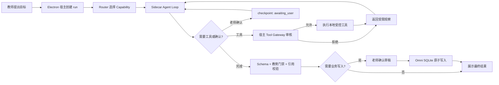

# DeepTutor 全功能清单、适配评估与生产交付矩阵

> 文档状态：DeepTutor 融合设计的功能台账与验收基线  
> 调研日期：2026-08-10  
> DeepTutor 源码基线：`D:\WorkProject\DeepTutor`，`v1.5.11`，commit `456f9c24226e008f1ff07a7e3455d7b4d39f6221`  
> Omni-Edu 源码基线：`D:\WorkProject\EduProject`  
> 上位架构文档：`docs/24_DEEPTUTOR_OMNI_EDU_INTEGRATION_DESIGN.md`

## 1. 文档目的与边界

本文把 DeepTutor 已实现能力按“可独立设计、开发、测试和上线的生产模块”梳理为 77 项，并逐项回答：

1. DeepTutor 是否真的已有源码实现；
2. Omni-Edu 是否已有对应能力；
3. 应整体集成、二次开发、裁剪替换，还是延后；
4. 迁移后必须补齐哪些流程、异常、权限、性能和界面能力；
5. 用什么关键测试证明它达到生产门槛。

这里的“全功能”指产品核心与平台核心，不把每个 DTO、内部辅助函数、管理端按钮或测试夹具单独伪装成一个功能。API 端点、内部类和前端页面会追溯到所属模块。

本轮交付是设计与验收基线，**不代表 77 个模块已经写入 Omni-Edu，也不代表已经完成生产压测**。只有满足第 9 节 DoD 且证据入库的模块，才能在后续开发中标记为“已完成”。

## 2. 处置分类

| 代码 | 处置 | 判定标准 |
| --- | --- | --- |
| A | 整体集成 | 核心算法或运行时边界清晰，能在 Apache-2.0 合规前提下以较少改动复用 |
| B | 二次开发改造 | 思路和部分源码可复用，但必须适配教师工作台、SQLite 真源、隐私和现有契约 |
| C | 裁剪替换 | DeepTutor 有实现，但其 Web/多用户/高风险工具边界与本项目冲突，只吸收接口或交互思想 |
| D | 延后或不集成 | 不服务当前 K-12 独立教师 MVP，成本或风险显著高于近期收益 |

“整体集成”也不等于直接复制目录。所有 A 类模块仍必须经过 Omni-Edu bridge、宿主权限、数据契约、错误码和验收门禁。

## 3. 源码覆盖概览

本地源码索引显示 DeepTutor 的主体分布在 `services`、`api`、`agents`、`core`、`runtime`、`learning`、`capabilities`、`book`、`partners` 与 `multi_user`。关键可运行入口包括 FastAPI server、CLI、知识库管理和文档解析服务。

主要源码证据：

- 统一运行时：`deeptutor/runtime/orchestrator.py`、`deeptutor/agents/chat/agent_loop.py`、`deeptutor/app/facade.py`；
- 能力协议：`deeptutor/core/capability_protocol.py`、`deeptutor/core/tool_protocol.py`、`deeptutor/core/context.py`、`deeptutor/core/stream.py`；
- 学习能力：`deeptutor/capabilities/*`、`deeptutor/agents/{question,research,visualize,math_animator}`、`deeptutor/learning/*`；
- 知识能力：`deeptutor/knowledge/*`、`deeptutor/services/rag/*`、`deeptutor/services/parsing/*`；
- 连接语境：`deeptutor/services/{memory,notebook,persona,skill}`、`deeptutor/book/*`、`deeptutor/co_writer/*`；
- 扩展能力：`deeptutor/tools/*`、`deeptutor/services/{mcp,cli_apps,subagent}`、`deeptutor/partners/*`；
- 平台能力：`deeptutor/api/*`、`deeptutor/services/session/*`、`deeptutor/multi_user/*`。

## 4. 全功能清单与逐项适配结论

### 4.1 统一 Agent Runtime 与回合治理

| ID | DeepTutor 已实现模块与源码证据 | Omni-Edu 现状 | 处置 | 改造与融合边界 | 关键生产验收 |
| --- | --- | --- | --- | --- | --- |
| R01 | Capability Registry：`core/capability_protocol.py`、`runtime/registry/capability_registry.py` | 有 8 类 route，无独立深任务能力层 | A | 复用 manifest/execute/stream 抽象；TypeScript 宿主拥有最终启停权 | 未注册、重复注册、版本不兼容、禁用能力均失败关闭 |
| R02 | Tool Registry：`core/tool_protocol.py`、`runtime/registry/tool_registry.py` | 已有工具审核、隐私等级、allowlist | B | 保留 Omni 注册表为唯一执行真源；DeepTutor 只提交工具请求 | 禁止工具永不执行；参数、权限、结果大小均被审计 |
| R03 | ChatOrchestrator：`runtime/orchestrator.py` | 当前 route 后走固定预取流程 | A | 迁移能力选择、统一 stream 和终态保证；路由只选目标，不预执行工具 | 每次 run 仅有一个可靠终态；异常必有可读错误 |
| R04 | 真正多轮 Agent Loop：`agents/chat/agent_loop.py` | 已有有界 observation-driven loop；最多 3 轮/8 次工具调用 | A | 复用 observation-driven loop；主进程限制轮次、工具次数并保留原有审核/脱敏/确认边界 | 多跳任务能依观察继续；无穷调用在预算内终止 |
| R05 | 上下文门控与延迟工具加载：`agents/chat/agentic_pipeline.py` | 已完成 progressive loader 首片：初始只暴露 `load_tools`、`ask_user` 和 route 允许的学生引用解析；工具族按需加载后下一轮才暴露 schema | B | `router.allowedTools` 仍是硬总许可；`load_tools` 只返回经过 route/context allowlist 过滤的 schema，不执行业务工具；主进程与 Python sidecar 均保留动态 schema 审计 | 无需工具的问答不执行工具；模型必须先请求工具族；跨 route 工具族请求 blocked；需补真实 provider 质量与复杂上下文装配验收 |
| R06 | StreamBus 统一事件：`core/stream.py` | 已有 run/event 表和 trace UI | A | 采用 stage/tool/source/result/error/done 事件；映射到现有 SQLite | 断流重连不重复写入；事件序号单调、终态可重放 |
| R07 | UnifiedContext：`core/context.py` | 当前按 route 组装若干 context pack | B | 只传脱敏快照与引用句柄；禁止 sidecar 直读 DB/文件 | PII、越权学生、隐藏 chunk 均不可进入模型上下文 |
| R08 | 持久 Turn Runtime：`services/session/turn_runtime.py` | 有 conversation/run/event，但恢复协议不完整 | A | 复用 start/subscribe/cancel/reply/replay 语义，存储落 Omni SQLite | 崩溃后可识别 running/pending/failed；取消在 1 秒内生效 |
| R09 | 暂停/询问/恢复：tool protocol 与 `ask_user` | 已有 `waiting_input` checkpoint、正常恢复与重启接管子 run | A | 统一为 `awaiting_user` checkpoint；答案经原子 claim 后由同一 run 或恢复 child run 继续 | 重启后仍能回答待确认项；重复回答保持幂等 |
| R10 | 续写、探索预算、settlement 与硬终止：v1.5.11 loop | 已有事件预算、最多三代受限 settlement 与追加预算审批；费用预算未完成 | A | 复用截断续写和有限结算；预算由宿主配置覆盖并由老师批准扩容 | 截断可续写；超限生成不完整但诚实的终止结果 |
| R11 | 取消、重试、再生成、分支：`app/facade.py`、session API | 已有持久 request snapshot、branch/retry/regenerate 首片；复杂写事务仍待完善 | B | 统一 run lineage、parentRunId、idempotencyKey | 取消不落最终业务数据；重试不重复执行写工具 |
| R12 | Prompt、语言与 persona 注入：`services/prompt`、`i18n` | 已有小智 system prompt、结构化回复、最终回合 JSON mode 与有界 repair | B | 小智身份与教育安全留在宿主；借用分层 prompt 和语言 fallback；无工具最终回合由 main 请求 `json_object`，失败最多 repair 两次，每次 8,000 tokens 且不暴露工具 | 中文、英文和缺失模板均有稳定 fallback；不得绕过系统约束；repair 失败必须把 run 结算为 failed |
| R13 | Attached-source ExploreContext：`capabilities/explore_context/*` | 有上下文 pack，但无独立只读探索 pre-pass | A | 复用“独立调查再回答”结构；只读已授权 source handle，按问题选择片段，不读取全部附件 | 无附件不运行；多附件只读取必要来源；导入他人对话不污染小智身份 |

### 4.2 智能辅导、解题、出题、研究、可视化与精通学习

> 2026-08-11 E07/E08 实施注记：`research_workspace` 已有 main-process `generate_research_outline` 本地知识切片宿主；`visualization` 已有 `render_learning_mermaid` 受限 Mermaid 宿主。两者均 no-student/no-write，专项 smoke 18 assertions、路由 122/122 通过；联网研究、引用核验和高级渲染仍是 B 类未完成项。

| ID | DeepTutor 已实现模块与源码证据 | Omni-Edu 现状 | 处置 | 改造与融合边界 | 关键生产验收 |
| --- | --- | --- | --- | --- | --- |
| E01 | 通用智能辅导 Chat | 有 `general_qa`，但流程同质化 | A | 以同一 loop 承载澄清、检索、讲解、行动建议；不用固定报告模板 | 寒暄零工具；事实查询只调用必要工具；无意义“推断”不出现 |
| E02 | Deep Solve 深度解题：`capabilities/solve/*` | 有错因分析和题目处理工具 | B | 复用 plan/replan/settlement；接入 OCR、题库检索、学生证据；教师可修正题干 | 题干缺失先询问；证据不足不伪造学生结论；可中断恢复 |
| E03 | Deep Question 自定义出题 | 有三元题组和题库 | B | 复用 explore-plan-generate；输出适配 `triplet-set.v1` | 学科、知识点、难度和答案完整；schema 不合格不得入库 |
| E04 | Mimic 仿题 | 有本地相似题召回 | B | 模仿“知识结构和难度”，禁止近似复制受版权保护原题表达 | 相似度过高触发重写；答案与解析可独立校验 |
| E05 | Follow-up 追问出题 | 无独立能力 | B | 根据当前解题/讲解上下文生成诊断追问，不创建新孤立流程 | 无前置上下文时降级为澄清；追问能回写本次学习证据 |
| E06 | Quiz Judge / 作答判定 | 有质量 grader，缺完整作答门禁 | B | 客观题确定性判分；主观题模型评分必须给 rubric、置信度和教师复核 | 无标准答案时 fail closed；选择题标签与正文均能正确解析 |
| E07 | Deep Research：`agents/research/*` | 有知识检索和 Markdown 产物 | B | 复用问题分解、提纲确认、恢复和报告；限定为教师教研场景 | 提纲未经确认不得启动高成本研究；引用可回溯，取消可恢复 |
| E08 | Visualize：SVG/Chart.js/Mermaid/HTML/Manim | 当前主要是 Markdown/HTML 预览 | B | 首期只开放 Mermaid、SVG 和静态图表；HTML 严格沙箱 | XSS、外链脚本、事件处理器被拒绝；渲染失败可回退文本 |
| E09 | Math Animator：`agents/math_animator/*` | 无 | D | 作为可选扩展；待 Python sidecar、Manim 打包和缓存稳定后上线 | 缺依赖给安装提示；渲染任务异步、限 CPU/时间/输出大小 |
| E10 | Mastery Path Capability：`capabilities/mastery/*` | 有学生记录、错题和复盘，没有精通路径 | B | 复用 loop 外壳与学习工具；改成“教师监督的学习计划” | 不自动给学生下达任务；路径变更需显示依据并允许教师覆盖 |
| E11 | 知识点/模块模型：`learning/models.py` | 已有知识点、题目与记录，但模型口径不同 | B | 建映射层，不复制第二份学生真源 | 映射可逆；未知知识类型不静默覆盖；迁移可回滚 |
| E12 | 诊断与掌握度：`learning/mastery.py`、`learning/policy.py` | 有学习状态但无统一 mastery 算法 | B | 复用近期加权与分类型门槛思想；以可配置规则重写并校准 | 单次答对不等于掌握；证据不足显示“未知”而非虚假百分比 |
| E13 | 下一学习目标与先修门禁：`learning/policy.py` | 无确定性路径引擎 | A | 复用纯函数 policy，输入改成 Omni DTO | 有到期复习优先；先修未满足不跨级；同输入结果确定一致 |
| E14 | 错因分类：`learning/grading.py`、`learning/models.py` | 已有错题与 AI 错因分析 | B | DeepTutor 四类仅作上层 taxonomy；保留教师自由标签和证据 | 空答案、粗心、概念误解不被同一规则误判；老师可改且留审计 |
| E15 | 间隔复习与 review queue：`learning/scheduler.py` | 已有确定性 scheduler、`get_review_queue` 与应用内 reminder 首片 | A | 复用 DeepTutor scheduler；时间以 epoch 计算，timezone 仅作展示元数据 | 正确/错误序列、重启、应用内提醒和本地高负载已验证；外部通知/发布硬件复测仍待验收 |
| E16 | 学情分析与报告 | 有学生档案、记录、报告产物，但缺统一路径指标 | B | 报告只聚合确定性统计与有引用的 AI 解释；支持时间窗、学科过滤 | 数值可从 SQLite 重算；AI 总结与事实分栏；无数据时不生成空洞建议 |
| E17 | Vision Solver / GeoGebra：`agents/vision_solver/*`、`geogebra_analysis` | 有错题图片与 OCR 状态，无几何图形命令生成 | B | 复用单次视觉分析 + 空结果修复思想；原图默认不上云，优先本地/显式同意的脱敏裁剪 | 无图直接结束；畸形 JSON 只修复一次；命令白名单校验，老师可预览修正 |

### 4.3 连接学习语境、内容创作与可检查记忆

| ID | DeepTutor 已实现模块与源码证据 | Omni-Edu 现状 | 处置 | 改造与融合边界 | 关键生产验收 |
| --- | --- | --- | --- | --- | --- |
| C01 | Notebook CRUD/统计/记录：`services/notebook/service.py` | 有知识库、对话和文档产物，无统一笔记本 | B | 融入“教师备课本”，记录引用题目、学生群体或资源 ID | 删除采用软删除/可恢复；并发编辑检测版本冲突 |
| C02 | Notebook 分析与摘要 agent：`agents/notebook/*` | 可由 general QA 临时完成 | B | 作为按需能力，不常驻注入所有对话 | 大笔记分块；摘要标明覆盖范围与未读取部分 |
| C03 | Question Notebook / 题目收藏与分类 | 已有题库，功能高度重叠 | C | 不复制 DeepTutor 存储；把收藏、分类、历史映射到现有题库 | 题目去重、分类变更和历史引用不破坏原题 |
| C04 | Book workspace：`book/engine.py`、`book/compiler.py` | 有 Markdown 产物，无结构化教材工作区 | B | 改为“专题讲义/单元备课包”；复用 spine/page/block 编排 | 长任务可恢复；单页/单块可重生成；原引用可追踪 |
| C05 | Book blocks：文本、章节、测验、卡片、时间线、代码、深入讲解、图、动画、交互、概念图、提示、用户笔记 | 产物类型较少 | B | 首期文本/章节/测验/卡片/图/概念图/提示；代码、动画、交互后置 | 每类 block 都有 schema、渲染失败 fallback 和导出验证 |
| C06 | Book source explorer/spine/page planner | 无独立编排 agent | B | 复用规划思路；所有 source 只用 Omni 引用句柄 | 引用删除或 KB 漂移后明确标脏，不继续宣称有效 |
| C07 | Book KB drift / fingerprint health | 有知识库更新，无产物漂移检测 | A | 复用 fingerprint/health 机制，接入托管文档 hash | 来源变化后受影响块可定位；不会整本无差别重生成 |
| C08 | CoWriter 文档与编辑历史：`co_writer/*` | 有 Markdown 产物但协同编辑弱 | B | 改为教师讲义编辑器；保留操作历史、diff 和撤销 | 模型只提交 patch；冲突不覆盖用户新修改；可撤销 |
| C09 | CoWriter automark / react edit / stream | 无 | B | 将批注、局部改写作为显式工具，不自动改全文 | 选区漂移时拒绝；每次编辑显示前后差异和理由 |
| C10 | Persona：教师、同伴、研究助手 | 小智身份固定 | C | 保留“小智”统一身份，仅把教学策略作为可选 role profile | profile 不得改变权限、安全和数据可见性 |
| C11 | L1 原始痕迹：`services/memory/trace.py` | 有 run/event/tool 证据 | C | 不再复制一份；现有 event/tool 日志即 L1，默认本地、可清理 | 保存的是动作摘要和证据，不保存隐藏思维链；支持按期清理 |
| C12 | L2 表面摘要：memory document/consolidator | 无可编辑跨会话摘要层 | B | 新增教师可见“近期教学事实/偏好/待办”层，条目带来源 | 每条都有 evidence refs；用户可编辑、删除、禁用记忆 |
| C13 | L3 综合画像：memory consolidator | 学生档案存在，但不可由模型随意改写 | B | 只形成候选画像或教学策略草稿；老师确认后写入正式字段 | 低证据主张不可提升 L3；更新前后 diff、撤销、审计齐全 |
| C14 | Memory graph、claim→evidence、snapshot/diff | 有 evidence，但缺统一 memory graph | A | 复用引用验证、snapshot、diff 和变更集思想；存 Omni SQLite | 断链被标记，不展示假引用；任何结论可打开原始证据 |
| C15 | Memory update/audit/dedup/merge/undo | 无完整维护工作流 | A | 复用分块、预算、原子写、回滚机制；写入仍需老师确认 | 中途失败保持原文；undo 恢复一致；重复条目可解释合并 |
| C16 | Chat history import | 有本地对话，无外部导入 | D | 暂缓；未来仅导入用户主动选择的受支持格式 | 导入前预览和脱敏；来源、时间、角色不丢失 |

### 4.4 多引擎知识、文档解析与资源管理

| ID | DeepTutor 已实现模块与源码证据 | Omni-Edu 现状 | 处置 | 改造与融合边界 | 关键生产验收 |
| --- | --- | --- | --- | --- | --- |
| K01 | KnowledgeBaseManager、上传、目录、链接目录、同步、重建、进度 | 有本地题库/知识库与托管文档 | C | 保留 Omni 数据模型；借用任务进度、重试、健康检查 | 中断可续传/重试；失败文件不阻塞整个批次；状态可解释 |
| K02 | LlamaIndex pipeline，向量/混合检索 | 已有较轻本地检索 | B | P1 以现有检索为默认；数据量/召回评测达阈值后可选引入 | 固定语料 Recall@K、MRR 和 p95 达门槛；索引版本可回滚 |
| K03 | PageIndex pipeline 与 MCP server | 无 | D | 属于外部/托管知识路径，首期不进入教师本地 P0 | 启用前显示数据出境；密钥加密；不可用时回退本地检索 |
| K04 | GraphRAG local/global/drift/basic | 项目明确不做高级 Graph RAG | D | 不进入近期路线；只有多跳教研基准显著优于现有检索才立项 | 独立 feature flag、独立索引、不污染默认路径 |
| K05 | LightRAG local 与 RAG-Anything | 同上 | D | 依赖重、打包大；仅作为实验 provider | 安装/卸载隔离；资源上限和迁移成本必须量化 |
| K06 | LightRAG server、IMA 关联库 | 无 | D | 不让外部服务成为本地教学闭环的硬依赖 | 断网仍可用核心功能；外部数据授权和删除路径完整 |
| K07 | Obsidian/folder linked KB | 有 Obsidian 使用场景但未正式接入产品 | B | 优先只读链接、增量 hash、用户选择范围；不扫描整个 vault | 路径越界/符号链接逃逸被拒绝；删除链接不删除原文件 |
| K08 | 可插拔 parsing service/factory/cache/signature | OCR/文本解析已存在，格式覆盖有限 | B | 复用 provider 协议、缓存与签名；保留现有 OCR 教师修正入口 | 同文件/同配置命中缓存；引擎变更触发可控重解析 |
| K09 | text-only、PyMuPDF4LLM、MarkItDown、Docling、MinerU 本地/云解析 | 当前 MVP 不追求复杂 PDF/Word | B | text-only 整合；PyMuPDF4LLM/MarkItDown 可选；Docling/MinerU 子能力延后 | 文件炸弹、超大文档、损坏 PDF、云解析失败均隔离且可重试 |
| K10 | 索引版本、embedding signature、preflight/probe | 有本地索引但版本治理不足 | A | 复用版本指纹、模型签名、预检和 provider 健康状态 | embedding 变化不误用旧索引；重建失败仍保留上一可用版本 |
| K11 | 原生 Obsidian Capability：search/read/list/backlinks/links/tags/create/append/property | 无产品级 vault 工具 | C | 只吸收 vault-relative 路径和关系查询；首期只读，写入改为 Omni 草稿 + 显式确认 | vault 越界和符号链接逃逸被拒绝；写操作不可绕过预览、diff 与确认 |

### 4.5 工具、技能、MCP、CLI、媒体、子代理与伙伴

| ID | DeepTutor 已实现模块与源码证据 | Omni-Edu 现状 | 处置 | 改造与融合边界 | 关键生产验收 |
| --- | --- | --- | --- | --- | --- |
| X01 | 内置工具：brainstorm、rag、kb_files、web_search、reason、paper_search、GeoGebra、read_source、web_fetch、GitHub、ask_user、cron | 有本地业务工具，外部工具少 | B | 只按教育场景逐个注册；web/paper/search 默认需配置，cron 延后 | 每个工具独立权限、schema、timeout、size limit、审计与 mock 测试 |
| X02 | 内置 memory/notebook 工具 | 无统一接口 | B | 映射 C01-C15，不允许绕过宿主数据服务 | 只读与写入权限分离；写入必须形成草稿或确认项 |
| X03 | 文件 read/write/edit/list 与 exec/code_execution | renderer 无直接 DB/文件调用 | C | 只保留工作区句柄化读文件；通用写文件/exec 默认不注册 | `..`、绝对路径、符号链接、命令注入与超时均被阻断 |
| X04 | imagegen/videogen/voice | 无核心依赖 | D | 教育配图可后置；视频/语音不进入当前核心 | 内容安全、费用上限、版权提示和用户确认齐全后再启用 |
| X05 | Progressive tool disclosure：`load_tools` | 当前工具集合较小 | A | 工具超过约 20 个后启用分组发现；加载仍受 route/capability scope | 不可加载未授权工具；schema 注入 token 可观测 |
| X06 | Skills + EduHub：`services/skill/*`、内置 pdf/docx/pptx/xlsx/creator | 无产品级技能系统 | B | 首期本地签名技能包、只读 manifest；社区安装必须评审 | 路径穿越、恶意脚本、凭据字段、版本冲突、卸载回滚均测试 |
| X07 | MCP manager/catalog/OAuth/secrets/per-user config | 无产品 MCP 面板 | D | 架构预留但不首发；未来 MCP 调用仍经宿主代理 | secrets 加密且不进日志；网络域名、工具 scope 和管理员批准明确 |
| X08 | CLI Apps catalog/installer/runner | 无 | D | 不在桌面教师 MVP 自动安装第三方 CLI | 安装必须显式确认、校验来源/hash，运行独立沙箱 |
| X09 | Subagent capability、sessions 与 coding CLI partner：`capabilities/subagent/*`、`services/subagent/*` | 无子代理 | D | 教育任务先用 capability 分工，不引入 Claude/Codex/Gemini 等编码代理 | 如后续启用，只能访问临时工作区，不能读学生数据真源 |
| X10 | Persistent partners 与消息通道：Slack、Teams、飞书、微信、企业微信、钉钉、QQ、Telegram、Discord、Email 等 | 无 | D | 不集成 IM 通道；与教师本地工作台边界不符且扩大隐私面 | 只有明确团队版需求和合规评审后另立项目 |
| X11 | Partner memory/search/transcription/bus | 无 | D | 不复制伙伴记忆；可复用事件总线设计但不复用远程通道 | 外部消息不得自动进入学生记忆；导入必须显式、可撤销 |

### 4.6 平台、配置、安全、可观测与界面

| ID | DeepTutor 已实现模块与源码证据 | Omni-Edu 现状 | 处置 | 改造与融合边界 | 关键生产验收 |
| --- | --- | --- | --- | --- | --- |
| P01 | FastAPI/CLI/SDK facade | Electron main/preload/renderer IPC | C | 不嵌入完整 server；保留 Python facade，走 stdio NDJSON/JSON-RPC | sidecar 仅绑定父进程；握手、版本、心跳、崩溃重启均可测 |
| P02 | Next.js/React Web UI | Electron + React UI 已存在 | C | 不复用 Web 外壳；只吸收运行时间线、ask-user、来源和块编辑交互 | 键盘可达、加载/空/错/取消/重试状态完整，无上下文工具底栏 |
| P03 | 多用户、登录、管理员、grants/audit | 单教师本地优先，不做多租户 | D | 不引入多用户服务；保留本地操作审计和未来 workspace boundary | 当前无登录也不能让 renderer 越过 preload/IPC 权限边界 |
| P04 | Model/provider catalog、上下文窗口和运行设置 | 已有 DeepSeek 配置 | B | 增加 capability 模型策略、成本上限、fallback 和健康检查 | Key 不落日志；错误 provider 可切换；配置错误不破坏本地功能 |
| P05 | Attachments/artifacts/outputs/dashboard | 有托管文件、Markdown 产物、运行记录 | B | 统一 artifact contract，避免 DeepTutor 建第二存储 | MIME、hash、大小、来源、清理策略完整；断链可检测 |
| P06 | Logging、memory probe/reclaim、service tests | 有日志/事件但缺 sidecar 观测 | A | 复用健康与资源探针思想；指标写本地 telemetry 表 | CPU/内存/队列/首事件/工具延迟/失败码可查询，不记录敏感正文 |
| P07 | Auth/secrets/network settings | 有本地配置边界 | B | 凭据由 Electron 安全存储托管，sidecar 用短期 capability token | token 过期/重放/越权失败；代理与 TLS 错误有明确提示 |
| P08 | 定时任务 cron | 无 | D | 不把后台自治引入首期；学习复习提醒用本地确定性 scheduler | 不因应用关闭丢规则；任何外发动作仍需用户批准 |
| P09 | 安装、可选依赖、preflight、运行测试 | Electron 打包已存在，Python sidecar 尚无 | B | 冻结 wheel/依赖锁和许可证清单；按能力安装可选 extra | 离线安装、升级回滚、缺依赖降级、Windows 路径和中文路径通过 |

## 5. 汇总结论

### E15 当前实现证据（2026-08-11）

- `review-scheduler.ts` 已直接复用 DeepTutor `learning/scheduler.py` 的 memory/concept/procedure/design 间隔序列与连续正确/错误回退状态机，按 epoch seconds 纯函数重算，排序稳定且 bounded。
- `get_review_queue` 已注册到真实 HostTool registry，仅开放 `student_diagnosis/practice_design`，只读本地 `learning_records`，输出 `omni.review.queue.v1`；缺学生、错误 route、超限参数和畸形证据均 fail-closed，不返回原始记录。
- `npm run test:deeptutor-review-scheduler`：20/20；`npm run test:deeptutor-review-queue`：14/14；`npm run test:deeptutor-review-recovery`：12/12；`npm run test:deeptutor-mastery-policy`：8/8；`npm run test:ai-harness`：125/125；observability 与 production build 通过。UTC/Asia/Shanghai/America/New_York 等值回放证明切换时区不丢任务，真实 SQLite close/reopen 证明队列可重算。
- E15 仍保持 A 类进行中：外部系统通知、发布硬件复测、真实教师覆盖和 live provider 仍未验收；普通备注标题已明确保持 unknown，不会污染队列。
- Electron smoke 已补充 quiz/grade 类型保持回归：procedure 点不会被通用 concept quiz 结果重分类，错误的 `mastery_assess` 入口保持 `wrong_gate`。
- E15 提醒切片已通过 `npm run test:deeptutor-review-reminder` 18/18 与 `npm run test:deeptutor-review-reminder-electron` 16/16：close/reopen 后摘要稳定，今日工作台可见，缺学生/空 ID fail-closed；提醒仍不等于外部系统通知或真实教师措辞验收。
- E15 高负载已通过 `npm run test:deeptutor-review-performance` 与 `npm run test:deeptutor-review-performance-electron`：8×200 fixture、16 并发，多次 native benchmark pass^3 p95 205–430ms/重启 196–225ms，Electron IPC 68–109ms；本地 SLO 证据通过，但发布硬件、外部通知和 live provider 仍未完成。

### E17 当前实现证据（2026-08-11）

- `analyze_geometry_figure` 已接入 `error_analysis` route 的真实 HostTool 注册表，使用本地错题图片分析元数据与脱敏 OCR 状态，不上传原图、不写业务数据。
- `vision-solver.ts` 复用 DeepTutor Vision Solver 的一次分析/一次修复设计，并在主进程执行 GeoGebra 白名单、脚本/URL/隐私文本阻断、点坐标赋值约束和圆括号修正。
- `npm run test:deeptutor-vision-solver`：12/12 通过，包含 no-image、HostTool round-trip、恶意命令、隐私回显、缺少学生绑定和 no-write。真实 vision provider、人工几何标注和最终渲染仍属于未完成生产闸门。

### C01 当前实现证据（2026-08-11）

- `teacher_notebooks` / `teacher_notebook_records` 已复用 DeepTutor NotebookManager 的记录模型，改为 Omni-Edu 本地 SQLite；main/preload IPC 提供完整 CRUD，避免引入第二存储。
- 删除使用软删除并支持恢复；备课本/记录通过 `version` 做乐观并发校验，冲突不会覆盖教师新修改。
- `npm run test:deeptutor-notebook-crud`：14/14 通过，覆盖软删除、恢复、删除后写入阻断、版本冲突和记录回读。

### C02 当前实现证据（2026-08-11）

- `routeAiPrompt('总结备课本中的一次函数笔记')` 自动选择 `knowledge_retrieval`，仅增加 `teacher_notebook` context 和 `analyze_notebook_context` 工具；普通问答保持零备课本上下文。
- `analyze_notebook_context` 真实执行器读取本地 SQLite、限量选择细节、统一脱敏并返回 `omni.notebook.analysis.v1`；`record_summary` 草稿含 `requiresTeacherReview=true`，没有业务写入。
- `npm run test:deeptutor-notebook-analysis`：14/14 通过；当前 `npm run test:ai-harness` 已扩展为 98/98，新增两条 notebook route/tool eval。真实 provider 仍受本机未配置 `DEEPSEEK_API_KEY` 的事实限制。

### C03 当前实现证据（2026-08-11）

- DeepTutor Question Notebook 的 bookmarked/category/reference 语义已映射到 Omni-Edu 题库 overlay；`question_bank_items` 仍是题干、答案、解析和来源的唯一 canonical 真源，没有第二题目正文库。
- main/preload 已提供题目收藏、分类创建/重命名/软删除/恢复、题目分类关联、usage 历史和分页检索；收藏与分类更新携带版本校验，题组保存会为已存在题库题写入去重 usage 引用。
- `routeAiPrompt('列出我收藏的一次函数题目')` 自动选择 `practice_design/question_notebook`，只允许 `question_notebook` context 和 `search_question_notebook`，不读取学生/教师知识库上下文。
- `npm run test:deeptutor-question-notebook`：22/22 通过；`npm run test:ai-harness` 已扩展为 100/100。已补齐第一版真实教师题本界面（搜索/分类/收藏/解析）；批量题库迁移、真实模型工具调用和外部教师可用性仍未完成。

### C04 当前实现证据（2026-08-11）

- DeepTutor `BookEngine/BookCompiler/KB health` 的可复用部分已落到 Omni-Edu 的结构化专题讲义/单元备课包，不复刻通用 Book Workspace 文件存储或 LMS 外壳。
- SQLite 已有 book/chapter/page/block/source 五层实体，支持状态、版本、bounded payload、sourceRefs 和来源指纹；page/block 可独立重生成，健康检查能将漂移/缺失精确定位到受影响 page/block。
- `inspect_teaching_book` 仅在明确讲义请求时使用 `teaching_book` context，禁止学生数据、知识库全量注入和业务写入；显式不存在的 bookId fail-closed。
- `npm run test:deeptutor-book-workspace`：26/26 通过；`npm run test:ai-harness` 已扩展为 102/102。C05 已补齐首版多 block Markdown renderer、讲义页面预览和教师点击后的 document_artifacts 导出；PDF/DOCX 现支持 Unicode 文字、标题/列表/代码样式的基础高保真导出，复杂版式、多媒体交互与真实教师可用性仍未完成。

### C05 当前实现证据（2026-08-11）

- `teaching-book-renderer.ts` 按 DeepTutor BlockRenderer 语义支持 text/chapter/section/callout、quiz、card、figure、concept_graph、prompt；未知/失败/生成中块保留安全 fallback，不执行任意代码。
- `draft_teaching_book_markdown` 只生成 bounded Markdown 预览，不写文件、不发布，要求教师复核；sourceRefs 仍可追溯到 book block。
- `npm run test:deeptutor-book-renderer`：24/24 通过；route/tool eval 已扩展为 104/104。document_artifacts 已有 Markdown/PDF/DOCX 真实写入、hash/readback；复杂表格、图片/动画和版式分页仍是后续边界。

### C06 当前实现证据（2026-08-11）

- `plan_teaching_book` 复用 DeepTutor SourceExplorer/Spine/PagePlanner 的候选章节语义，基于现有 `searchKnowledge` 的 bounded chunk 主题和来源生成 chapter/page/block 草案；不新增第二套知识检索真源。
- 规划请求动态启用 `teaching_book + teacher_knowledge`，普通讲义 inspection 仍只启用 `teaching_book`；学生 context、自动写入和整本重建均不允许。
- `npm run test:deeptutor-book-planner`：20/20 通过；route/tool eval 已扩展为 106/106。LLM 多轮 spine synthesis、章节落库确认 UI 和跨知识库高级融合仍未完成。

### C08 当前实现证据（2026-08-11）

- SQLite 新增 teaching_book_patches，保存 block before/after、baseVersion、resultVersion、reason 和 draft/applied/rejected/undone 历史；未复制 DeepTutor 文件型 CoWriter storage。
- draft_teaching_book_patch 只创建需教师复核的 patch，apply/undo 通过版本条件更新和 readback；老师新修改会让旧 patch fail-closed，禁止覆盖。
- npm run test:deeptutor-book-cowriter：24/24 通过；本轮 route/tool eval 已扩展为 110/110。富文本选区 patch、教师 UI diff/撤销面板和多块事务编辑仍待后续。

### C09 当前实现证据（2026-08-11）

- 复用 DeepTutor CoWriter 的 automark、react-edit 选区快照和 SSE stream 语义；Omni-Edu 以 SQLite `teaching_book_patches` 为唯一可审计真源，不引入第二套文件存储。
- `draft_teaching_book_selection_patch` 要求显式范围和原文，生成 `replace_selection`/`automark_selection` 草稿及 bounded stream events；正文仍保持 no-write-before-confirm。
- apply 时同时检查 block `baseVersion` 和选区 SHA-256 指纹；教师在模型返回期间修改文本、选区内容变化或 scope 缺失都会拒绝，不覆盖新内容，并保留 rejected 原因。
- `npm run test:deeptutor-book-cowriter-selection`：28/28 通过；`npm run test:ai-harness`：112/112，routeAccuracy=1。当前 stream 是本地可审阅事件边界，不代表已接通真实云端 provider；真实 provider 仍需独立 live evidence。

### C10 当前实现证据（2026-08-11）

- 复用 DeepTutor Persona 的“行为/声音预设而非能力 skill”语义，新增 `role-profile.ts`：teacher、peer、research_assistant 三种 profile，未知输入安全回退 teacher。
- role profile 只写入 router/Agent trace 的教学策略提示；工具 allowlist、context policy、学生隐私和写入确认完全不变，避免“切换人格即越权”。
- `npm run test:deeptutor-persona-profile`：18/18；能力回归 48/48。当前 profile 是受控内置策略，不开放任意 Markdown system prompt 注入；可编辑 Persona 存储与管理员治理仍待后续。

### C07 当前实现证据（2026-08-11）

- 新增 \`teaching_book_invalidations\`，以托管来源的原始 fingerprint 为基线，刷新时持久化 available/stale/missing 状态和按 source ref 的 open/resolved 队列。
- 失效定位保持 page/block 粒度；来源恢复只关闭对应队列项并把 ready/partial 状态同步回讲义，不覆盖 block payload，不触发整本盲目重生成。
- 新增 \`refresh_teaching_book_health\`、refresh/list IPC 与显式 bookId fail-closed；工具只更新本地健康元数据，禁止学生 context 和正文写入。
- \`npm run test:deeptutor-book-health\`：24/24 通过；\`npm run test:ai-harness\` 已扩展为 108/108。批量后台 watcher、教师 UI 队列操作和大规模知识库压测仍未完成。

按上述 77 项生产模块统计：

| 处置 | 数量 | 代表能力 |
| --- | ---: | --- |
| A 整体集成 | 17 | agent loop、registry、StreamBus、turn runtime、上下文探索、学习 policy、复习调度、索引版本治理 |
| B 二次开发改造 | 38 | Deep Solve、出题、视觉求解、研究、精通路径、报告、记忆、讲义、解析、模型配置 |
| C 裁剪替换 | 8 | DeepTutor 工具执行真源、题目笔记本存储、persona、L1 记忆、知识库外壳、Obsidian 写工具、通用 exec、FastAPI/Web UI |
| D 延后或不集成 | 14 | Math Animator、多引擎高级 RAG、媒体生成、MCP/CLI Apps、子代理、IM Partners、多用户、cron |

说明：同一模块可能包含多个子项，表中按处置标签计数时以每一行主处置为准；最终开发排期以 ID 为唯一追踪键，不以汇总数字代替验收。

核心选择是：把 DeepTutor 的 agent-native 内核运进来，把它的平台外壳留在外面。Omni-Edu 的 Electron 主进程、SQLite、学生数据、题库、知识库、确认队列和工具权限继续是唯一真源。

## 6. 目标生产流程

任何 capability 都不得绕过 `Tool Gateway` 直读 SQLite、原始学生目录、错题图片或本机任意文件。任何“生成完成”也不得直接等价为“已写入业务数据”。

## 7. 性能目标与“2 秒响应”定义

外部大模型、网页搜索和长文研究无法诚实保证两秒内完成。生产口径把“响应”定义为：请求已被接受，并向界面返回首个可见事件、首个 token、可执行澄清或明确失败，而不是深任务的最终全文。

### 7.1 标准桌面负载 W1

- 1 个前台交互 run；
- 最多 3 个后台异步任务，包括索引、研究或讲义生成；
- 最多 10 个并发本地只读 IPC/tool 请求；
- 单教师工作区，WAL 模式，本地 SSD；
- 大模型与外网延迟单独记账，不混入本地组件伪装成已达标。

### 7.2 SLO

| 路径 | W1 下目标 |
| --- | --- |
| Router + capability 选择 | p95 ≤ 100 ms |
| run 创建并返回 `runId` | p95 ≤ 200 ms |
| sidecar 暖启动握手 | p95 ≤ 300 ms |
| sidecar 冷启动 | p95 ≤ 2 s；超时进入降级模式 |
| 本地只读工具 | p95 ≤ 500 ms；单次硬超时 2 s |
| UI 首个可见 stage/progress | p95 ≤ 500 ms |
| 常规在线问答首 token | p95 ≤ 2 s，按 provider 分桶统计 |
| 深研究/讲义/动画 | 200 ms 内返回 runId，500 ms 内有进度；最终完成异步 |
| 取消前台任务 | p95 ≤ 1 s |
| UI 60 fps 交互 | 流式更新批量刷新，不因 token 事件阻塞主线程 |

若外部 provider 首 token 超过 2 秒，界面仍须在 500 ms 内显示“已开始、正在等待模型”，并记录 `provider_wait_ms`。不得把等待动画当成模型性能已达标。

## 8. 权限、安全和隐私基线

### 8.1 四层权限

1. Route scope：当前目标允许哪些 capability；
2. Capability scope：本次 run 允许发现哪些工具；
3. Tool scope：工具可读的学生、资源、字段和时间窗；
4. Commit scope：哪些草稿允许老师确认后原子写入。

### 8.2 强制控制

- sidecar 每个工具请求携带短期、单次 run 绑定的 capability token；
- renderer 不持有数据库连接、API Key 或 sidecar 管理权限；
- 云端只接收脱敏后的必要文本；原始错题图片和本机路径默认不出境；
- 写学生档案、学习记录、题库、记忆 L3 和正式报告必须走确认队列；
- 通用 shell、任意文件写入、远程 MCP、伙伴通道默认不注册；
- 工具参数和结果有 schema、大小上限、超时、取消和审计；
- 日志记录 hash、ID、耗时、状态和错误码，不记录密钥与默认不记录学生敏感正文；
- 许可证保留 Apache-2.0、NOTICE、第三方 notices、上游 commit 和本地修改说明。

## 9. 每个模块统一生产 DoD

R01-P09 的每一项只有同时满足以下内容，才能在 `2.Memory.md` 标记完成：

### 9.1 可运行代码

- 有真实入口，不是仅 UI mock、静态示例或无调用方的类；
- 有 typed contract、版本字段和稳定错误码；
- 主路径、空状态、失败、取消、重试/恢复和幂等路径完整；
- 任何 DB 写入有事务或补偿，任何外部调用有 timeout 和 cancellation；
- 有 feature flag，可独立禁用并回退到上一稳定路径。

### 9.2 配置说明

每个模块在 `docs/config/deeptutor/<module-id>.md` 记录：默认值、环境变量、本地设置项、密钥归属、资源预算、feature flag、依赖和降级策略。配置必须能校验，不能静默吞掉拼写错误。

### 9.3 部署文档

每个阶段在 `docs/deployment/deeptutor/` 提供：Windows 开发启动、sidecar 构建、Electron 打包、离线安装、升级/回滚、健康检查、日志位置、数据迁移/备份与故障排查。不得依赖开发机绝对路径。

### 9.4 关键测试

- unit：纯算法、schema、policy、权限、错误映射；
- contract：TypeScript ↔ Python golden fixtures，双向版本兼容；
- integration：真实 SQLite、bridge、tool gateway、checkpoint；
- E2E：Electron main/preload/renderer 的真实链路；
- eval：任务路由、工具选择、教育可用性、诚实性和写入边界；
- performance：W1 的 p50/p95/p99、队列和资源曲线；
- security：路径穿越、提示注入、越权学生、PII 泄露、XSS、命令注入、token 重放；
- chaos：sidecar 崩溃、模型超时、断网、索引损坏、磁盘满、取消竞态。

### 9.5 证据入库

测试命令、版本、数据集 hash、通过/失败计数、性能样本和剩余缺口写入现有回归证据表。skip、mock、seeded proxy 与真实在线验证必须分开显示。

## 10. 分阶段交付包

| 交付包 | 模块 ID | 必须交付的代码 | 配置/部署 | 最小验收 |
| --- | --- | --- | --- | --- |
| DT-0 Bridge | R01、R03、R06-R08、P01、P06、P09 | sidecar facade、stdio transport、handshake、event mapper、supervisor | bridge 配置、wheel 锁定、打包和回滚 | contract fixtures、崩溃恢复、冷/暖启动 SLO |
| DT-1 小智真循环 | R02、R04-R05、R09-R12、E01、P04、P07 | loop runner、budget、host tool gateway、checkpoint、cancel/retry | 模型/预算/工具策略 | 48 个 capability eval + 无穷工具/提示注入/越权测试 |
| DT-2 解题与出题 | E02-E06、C03、P05 | solve/question adapters、judge、triplet mapper、artifact | 学科/难度/rubric | 题干缺失、证据不足、选择/主观题、重复写入 E2E |
| DT-3 精通与学情 | E10-E16 | mastery domain、policy、scheduler、report assembler | 阈值、时区、复习策略 | 确定性回放、教师覆盖、数值重算、报告引用 |
| DT-4 教研与可视化 | E07-E08、C01-C02、C08-C09 | research、safe renderer、notebook、patch editor | 搜索、渲染、任务预算 | 提纲确认、XSS、冲突编辑、取消恢复、引用断链 |
| DT-5 知识与记忆 | C11-C15、K01-K02、K07-K10 | memory graph、consolidator、parser provider、index version | retention、解析器、embedding | PII/断链/undo、缓存、版本回滚、检索基准 |
| DT-6 结构化讲义 | C04-C09 | book/spine/block adapters、drift health、CoWriter selection patch | block 白名单、导出、选区冲突 | 块级重生成、来源漂移、选区漂移、导出内容核验 |
| 实验区 | E09、C16、K03-K06、X04、X06-X11、P03、P08 | 与主程序隔离的 feature package | 独立安装/卸载/许可 | 只有独立 ADR、威胁模型和收益基准通过后进入产品 |

每个交付包完成后必须能够单独关闭，而不破坏当前本地题库、错题处理和三元题组 P0 闭环。

## 11. Eval 与关键用例分配

现有 route eval 继续保留；新增 48 个 capability eval：

| 组 | 数量 | 覆盖 |
| --- | ---: | --- |
| 真循环与工具自主选择 | 10 | 零工具、单工具、多跳、补证据、拒绝工具、预算终止 |
| 解题与出题 | 8 | OCR 缺失、仿题版权、答案一致、三元结构、追问 |
| 精通学习与学情 | 8 | 先修门禁、单次答对不掌握、错题优先、到期复习、教师覆盖 |
| 研究与引用 | 6 | 提纲确认、来源冲突、无来源、断网、取消恢复、引用断链 |
| 记忆与个性化 | 6 | L2/L3 提升门槛、PII、删除、undo、矛盾事实、过期证据 |
| 权限与安全 | 6 | 越权学生、提示注入、路径穿越、XSS、token 重放、写入绕过 |
| 稳定性与性能 | 4 | 截断续写、sidecar 崩溃、W1 首事件、外部超时降级 |

通过门槛：

- schema/contract/permission：100%；
- 高风险安全用例：100%；
- capability 选择：≥95%；
- 教育可用性：≥90%，且无关键事实伪造；
- 同一问题工具轨迹不要求一致，但必须满足必要性、权限和结果正确性；
- W1 性能满足第 7 节，未达标模块不得默认开启。

## 12. 异常分类与统一 UI 行为

| 错误码族 | 场景 | UI 必须显示 | 恢复动作 |
| --- | --- | --- | --- |
| `INPUT_*` | 缺题干、格式错、范围不清 | 缺什么、为何需要 | 就地补充后继续同一 run |
| `PERMISSION_*` | 越权学生、工具未授权、写入未确认 | 被阻止的动作与边界 | 缩小范围或老师确认，不能偷偷降权执行 |
| `DEPENDENCY_*` | sidecar/解析器/Manim/MCP 未安装 | 缺失依赖和当前可用替代 | 降级或打开配置，不循环重试 |
| `PROVIDER_*` | 模型、embedding、搜索超时/限流 | 等待位置、已保留进度 | 重试、切换 provider、稍后恢复 |
| `EVIDENCE_*` | 无命中、引用断链、冲突事实 | 已检查范围、未知项 | 请求资料或改用不依赖该事实的路径 |
| `BUDGET_*` | 轮次/token/费用/时间超限 | 已完成部分与未完成部分 | 用户批准追加预算或保存草稿 |
| `STORAGE_*` | 磁盘满、事务失败、索引损坏 | 数据是否已写、是否可恢复 | 回滚、清理空间、重建副本 |
| `CANCELLED` | 用户取消 | 已取消、保留哪些草稿 | 恢复或从 checkpoint 重开 |
| `INTERNAL_*` | 未分类异常 | 可读摘要和 traceId | 安全重试；原始堆栈只进本地诊断日志 |

界面展示“动作—结果—依据—下一步”的可审计工作轨迹，不展示模型隐藏思维链。底部“上下文工具”组件删除后，来源和工具详情进入按事件展开的运行时间线，不占用回答正文。

## 13. 对抗性审查后的修正

### 13.1 “所有功能都迁移”会把单机教师工具变成平台拼盘

修正：77 项全部入账，但 D 类明确不进默认产品；“梳理完整”不等于“全部开启”。近期资源只投入能闭合教师备课、错题、出题、学情和复习的模块。

### 13.2 “整体复用”会制造第二数据真源

修正：A 类只复用运行时或纯算法。DeepTutor 的 session、question notebook、learning store、KB metadata 不能与 Omni SQLite 并行写正式业务数据。

### 13.3 两秒指标可能驱动假进度

修正：首事件、首 token、本地调用和深任务最终完成分开度量。UI 的“处理中”不等于模型已响应，必须记录真实 provider wait。

### 13.4 学情算法会把模型推断包装成精确数字

修正：掌握度只使用可重放的作答、复习和教师确认事件。AI 解释与统计事实分栏；低证据状态显示“未知/待确认”。

### 13.5 分层记忆可能固化偏见或泄露学生隐私

修正：L1 使用已有审计事件；L2 可见可编辑；L3 仅生成候选并经老师确认。每条 claim 有证据、适用范围、置信状态、创建和过期时间。

### 13.6 Agent 自主性扩大攻击面

修正：模型只决定“请求什么”，宿主决定“能否做”。exec、任意文件写、MCP、外部伙伴和远程安装默认不注册，不能依赖 prompt 约束代替执行层权限。

### 13.7 上游复用存在许可证与漂移风险

修正：冻结 commit、建立 `vendor/deeptutor-core` 补丁台账、保留 LICENSE/NOTICE/第三方 notices；每次升级先跑 contract/eval/security 基线，不追随上游 main 自动更新。

## 14. 后续执行顺序

1. 创建 DT-0 分支与可独立运行的 `python/omni_edu_deeptutor_bridge` spike；
2. 固化 5 份跨语言 contract 和 golden fixtures；
3. 先让 `general_qa` 通过真实多轮 loop，证明不会预执行全量工具；
4. 完成 48 个 capability eval 并接入现有 eval runner；
5. 再依次开发 DT-2 至 DT-6，每个交付包按第 9 节验收；
6. D 类能力保持关闭，只有业务价值、威胁模型、打包成本与基准评测同时通过才转入开发。

第一开发验收点不是“页面出现 DeepTutor”，而是：同一个小智界面中，无工具问题不调用工具，多跳任务能根据观察继续，越权调用被宿主拒绝，运行可暂停/恢复/取消，最终结果通过结构、教育和引用门禁。

## 15. DT-0 实际开发状态（2026-08-11）

已验证：

- 上游 v1.5.11 固定 commit 已机械 vendor 到 `python/vendor/deeptutor`，并保留许可证、第三方声明和来源说明。
- bridge handshake 通过上游 `CapabilityRegistry` 读取能力 manifest；chat dry-run 实际调用上游 `AgentLoop`，deep_solve/mastery_path dry-run 实际调用上游 Capability + AgenticChatPipeline + AgentLoop。
- `npm run test:deeptutor-bridge` 已覆盖非法 JSON、超大帧、能力拒绝、重复启动、取消幂等、chat/solve 终态和连续 sequence；`node apps/desktop/scripts/electron-smoke.mjs` 已覆盖 Electron→main→sidecar handshake/start/stop。
- sidecar 安全事件已由 Electron main 串行写入现有 `ai_agent_events`，`done` 会闭合 `ai_agent_runs`；preload/renderer 已有订阅和 SQLite readback IPC，事件序列连续且可重放。
- 对抗性验收已覆盖隐藏思维标记、secret-like 文本、blocked HostToolProxy result 和数据库序列连续性；blocked 工具结果被记录为 `observe` 证据，不会伪装成成功工具调用。
- `npm run test:deeptutor-agent-tool-call` 已验证上游 AgentLoop 原生 `tool_calls` → DeepTutor dispatcher → `_HostProxyTool` → Electron blocked result 的真实 loop 片段，事件序列连续且终态可达。
- ModelProxy 已接入版本化 request/result：Electron main 是唯一 provider/credential owner；`npm run test:deeptutor-model-proxy` 验证 sidecar round-trip，Electron smoke 验证无 Key 时 failed run、无 credential 泄露。

仍不能标记为生产完成：

- HostToolProxy 双向 request/result 第一段已接通并通过 blocked round-trip smoke；原生 AgentLoop tool-call parity 和 ModelProxy 协议已完成，但本机未执行 live provider，真实业务工具和 sidecar 崩溃恢复仍未完成；常规问答入口已完成本地 fail-closed 切换验收。
- deep_question/deep_research/visualize 仍为 manifest 可发现，不是已接入生产能力。
- Fake stream / seeded smoke / 首个事件只证明工程链路，不能替代真实在线、教师评分、性能和安全门禁；renderer 事件订阅已完成，但普通 AI 页面仍非全量 sidecar runtime。

### 当前实施状态补充（2026-08-11）

- 普通问答入口已改由 `runDeepTutorConsole` 驱动，完成 router → sidecar AgentLoop → main ModelProxy → SQLite evidence → structured reply 的本地 fail-closed 链路。
- no-key 对抗性验收已通过：console 返回 `ok=false`、具体凭证错误和持久化 runId；不得将此结果计入 live provider 或生产可用率。
- 真实业务工具、deep_question/deep_research/visualize 等 Capability、跨进程断线恢复、live provider 与教师质量评测仍未完成；本地 review/SQLite/Electron IPC 的 2 秒性能闸门和 48-case capability eval 已有独立证据，不能外推为全项目生产 SLO。
- R02 工具边界新增本地证据：允许的 `get_student_profile` 进入 `used` observation，越权/不存在学生仍进入 `blocked` observation；DeepSolve/Mastery 并发 monkey-patch race 已修复，但真实 provider 工具调用仍待 live 验收。

### R09 生产矩阵补充（2026-08-11）

- 已落地：`waiting_input` run 状态、`ai_capability_checkpoints` 表、`ask_user` registry/allowlist、版本化 user-input request/result、main/preload/renderer 提交卡片、原子 answered/duplicate 防重和 close/reopen 后安全恢复子 run。
- 仍需验收：真实模型自主触发 ask_user、过期清理在 live provider 下的行为、48-case 全量回归、性能与真实教师可用性；因此 R09 仍不能标记为完整生产完成。
- 证据：`npm run build`、四个 DeepTutor protocol/tool/model smoke、`node scripts/electron-smoke.mjs` 均通过；本机无 `DEEPSEEK_API_KEY`，不计入 live provider 通过。
### 19.1 E03 Deep Question 实际状态（2026-08-11）

| 项目 | 当前状态 | 证据/边界 |
| --- | --- | --- |
| 上游代码复用 | 已完成本地适配 | `DeepQuestionCapability` + question pipeline + upstream result parser |
| Electron 入口 | 已完成 dry-run vertical slice | `deepTutorStartTurn` -> sidecar -> main event/SQLite readback |
| 结果安全边界 | 已完成第一版 | 题组进入 `save_exercise_set` pending confirmation；不直接写题库 |
| 对抗路径 | 已完成基础覆盖 | 非法 `num_questions` 生成 failed run + failed guardrail |
| 生产状态 | 未完成 | 无 live provider、48 eval、断线恢复和真实教师质量评估 |

本条只把 E03 从“manifest-only”提升为“本地 upstream dry-run 已接入”，不把 fake provider 证据误报为生产可用。
### 19.2 E10-E12 Mastery/learning data first slice（2026-08-11）

| 项目 | 当前状态 | 证据/边界 |
| --- | --- | --- |
| Omni 学习记录映射 | 已完成第一版 | JSON 明确 `knowledgePoint/isCorrect` 才进入 attempts；自由文本保持 unknown |
| DeepTutor 纯引擎复用 | 已完成第一版 | `compute_mastery`、`next_objective`、`map_summary` 在 sidecar 运行 |
| 教师监督路径 | 已完成 dry-run | 输出 next/map 证据，不自动给学生布置任务 |
| 生产状态 | 未完成 | 尚需 mastery quiz/grade/assess/build 的完整生产闸门、跨进程复习队列恢复、外部通知、教师覆盖与 live 评测；本地提醒/高负载及 48-case 合同评测已有证据 |

本轮增量：`mastery_status` 只读 HostTool 与 `mastery_quiz → ask_user → mastery_grade` 第一条互动闭环已完成本地 vertical slice。题目私有状态持久化在 `ai_mastery_questions`，grade 写回显式 `mastery_attempt`，Electron smoke 已验证 checkpoint、答案一致性、重复评分 blocked 和 expectedAnswer 不出 public state。该增量不改变 E10-E12“生产未完成”结论：多题 quiz/assess/build、真实模型自主调度、live provider、跨进程恢复、发布硬件与教师质量评测仍未完成；本地 48-case capability eval 与 review 高负载基线已有独立通过证据。
本轮增量（assess/build）：`mastery_assess` 已实现 concept/design 门控并生成待确认学习记录变更；`mastery_build` 已实现待确认的 `ai_mastery_paths` replace/append、版本化和 ID 重映射，坏模块不再部分落库；Electron smoke 已验证确认成功、拒绝、错误类型 blocked、无效路径 blocked、路径回读和 append 无碰撞。E10-E12 仍保持“生产未完成”，因为多题调度、真实模型、live provider、跨进程恢复、发布硬件复测及教师覆盖尚未完成；48-case capability eval 已通过 48/48，本地 review 高负载也已单独通过。

本轮安全修正（2026-08-11）：上述 assess/build 的“写回”必须理解为“生成待确认变更”，不是模型或 sidecar 直接落库。主进程创建 `save_mastery_state` confirmation，教师确认后才写入；Electron smoke 已覆盖确认、拒绝和拒绝后路径版本不变。48-case capability eval 已新增并通过 48/48，但 live provider、真实模型自主调度、跨进程恢复、发布硬件复测和外部教师样本仍未完成，不能宣称生产完成。

本轮稳定性增量（2026-08-11）：sidecar 断线会 fail-closed 收敛活动 run/checkpoint，turn watchdog 会收敛超时 run；恢复烟测和 dry-run 性能烟测通过。R09 新增 close/reopen 后回读等待输入、原子提交和 parent lineage 的 Electron 对抗证据；仍不覆盖 DeepSeek 网络或发布硬件。

本轮策略增量（2026-08-11）：E13/E15 已接入 `mastery_status` 的确定性 policy 输出。策略复用 DeepTutor 的加权掌握、confidence cap 和间隔复习原则，输出受限 next action/due count；概念/设计知识点严格要求教师确认的 assess 证据，单次 quiz 不得自动晋级。8 个策略回放、Electron HostTool round-trip 与本地高负载 benchmark 通过，但 live provider、跨进程 AgentLoop 恢复和发布硬件复测仍未完成。

本轮 E10/E12 增量（2026-08-11）：`mastery_status` 已能从 `ai_mastery_questions` 恢复最近单题的 `pending/answered` 状态；`mastery_grade.questionId` 在绑定学生范围内可省略并安全回退，跨学生题目 fail-closed，公共投影不含 `expectedAnswer`/答案。`npm run test:deeptutor-mastery-pending` 14/14 通过，覆盖 SQLite close/reopen、无题号评分和越权攻击。该增量仍不改变 E10-E12“生产未完成”：多题 quiz、真实模型自主选题、跨进程 AgentLoop 恢复、live provider、发布硬件和教师质量评审尚未完成。

本轮 E10/E12 多题队列增量（2026-08-11）：`mastery_quiz.questionCount` 已支持 1-5 道题，main 事务写入并按 oldest-first 恢复；同一学生已有 pending/answered 时第二组 blocked，`mastery_grade` 逐题消费并在 `mastery_status.pendingQuestionCount` 暴露剩余数量，queue head 之前的题不能被显式题号跳过。`npm run test:deeptutor-mastery-quiz-queue` 23/23 通过，且 pending 14/14、48-case capability eval、AI harness 125/125 回归通过。该增量仍不改变 E10-E12“生产未完成”：真实模型自主选题、跨进程 AgentLoop 自动续跑、live provider、发布硬件和教师质量评审尚未完成。

本轮 R13 增量（2026-08-11）：`attached_source_exploration` 已完成第一条本地 vertical slice。它复用 DeepTutor source manifest/read-source 语义，按查询从当前学生授权附件的脱敏 OCR 中选择 bounded 片段；不自动加载学习记录全文，不返回 localPath/原始文件，越权 attachmentId 和无学生均 fail-closed。`npm run test:deeptutor-attached-source` 18/18，AI harness 125/125、48-case capability eval 和 build 通过。R13 仍未生产完成：通用 PDF/DOCX/PPTX source extraction、跨会话 manifest、PageIndex/联网检索、live provider 和真实教师质量评估待继续。

本轮 E16 增量（2026-08-11）：`analyze_learning_progress` 已完成第一条生产边界 vertical slice。它基于 Omni `learning_records` 生成可重算的 `omni.learning.analytics.v1`，支持 UTC 日历时间窗、学科过滤、事实/未知分栏、来源记录绑定和空数据降级；报告草稿沿用 `create_review_report` 教师确认队列。对抗 smoke 8/8、Electron HostTool round-trip、确认/Observability 回归通过。E16 仍不等于真实模型分析质量或外部教师验收完成，后续需要 live provider/真实样本和负载基线。
本轮 E14 增量（2026-08-11）：`classify_error_patterns` 已完成第一条确定性错因分类 vertical slice。它直接复用 DeepTutor 四类 taxonomy，优先结构化证据，证据不足归 `unknown`，并将应用错误/粗心标记为需老师复核；输出只包含 bounded 分类、来源 ID、facts/unknowns 和不含原文的重算指纹，不写学生档案。E14 smoke 11/11 通过；真实教师标注一致性、模型解释质量和持久化教师标签仍未完成。

### C11 当前实现证据（2026-08-11）

- 适配范围：DeepTutor L1 trace；Omni-Edu 复用既有 `ai_agent_runs`、`ai_agent_events`、`ai_tool_runs`，不新增 JSONL 记忆存储。
- 代码入口：`apps/desktop/src/main/db.ts`（bounded run/event readback）、`apps/desktop/src/main/ai-harness/router.ts`（memory_trace 路由隔离）、`apps/desktop/src/main/ai-harness/tool-registry.ts`（inspect_memory_trace）、`apps/desktop/src/preload/index.ts` 与 `apps/desktop/src/main/index.ts`（IPC）。
- 验收证据：`npm run test:deeptutor-memory-trace` 通过；`npm run test:ai-harness` 为 114/114；`npm run test:deeptutor-capability-evals` 为 48/48；build 与 observability gates 通过。
- 对抗边界：默认不读学生正文；不输出 prompt/detail/raw thinking；显式缺失 run fail-closed；limit 最大 50；L2/L3 仍未宣称完成。

### C12 L2 可编辑记忆摘要

| 能力 | 适配结论 | 当前证据 | 生产边界 |
| --- | --- | --- | --- |
| surface 文档/条目/修订 | 已集成 SQLite 三表与 typed IPC | `db.ts`、`preload/index.ts`、`main/index.ts` | 仅本地教师工作区 |
| 候选摘要 | 已集成只读 `draft_memory_summary` | C12 smoke 36/36 | 不自动写正式记忆 |
| 教师编辑 | 已集成采纳、编辑、停用与乐观锁 | stale version/invalid ref 对抗通过 | 仍需真实教师样本评估语言质量 |
| 路由与工具 | 已集成 `memory_summary` context isolation | ai-harness 116/116 | 不升级学生/知识库上下文 |
| UI | 已集成 L2 页面与 preload-only 调用 | build + Electron smoke | live provider、高并发和跨进程恢复仍待 C13-C15 |

C12 不把 deterministic smoke、seeded SQLite 或 fake model 当作 live provider、教师一致性或性能验收。

### C13 L3 跨 surface 综合记忆

| 能力 | 适配结论 | 当前证据 | 生产边界 |
| --- | --- | --- | --- |
| 四槽位 L3 文档 | 已集成 SQLite 独立表 | `ai_memory_l3_documents` / `ai_memory_l3_entries` | 不与 L2 混表，避免层级语义漂移 |
| 跨 surface 综合 | 已集成 bounded 本地候选 | C13 smoke 18/18 | 目前是确定性拼接，尚无 live LLM 质量门 |
| 教师审核写入 | 已集成采纳与版本锁 | create/update readback、stale version 对抗通过 | 仍需真实教师样本和撤回/批量治理 |
| 路由/隐私 | 已集成 `memory_synthesis` context isolation | ai-harness 118/118 | 不读取学生正文、prompt 或 hidden reasoning |
| UI | 已集成槽位切换、候选采纳、L3 只读展示 | build green | C14 仍需 evidence graph 与治理面板 |

C13 仅证明 L3 结构、边界与可编辑工作流，不宣称 DeepTutor 全部记忆治理已经生产完成。

### C14 记忆证据图

| 能力 | 适配结论 | 当前证据 | 生产边界 |
| --- | --- | --- | --- |
| L3→L2→run/event 追溯 | 已集成只读图投影 | C14 smoke 24/24 | 当前按 bounded query 动态计算，无增量索引 |
| 图工具与路由 | 已集成 `inspect_memory_graph` | memory_synthesis allowlist + IPC | 不允许作为学生工具或写入工具 |
| 隐私/安全 | 已集成标签化节点、无正文输出 | sensitive probe 通过 | 仍需删除传播、审计导出与权限治理 |

C14 的 graph 是可追溯性基础，不代表已经完成跨用户权限、全量历史版本图或高负载图查询优化。

### C15 记忆治理

| 能力 | 适配结论 | 当前证据 | 生产边界 |
| --- | --- | --- | --- |
| 引用完整性 | 已集成 active L2 refs 悬空检查 | C15 smoke 30/30、valid fixture 0 dangling | 尚无后台定时修复任务 |
| 删除/停用边界 | 已集成 soft-state 统计与 active-only graph | L2/C13/C14 smoke | 跨版本/批量撤回仍待治理面板 |
| AI 写权限 | 明确报告 `writableByAi=false` | governance tool round-trip | 仍需正式权限模型与审计导出 |
| 运维可见性 | 已集成 bounded governance IPC/UI | build + Electron smoke | 高并发、迁移、备份恢复尚未完成 |

C15 完成记忆治理第一条安全闭环，但全项目生产验收仍受 live provider、真实教师样本、跨进程恢复和性能基线限制。

### C15 性能证据

| 场景 | 当前证据 | 结论 |
| --- | --- | --- |
| 100 L2 + 1 L3，20 次并发 graph/governance | `test:deeptutor-memory-performance` p95 2ms、max 2ms | 本地 fixture 通过 2 秒门槛 |
| 真实全项目并发与 provider | 尚未测量 | 不能把局部基线外推到总体生产 SLO |

### C03 教师题本工作区增量（2026-08-11）

- 已新增 renderer 题本入口：搜索题干/解析/知识点/标签、分类筛选、仅看收藏、答案与解析展开、来源与使用次数展示。
- 收藏、分类、软删除和版本冲突仍全部通过 preload → main → SQLite overlay；题库正文不复制，冲突时刷新后重试。
- `npm run test:deeptutor-question-notebook` 22/22，`npm run build` 通过；该证据覆盖数据/权限/脱敏/HostTool round-trip，不等同于批量迁移、真实教师样本或 live provider 验收。

### 本地数据备份完整性增量（2026-08-11）

- `exportDataRoot` 现在生成 `omni-edu-backup-manifest.v1.json`，逐文件保存相对路径、大小和 SHA-256，并在返回前执行完整回读。
- `verifyDataBackup` 可通过设置页 IPC 校验缺失/篡改/额外文件；备份目标位于当前数据目录内会 fail-closed，避免递归覆盖源数据。
- `npm run test:deeptutor-backup-integrity`：9/9 通过，包含正常备份、清单结构、篡改检测和源目录边界。该能力仍是“可验证备份”，不代表自动恢复、跨磁盘故障演练或高并发备份完成。

### C05 教学书 renderer/export 增量（2026-08-11）

- 新增左侧“讲义”工作区：书目/章节/页面/内容块通过 typed `teachingBook:*` IPC 读取，主进程调用 `renderTeachingBookMarkdown`，renderer 不复制编译逻辑。
- 预览标记 `writesFile=false`；只有教师点击“导出 Markdown”后才调用现有 `documents:exportArtifact`，并以 `document_artifacts` 的 status/filePath/fileSize/contentHash readback 为准。
- stale/missing 来源显示警告，未知 block 安全 fallback；`npm run test:deeptutor-book-renderer` 已扩展为 28/28，`npm run build` 通过。复杂交互 block、PDF/DOCX 复杂版式、真实教师样本与 live provider 仍未完成。

高级 block 首片已补齐 `timeline`、`code`、`deep_explanation`、`user_note` 的 bounded Markdown 编译；`interactive/animation` 明确降级为不可执行占位。`npm run test:deeptutor-c05-advanced-blocks` 为 24/24，连续三次通过，覆盖脚本/外链/iframe/SVG 注入和异常 payload。PDF/DOCX 已补齐 Unicode 文字和标题/列表/代码样式的基础高保真 smoke，但复杂分页、多媒体、教师可用性和真实 provider 验收未完成。

### R10 预算硬终止首片（2026-08-11）

| 能力 | 当前状态 | 证据与生产边界 |
| --- | --- | --- |
| 宿主事件预算 | 已完成第一条可运行切片 | `DeepTutorRunBinding.maxEvents/persistedEvents` 串行计数；`maxEvents` 归一化到 1-256，sidecar 收到同一份 normalized budgets |
| 超限结算 | 已完成可续写首片 | SQLite 写入 `budget_exhausted` guardrail，run 进入 blocked 并创建一次性 continuation checkpoint，sidecar cancel，binding 清理；renderer 收到硬终止 done |
| 晚到事件 | 已完成 | binding 删除后事件被忽略，专项 smoke 证明 SQLite event 列表不再变化 |
| 续写 / settlement | 已完成受限首片 | `deepTutorContinueTurn` 消费一次性 token，bounded 可见摘要重建子 turn，`parent_run_id` 保留 lineage；预算增加先创建 `budget_approval` checkpoint，批准后才消费 token |
| 验收 | 31/31 通过 | `npm run test:deeptutor-r10-budget`；覆盖三代 settlement、预算审批并发单赢家、checkpoint 状态脱敏、重复/过期 token 与 UI 续写入口；该证据不代表 live provider、token/费用预算或完整 R10 生产完成 |

### R11 运行变更与持久 lineage 首片（2026-08-12）

| 能力 | 当前状态 | 证据与生产边界 |
| --- | --- | --- |
| 私有 request snapshot | 已完成首片 | `ai_agent_run_requests` 本地保存恢复请求；不通过 renderer checkpoint/API 暴露 |
| retry / branch / regenerate | 已完成首片 | `ai:deepTutorMutateRun` 复用同一 sidecar runtime；成功源 retry fail-closed，blocked 源可受限 retry |
| 幂等与 lineage | 已完成首片 | `ai_agent_run_actions` 唯一键 + action queue；子 run `parent_run_id` 可 close/reopen 回读 |
| UI 入口 | 已完成首片 | assistant 消息显示重试/分支/重新生成动作，均经 typed preload |
| 验收 | 12/12 通过 | `npm run test:deeptutor-r11-lineage`；复杂写工具事务回滚、多设备冲突、live provider 和完整结果合并仍未完成 |

### R05 Progressive Tool Disclosure 首片（2026-08-12）

- 主进程新增 `TOOL_GROUPS` 与 `load_tools` 控制面工具。模型首轮只看到 loader、`ask_user` 和当前 route 允许的 `resolve_student_reference`；`router.allowedTools` 仍是不可扩大权限的总 allowlist。
- `load_tools` 只返回经过 route/context 过滤的真实 JSON schema，并明确 `toolsExecuted=false`；模型下一轮才可见已加载工具。未知族、越权族和隐藏工具均返回 blocked，不会触发业务数据库读取。
- Python sidecar 继续持有宿主提供的完整 catalog，但 `_SingleToolLookup` 只向 vendored AgentLoop 暴露 initial names；解析宿主 `omni.tool.catalog.v1.loadedToolNames` 后才激活 schema，保持“可用”和“已加载”分离。
- `npm run test:deeptutor-progressive-tools` 18/18，`npm run test:deeptutor-progressive-sidecar` 14/14，`npm run test:smoke` 通过；覆盖初始 schema 门控、动态 round-trip、越权阻断、工具不提前执行和真实 Electron 清理。仍需真实 provider、复杂上下文编译、工具族优先级与性能压测验收，不能宣称 R05 完整生产完成。

### Console Agent Harness v1（2026-08-12）

| 能力 | 当前状态 | 证据与生产边界 |
| --- | --- | --- |
| route→capability | 已打通 Console | 单一映射模块；10 个 route/subIntent 样本覆盖 chat/deep_solve/deep_question/deep_research/visualize |
| HostTool 状态 | 已打通 | student reference 解析状态在同一 turn 内传递，后续工具无需重复 studentId |
| waiting_input | 已打通同进程续接 | Console IPC 在 renderer 提交前保持 pending；重启恢复仍遵循既有 R09 child run 契约 |
| 运行时 Prompt | 已完成 v1 | 身份、权限、上下文预算、工具协议、证据和完成定义分层注入并暴露 harnessVersion |
| 启动兼容 | 已修复 | 旧库先迁移列再建索引；repo root 有界探测；Sidecar 异常带脱敏 bounded 诊断 |
| 最终质量门禁 | 已接入 | schema、Education Grader、Usability Grader 任一失败均 fail-closed |
| 验收 | live 2/2 + deterministic gates | DeepSeek v4-flash 隔离回放教育 100/100、可用性 95/100 与 100/100；Harness 125/125、Capability 48/48。样本量仍小，不代表外部教师规模化验收 |
