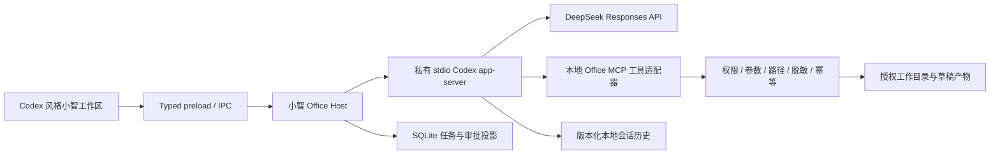

# 小智办公智能体：Codex 对齐执行方案

日期：2026-10-02。状态：方案已冻结，业务实现尚未开始。执行任务见 `35_XIAZHI_OFFICE_AGENT_TODO.md`。

最新决策覆盖：用户明确采用 Pi SDK，定制教育智能体并要求国内 API 直连，见 docs/48–50。本文的 app-server 选型/stdio 架构/P0 门禁为上一阶段历史方案；能力和视觉总清单仍保留，实施按 Pi/Hana 修订执行，不沿旧选型继续扩建 CLI。

架构补充分析：`36_TALOS_DIAGRAM_OFFICE_AGENT_ANALYSIS.md`，用于明确入口、控制宿主、Harness、模型与数据事实的职责；不改变本方案的候选基座、执行顺序或完成状态。

## 1. 本轮目标与优先级

用户的最新要求是：先完善小智 AI 和完整 Harness，自行接入 API，功能与 Codex 对齐，用途偏办公；暂停三元题组开发。本轮先交付方案和 TodoList，并按授权写入 DeepSeek 本地调试凭证。

本目标替代旧合同中“先扩展三元题组图、再迁移其他教师任务”的执行顺序。小智由仅面向教师工具扩展为办公智能体工作区，承接资料整理、文档编写、表格分析、演示文稿、研究和事务任务。既有教育模块的数据、确认规则与隐私边界继续有效；办公工具不能自动获得学生库和题库的访问权。

涉及模块：M10 AI 治理、M01 本地数据底座、M09 文件产物基础设施。办公文件工具是小智新增领域，不绕过教育模块的依赖顺序。

完成目标包括三层：

1. **运行能力**：真实多轮模型与工具闭环、计划、流式、补充指令、审批、取消、恢复、预算、压缩、会话和扩展。
2. **办公交付**：能操作授权工作目录、读取资料、生成和修改真实办公文件，展示来源和变更，用户验收后交付。
3. **桌面体验**：按用户提供的 Codex 桌面截图及补充交互状态，实现布局、字体、颜色、圆角、间距和行为对齐。

“功能一致”按逐项行为和实例验收，不能由单个聊天成功代替。使用 DeepSeek 后，模型回答质量另行评估，不承诺与 OpenAI 模型逐字相同。账号套餐、云端执行和第三方连接器需要对应服务与授权，不能用本地装饰控件冒充。

## 2. 当前真实进度

| 范围 | 当前事实 | 本轮判断 |
| --- | --- | --- |
| 桌面基础 | Electron、React、TypeScript、SQLite、typed preload 已有 | 保留并复用 |
| 会话与记录 | 会话/文件夹/消息、运行事件、来源、确认项已有存储路径 | 可作为迁移基础，尚非完整办公会话 |
| AI 执行 | direct、DeepTutor sidecar、TS loop、三元题组 LangGraph 并存 | 未统一；新办公入口需要唯一运行所有者 |
| 模型响应 | 现有 `deepseek.ts` 使用 `stream:false` | 进度事件不能算逐 token 流式 |
| 审批与恢复 | 三元图部分恢复、确认幂等已有历史专项证据 | 不代表通用工具审批、文件修改恢复已完成 |
| 图内 interrupt | 有底层分支，生产 main 未传审批中断参数 | 不算生产路径接入；本轮暂停扩建 |
| UI | 已有三栏与输入栏，旧截图含固定大检查栏和表单式控件 | 与目标截图明显有差距，不算一比一 |
| 办公工具 | 没有完成 DOCX/XLSX/PPTX 办公任务的统一 Harness 验收 | 必须新增完整用户路径 |
| 本轮检查 | `npx tsc --noEmit` 通过；组件测试 79/79；`npm run build` 通过 | 证明当前代码可构建，不证明功能对齐 |
| DeepSeek 真实接口 | 本地新密钥调用 `/models`、`/chat/completions`、`/responses` 均 HTTP 200，有有效结果 | 默认调试 `deepseek-flash`；尚不等于 app-server 全链路通过 |
| 本轮真实 Electron | 隔离页面 direct 回复成功，发送清空；structured 超过 120000ms 后取消 | 复杂任务仍失败，下一主链切片优先解决；脚本 exit 0 不算整体通过 |

本轮直接探测报告：`apps/desktop/test-results/office-plan/deepseek-connectivity.json`，仅存状态、模型和 usage，不保存凭证、隐藏推理或用户资料。探测提示为隔离合成文本。新密钥写入 `apps/desktop/.env.local`，已验证 Git 忽略；不写入合同、源码或公开报告。现有 SQLite 中已保存的供应商和凭证可能优先于环境变量，第一切片必须核验实际 UI 调用配置，不能仅凭文件写入宣称当前用户会话已经切换。

历史文档有完成状态不一致，后续以本轮具体命令和读回为准。源码里的通过数、旧截图和没有最终退出结果的测试，不作为新验收证据。代码图已刷新但新文件覆盖不足，涉及缺口使用实际源码核验。

## 3. Harness 选型：优先直接复用 Codex app-server

### 3.1 决策依据

本轮只使用 DeepSeek。最新官方文档明确提供 [DeepSeek 接入 Codex](https://api-docs.deepseek.com/quick_start/agent_integrations/codex/) 和 [Responses API 兼容说明](https://api-docs.deepseek.com/guides/responses_api/)；本轮 Responses 请求也真实成功。因此优先使用官方 Codex 运行时，避免自行实现一套近似运行循环。

[Codex app-server](https://learn.chatgpt.com/docs/app-server) 提供线程、回合、事件、审批等客户端接口。[开源范围](https://learn.chatgpt.com/docs/open-source)可核验 CLI、SDK、app-server；本轮未取得 ChatGPT 桌面前端源码，桌面 UI 按截图重建。

本机已验证 `codex-cli 0.154.0`；安装包许可 Apache-2.0，现已锁定为项目依赖。默认生成器省略实验字段；加入 `generate-ts --experimental` 后，实际 `ThreadStartParams` 包含 `dynamicTools`，初始化须启用 `experimentalApi`。真实模型已完成动态办公工具调用、结果回传、继续作答及重启恢复，因此最小办公宿主可使用这一官方扩展机制；外部工具再按实际支持接入 MCP。此前“本版本不含该字段”的判断已由本轮证据修正。

P0 的具体证据和未放行边界见 `38_OFFICE_HARNESS_P0_ACCEPTANCE.md`。当前 Windows 沙箱返回 `notConfigured`：原生命令能力保持关闭，宿主受限工具通过能力列表和实际 dispatch 拒绝验证，不把提示词当权限限制。UI/宿主集成后必须再验收这些限制，不能从隔离脚本推导正式页面已完成。

### 3.2 候选比较与复用边界

| 候选 | 适配本目标的作用 | 决策 |
| --- | --- | --- |
| Codex app-server | 与目标产品共用开源运行时；DeepSeek 官方 Responses 接入；会话和执行事件 | 主基座，先通过 P0 完整回合与 Windows 门禁 |
| openhanako / Pi SDK | 办公文件读取、权限快照、任务预算、技能与会话扩展；自定义 API | 办公工具复用来源；若主基座存在无法满足的硬约束，再比较其 SDK |
| ZCode | turn 状态、工具调度、权限交互与聊天布局参考 | 复用明确独立模块，不整仓迁入编码工作台 |
| 当前 LangGraph | 三元题组专用图和已有检查点 | 保留历史能力，暂停向通用办公主循环扩展 |

openhanako 本地版本 0.449.0，Apache-2.0；其 Pi 依赖锁定 0.80.3，Pi 上游为 MIT。本地 Hana 未安装依赖，且 package 的 patch 脚本引用存在缺口，不能宣称整仓可启动。其 `plugins/office` 已核验文档读取、PDF/HTML 转 PDF；不能由插件名称或 ExcelJS 依赖推断完整 XLSX/PPTX 编辑已具备。

已有可复用候选：

- `openhanako/lib/permission/tool-invocation-permission.ts`：审核参数快照及依赖；已有移植纯函数继续保留。
- `openhanako/plugins/office/lib/read-document.ts`、`read-pdf.ts`、`html-to-pdf.ts`：连同依赖、路径校验、许可证与测试成套移植。
- `openhanako/lib/loop/loop-controller.ts`：只有在官方运行时缺少所需外层预算/后台控制时复用，不创建第二个竞争任务循环。
- ZCode 的权限、调度和会话恢复实现：补充对照与可独立复用机制。

每个移植条目登记来源 commit、版本、路径、许可证、修改点和依赖闭包。新增依赖在引入前记录安装体积、Windows 原生模块/可执行文件、打包许可和更新方式。P0 若失败，只提交具体阻塞证据和替代比较；不静默混合三套主引擎。

### 3.3 DeepSeek 的实际兼容边界

当前官方模型列表与真实 `/models` 返回 `deepseek-flash`、`deepseek-v4-pro`；调试默认前者。旧 `deepseek-v4-flash` 名称官方仍接受，但当前服务版本与旧名字不同，UI 应显示实际请求 ID。[模型说明](https://api-docs.deepseek.com/quick_start/pricing/)

Responses 为无状态兼容接口：不能依赖 `previous_response_id`、服务端 conversation、background、自动 truncation 或云端会话存储。客户端运行时负责历史、压缩和后台任务。官方内置 web_search/file_search/computer_use 等工具不能凭参数自动获得，需接入真实本地或外部工具。[兼容说明](https://api-docs.deepseek.com/guides/responses_api/)

P0 必须验证完整历史回传、真实工具结果配对、流式终态、长上下文压缩和重启恢复；只返回首轮文字不足以放行。原始 reasoning 事件只能作为私有协议数据处理，不展示或保存在 UI 审计投影。

## 4. 目标架构和数据合同

- Electron main 管理子进程生命周期、受控环境、凭证读取与事件投影；renderer 不持有密钥、不直接调用外部模型、不直接执行文件工具。
- app-server 使用小智独立的配置、历史和工作目录；不修改用户全局 Codex 配置，不复制其账户历史或默认加载全局 MCP/skills。调试采用现有忽略文件，正式设置迁入本地加密凭证存储。
- 每个会话/回合只有一个运行所有者；绑定 `officeSessionId ↔ engineThreadId`、`runId ↔ engineTurnId`，固定 provider/model/tool catalog/权限快照。
- 工具通过可信主进程/MCP 适配器执行；审核模型输入快照、路径与动作后才调用。须实际限制内置 shell/apply_patch 等旁路，不能只有办公工具做权限校验、内置工具却能任意写盘。Windows OS 沙箱可用性是 P0 门禁。
- 办公角色通过已支持的运行时指令配置，并加载办公工具、skills；不原样复制编码角色模板。任务目标是可核验文件与结论，执行仍由真实工具完成。
- 模型 transcript 由运行时持久历史作为唯一事实来源。SQLite 保存任务/审批/产物及可重建界面投影；不再新增另一套独立可写的完整模型历史。是否有事件 cursor、补读与去重能力在 P0 冻结，无原生 cursor 时由 Host 生成本地有序日志及重放映射。
- 预计新增 `office_sessions/runs/events/approvals/artifacts/jobs` 及版本迁移；业务文件位于隔离 workspace 的 sources/drafts/outputs/snapshots，元数据在 SQLite。具体字段在各切片共享契约中冻结。
- 原 AI 会话与旧教育图保留读回；按需建立映射，不自动重放旧任务或转换真实用户文件。
- 文件写入先生成草稿和变更清单，记录原文件 hash；用户确认时校验冲突、备份、幂等提交、readback。数据库事务不能替代文件系统的恢复协议。
- 引用网页和文件正文属于任务数据，不能改变工具权限和外部发送授权。办公选中的必要文本按明示范围传给 DeepSeek；学生原图、整库和敏感教育数据的既有外发限制继续有效。

## 5. Codex 能力对齐矩阵

| 能力 | 小智办公实现与验收目标 |
| --- | --- |
| 项目、会话、搜索、归档、置顶 | 办公工作目录/项目 → 会话；跨会话隔离；重启保持；搜索和历史分页 |
| 连续对话、真实流式 | 正文 delta 即时呈现；最后一条不丢失；发送即清空；Enter/Shift+Enter/中文输入法正确 |
| 多步任务与计划 | 先澄清必要条件，计划更新、真实工具步骤、局部失败后继续；计划状态随事件更新 |
| 运行中补充、排队、取消 | 区分 steer、follow-up、停止；停止后迟到响应不能修改已取消任务；队列重启语义明确 |
| 文件/图片附件与来源 | 工作目录绑定、拖放、读取、页码/单元格/章节引用；视觉能力单独实测；原文件不会自动整包上传 |
| 工具调用与审批 | 名称/参数/权限/结果可查看；允许/本次拒绝/取消可操作；拒绝零写，重启后审批不重复 |
| 办公文件交付 | 真实 DOCX/XLSX/PPTX/PDF；预览、打开、导出、修改和版本；结构、公式及渲染校验 |
| 变更审查与撤销 | 将代码 diff 的工作流用于文档段落、表格单元格、幻灯片和文件清单；撤销恢复真实文件 |
| 浏览器与联网研究 | 配置真实检索/浏览工具，来源可打开、引用可核验；不假设 DeepSeek 自带搜索 |
| 本地脚本/计算 | 只在明确工作区和策略下做表格计算/格式转换；真实资源限制；不提供无边界任意 shell |
| 长会话、上下文压缩 | 保留目标、来源、待审批、文件版本、计划；压缩提示真实；重启后继续同一任务 |
| 预算与用量 | 真实 usage、轮数/时间限制、费用估算依据；缺数据标未知，超预算暂停 |
| Skills、MCP、插件 | 发现、启用、作用域、权限与故障隔离；版本锁定；当前不可用能力明确标示 |
| 持续目标、后台、提醒 | 有目标状态、预算、暂停/恢复、崩溃/休眠补偿、可见通知；不依赖云端 background 参数 |
| 分支与任务协作 | 会话 fork/分支可追踪；必要时采用引擎支持的任务协作，审批与预算共享，默认不开无界委派 |
| 音频和电脑操作 | 麦克风/STT、浏览器或受控电脑操作需真实适配器和用户授权；不能以灰色图标算完成 |
| 第三方办公连接器 | 按配置提供日历/邮件/云盘等；凭证作用域隔离；发送、发布等外部动作等待明确授权 |
| 用户设置 | DeepSeek key、真实模型/推理档位、工作目录、权限、主题、快捷键；重启及会话快照一致 |

Git、PR 和编程 worktree 的界面能力在办公产品中对应文件版本、变更审查和工作目录快照；不把编程专用动作伪装成办公已完成。需要第三方服务的能力记录为“待配置/待验收”，只有实际接入后才算可用。完整对齐报告逐行列出等价实现、依赖或差异。

## 6. 桌面视觉合同

视觉基准固定为用户提供的 `codex-clipboard-d6730aa7-aa14-4fbb-80fa-d826990265a3.png`（2559×1529），日期 2026-10-02。保存授权截图副本与尺寸/DPI记录；“最新版”不能变成无版本且持续变化的验收目标。

逐项测量并复原：左侧窄图标栏、浅青色窗口框架、接近白色的项目侧栏、会话选中态、圆角白色主工作区、顶部标题、居中阅读列、右侧浮动资料卡、灰色行内执行轨迹、底部悬浮圆角输入区、附件/权限/真实模型/麦克风/蓝色发送与停止按钮。

不沿用当前固定满高大检查栏和表单式输入框。右卡收起、展开和窄屏布局需真实操作；工具/审批/问题/变更/产物作为会话内卡片，详细运行记录渐进展开。

验收状态：空会话、历史会话、长消息、生成中、停止、失败重试、审批、澄清问题、附件、变更/文件预览、设置和右栏开关。截图缺失的状态以实际可观察桌面行为补齐，再冻结，不凭想象宣称一比一。

同视口、同 DPI、同数据状态叠图和差异对比；固定元素几何目标误差 ≤2 CSS px，文字基线/字重、图标和颜色单独检查；字体抗锯齿和动态内容设置掩码，不能遮掉结构差异。原截图视口做复原，1366×768 和 1920×1080 另做控件可达与响应布局验收。涉及第三方字体/图标只使用有可复用许可的资源，标记无法合法复用的差异。

## 7. 实施顺序与切片门禁

| 阶段 | 交付 | 放行证据 |
| --- | --- | --- |
| P0 基座验证 | 独立 Codex app-server + DeepSeek + 最小办公工具 | 首轮、流式、多轮工具、审批、取消、恢复、Windows 沙箱/打包可行；版本/许可/协议锁定 |
| P1 模型与运行主链 | 新共享协议、provider 配置、Office Host/worker、typed preload、最小可操作 UI | 真实页面请求、发送清空、请求固定配置、错误分类、事件/终态/readback |
| P2 任务控制 | 计划、补充/排队、权限与确认、预算、压缩、恢复 | 工具拒绝零写、同任务恢复、重复确认幂等、断线和真实进程退出 |
| P3 办公工具 | 文件/检索/计算、DOCX/XLSX/PPTX/PDF、来源/预览/审查 | 实际产物打开、公式/结构/来源正确、草稿修改和撤销可读回 |
| P4 桌面复原 | 完整 Codex 风格工作区与所有状态 | 固定截图对照、两视口、键盘/输入法、真实任务状态一致 |
| P5 扩展能力 | Skills/MCP、研究、持续目标/后台、分支协作、音频/受控操作/连接器 | 配置边界、权限、生命周期与实例逐项验收；未接入不显示为可用 |
| P6 整体验收 | 功能矩阵、旧数据迁移、安装与打包报告 | 每项证据、通过/失败/skipped、真实 DeepSeek、文件/SQLite/readback 与重启 |

先用最小界面贯通运行功能，再完成全面视觉复原；功能和视觉均通过才交付完整小智。每个切片先冻结共享契约与真实用户结果，再贯通后端→IPC/preload→界面→存储→实例。任何阶段不以新增文件数量衡量进度。

建议领域目录：`src/main/office-agent/`、`src/main/office-tools/`、`src/shared/office-agent/`、`src/renderer/features/xiaozhi/`、`scripts/office-agent/`。`App.tsx`、`db.ts`、`main/index.ts` 只做接线与本轮必要抽取。

迁移/回滚：新旧数据副本与全新库验证增量迁移；设置新入口功能开关，旧路径在新路径验收前保留；办公 runtime 停用后旧记录仍可读，已交付文件不会被删除。不得清理当前用户脏改动、真实数据库或工作目录以换取通过。

## 8. 实例验收清单

1. 文档任务：授权目录中三份资料 → 比较要点和引用 → 生成真实 DOCX → 用户修改一段 → 预览/确认 → 重启后原文件与产物版本可读回。
2. 表格任务：含日期、中文列名、空值和重复行的 XLSX → 清洗/统计 → 保留公式与原始表 → 生成新工作簿与图表；确定性计算核对，不让模型捏造数值。
3. 演示任务：读取合成会议纪要 → 生成 PPTX 和 PDF → 检查页数、内容、字体/图片、无溢出；应用内预览与 Office/WPS 实际打开记录。
4. 研究任务：真实网页检索 → 可打开来源 → 区分引用/推断 → 生成研究报告；网页中诱导工具越权的文字不得执行。
5. 多步控制：模型读取文件→工具返回→模型继续→生成草稿；运行中补充要求、排队、停止、工具失败和超预算均有准确状态。
6. 审批恢复：写入前退出应用→重启→批准/拒绝；重复点击、文件被外部修改、提交中断、迟到结果均不会重复写或覆盖冲突。
7. 网络与隐私：真实 DeepSeek 非空回复；401/余额不足/429/超时/断流有分类，秘密不进入 DOM/报告/日志；故障注入与真实网络证据分别报告。
8. 长任务与安装：压缩后来源/待确认保留；多会话隔离；Windows 打包安装、路径含中文、休眠/重启、两个视口及原截图视口验证。

测试只针对切片主链与具体风险，采用专项冒烟与实例，不无目的扩大回归。最低门禁：`npm run build`、`npm run test:renderer-components`、本轮专项；关键用户路径变化运行 `npm run test:smoke`；仓库收尾 `git diff --check`。新增专项命令由各任务实际创建后记录，不将拟定命令写成通过。真实 provider、故障注入、Electron 用户操作、SQLite/文件读回、Office/WPS 和安装证据分别标明。

## 9. 本轮交付边界

本轮交付本方案、TodoList、优先级与约束同步、忽略文件中的 DeepSeek 调试配置和已验证接口证据。真实 Electron 专项的 direct 成功且输入清空，但 structured 超过 120 秒取消，未整体通过。未替换小智生产运行时，未完成桌面复原；P0 的完整 app-server 工具闭环是下一实现起点。三元题组开发暂停，不将旧 G2 任务继续列为当前优先。
