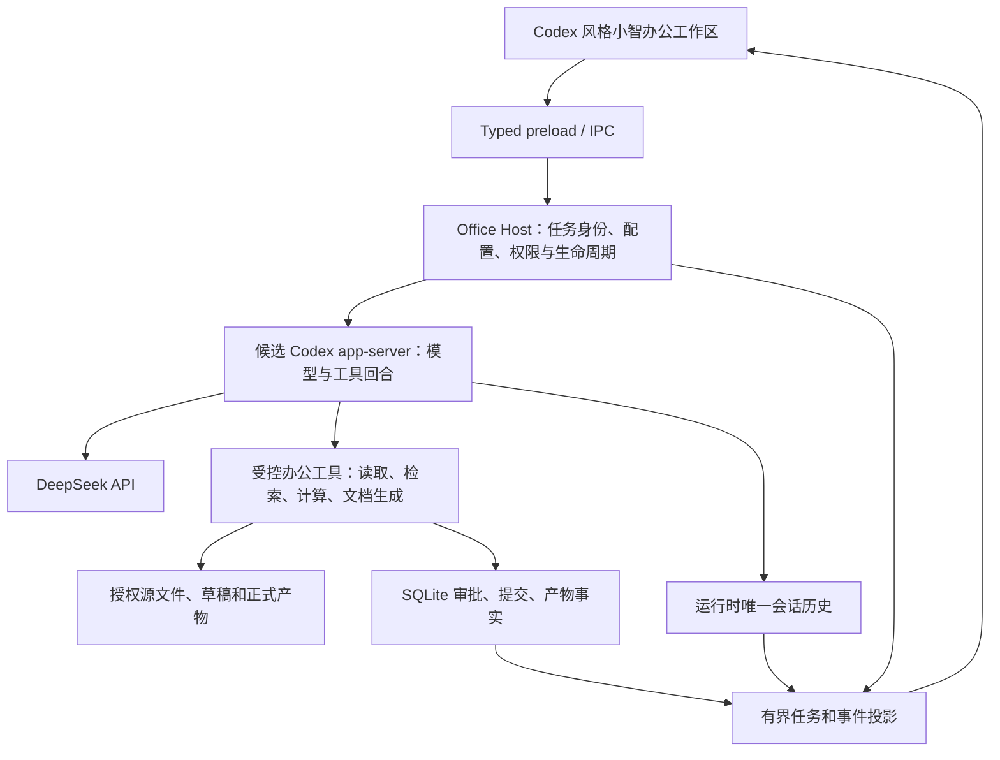

# TALOS 架构图片分析与小智办公智能体映射

日期：2026-10-02。输入：用户提供的 `codex-clipboard-a30fd192-3b4a-4624-85b3-f8ec35ddecca.jpg`，1440×903；图标题为 TALOS 当前全景系统架构，标注 2026-10-01。

本文件分析图片，不证明 TALOS 的源码、运行状态、开源许可或完成度。图中较小的文字和部分连线模糊，以下区分可辨内容与设计推断；不猜测 AOR/DHC 的英文全称。当前实现合同仍为 docs/34，执行台账仍为 docs/35，本分析不另建主运行时。

## 1. 图片表达的系统分层

图片从左到右呈现四个区域：用户与产品入口、本机访问入口、实际运行组件、数据与外部提供方。不是单个聊天界面或简单的模型调用架构。

| 区域 | 可辨内容 | 从关系作出的解释 | 小智对应 |
| --- | --- | --- | --- |
| 用户入口 | TALOS Lens 桌面工作台；Codex/Claude；Obsidian；DHC iPhone 远程会话控制 | 桌面、CLI/外部智能体、笔记、远程设备是不同入口 | 先小智桌面；CLI/笔记/移动端后续按需要增加 |
| 访问入口 | Lens Rust IPC 与本机数据入口；talosctl/Python；Persona 接口；DHC Mac 会话与设备配对入口 | 入口先进入受管理接口，界面不直接决定所有执行与数据写入 | typed preload → Electron main 的 Office Host |
| 运行组件 | Lens 本机后端；Bonsai 本地模型服务；AOR 原生运行器；TALOS System；Persona；Qwen/Laya 训练进程；DHC/Harness | 模型推理、任务执行、控制/治理、领域服务、训练、远程会话分开部署或组织 | Codex app-server、DeepSeek 网关、办公工具和宿主控制分工 |
| 数据与外部提供方 | AOR SQLite 中的 run/事件；治理事实；Persona Markdown；训练数据/检查点；业务记录；缓存/索引；远程会话配对记录；Realtime API 字样 | 不同事实与派生数据有不同存储和生命周期 | 运行历史、SQLite 审批/任务/产物事实、本地文件、可重建搜索/缓存 |

箭头显示调用和写入关系；图片无法证明它们是同步还是异步、是否事务、是否幂等，也无法仅凭颜色区分已上线与计划模块。虚线没有清楚图例，不直接判定为已实现或未来模块。

图中的 Codex/Claude 位于产品入口区域，不能据此推断 TALOS 就是 Codex 内部架构，也不能推断 AOR 是 Codex 的官方运行时。Lens 是该系统自己的桌面产品入口，不能据图声称可以直接复用其源码。

## 2. 可借鉴的核心关系

### 2.1 把界面、管理、执行分开

图中 Lens、IPC、本机后端与 AOR 分开，提示小智需要明确职责：

- UI：提交需求、展示真实过程、收集补充输入/审批、查看产物。
- Host：创建任务身份、绑定工作目录、配置快照、权限、进程生命周期和界面投影。
- Harness：模型/工具回合、历史和运行事件；使用候选运行时真实支持的能力。
- 工具：实际读取、计算、生成和修改文件，返回可验证结果。

UI 中出现“完成”必须由任务条件计算，不能由最后一条 assistant 文本或前端计时器决定。关闭视图与取消任务是不同动作；退出整个应用后的暂停、恢复或中断语义需另行实现。

### 2.2 模型服务与 Harness 是不同责任

Bonsai 在图中是本地模型服务，AOR 是单独的运行器。对小智，DeepSeek 提供生成、工具请求及协议响应；完整的任务控制、工具权限、文件写入、审批和恢复由运行时/宿主完成。

不能把 API 换成新的模型就当作拥有新 Harness。也不能假定使用了 Codex app-server 后，模型供应商、宿主适配、文件工具和 UI 的全部能力都自动具备。沿用 docs/34 的主基座候选，P0 逐项实测后才确认可接管。

### 2.3 任务身份、事件和运行所有权

图中 AOR 与 run/事件存储之间存在明确关联，运行器节点里可辨租约和事件字样。对小智有三项直接启示：

1. 一项任务有稳定身份，并关联会话、引擎线程/回合、工具调用、审批和产物。
2. 执行步骤来自真实事件；重启后通过历史和事实读回恢复，不依赖 React 内存。
3. 一项运行由一个所有者推进，不能同时让旧 sidecar、新 Harness 和后台调度重复续跑。

图片没有证明其租约实现。小智先采用单运行所有者与已有引擎的互斥/恢复能力；只有存在多个进程竞争认领时，才增加持久认领、租约与 fencing 校验。不能为了模仿名词引入分布式服务或第二套调度器。

停止操作要传到模型请求、工具进程及写入提交门禁；被取消任务的迟到响应不能创建新的业务效果。文件副作用必须有独立幂等和提交恢复记录，不能仅重放消息历史。

### 2.4 数据分类与唯一事实来源

右侧多个存储图标的价值是区分用途，小智不必照搬多个数据库。

| 数据类别 | 应保存什么 | 约束 |
| --- | --- | --- |
| 模型会话历史 | 用户消息、模型/工具协议历史、压缩边界 | 运行时唯一模型 transcript，界面投影不能反向另写一套历史 |
| 任务/运行/审批事实 | 任务状态、执行身份、权限快照引用、确认决定、审计事件 | SQLite 或已冻结适配；去重、可读回、可恢复 |
| 办公产物与源文件 | DOCX/XLSX/PPTX/PDF、源文件版本与 hash | 文件系统保存，SQLite 记录元数据；索引不能覆盖原文件 |
| 项目知识与用户记忆 | 明确来源和作用域的偏好、模板、项目事实 | 允许查看/修正/删除；会话、项目、用户级分开；不能将未经审核摘要提升为权限 |
| 派生数据 | 全文/向量索引、预览、缩略图、缓存 | 可重建；不是审批或文件状态真源 |
| 凭证 | API key、外部服务授权 | 私有加密配置或本地调试环境；不进入模型 transcript、日志、记忆或 UI |

文件系统与 SQLite 无法天然组成一个事务。提交应记录批准范围、输入版本、目标版本和提交阶段；崩溃后通过 readback 对账，发现冲突停在可操作状态。

### 2.5 记忆、领域服务与扩展有独立作用域

图里 Obsidian/Persona/Markdown 和业务记录分开，适合办公场景中的项目资料与长期偏好管理。

小智需要区分：当前任务材料、项目知识、用户确认的偏好、模型会话摘要和系统权限。资料里的句子不自动成为运行指令；生成的摘要不自动成为真实业务事实。来源、版本和有效范围必须保留。

办公工具模块通过受控适配器接入，不把所有业务塞进 prompt 或主进程入口文件。一个工具应有参数 schema、效果分类、路径/网络作用域、超时/取消、版本化结果、来源与错误码。格式转换工具返回文件和校验结果，不仅返回“已经完成”文字。

### 2.6 多入口和远程控制不改变权限边界

DHC iPhone → Mac 配对入口 → Harness → 会话/配对记录的底部链路体现远程接入与设备身份的分工。小智以后接移动端时，应连接同一任务控制入口，继承权限和审批；不直接暴露任意工具调用、shell 或数据库写入。

当前只需要桌面入口；远程配对、Realtime 语音与外部连接器仍按 docs/35 的后续任务验收，不因图片中出现节点而提前增加。

## 3. 图片不能替代的实现细节

| 图片尚未说明的点 | 小智需要补充的合同与验收 |
| --- | --- |
| 执行状态与成功条件 | 区分模型回合完成、待审批、文件提交完成、任务完成；每个转换有事件和原因 |
| 接口与关联 ID | requestId、sessionId、runId、thread/turnId、toolCallId、approvalId、artifactId；不是让每层自建无关联编号 |
| 工具与审批契约 | 审核固定参数/作用域/文件版本；审批有效范围、拒绝、过期、重复提交、重启后处理 |
| 恢复及文件一致性 | 谁认领、从哪里恢复、哪些只读步骤可重执行、哪些副作用需对账、如何处理冲突 |
| 事件和错误 | 补读/序号/去重、超时来源、阶段耗时、网络/工具/输出/提交错误；前端不得拼装假状态 |
| 预算和能力差异 | 模型调用、工具运行、整个任务分别有上限；实际 usage 与能力，不套用广告窗口长度 |
| 部署和可信度 | 进程边界、沙箱与版本兼容、依赖/许可证；框图存在不代表源码可复用或已成功运行 |
| 结果验收 | 输出文件打开、结构、公式、引用与内容检验；聊天文字不能代表产物有效 |

尤其要避免多条横向写入箭头变成“任何模块都能改同一事实”。一个事实有一个负责写入的组件，其他组件按契约请求修改或读取投影；图上重叠的关系在实现时应拆成调用、事件、事实写入三种关系。

## 4. 对小智的精简映射

图中的 Persona 类作用映射为项目知识/用户记忆管理；索引和缓存作为可重建数据。模型供应商先固定 DeepSeek，不建设 Bonsai 本地模型或 Qwen/Laya 训练系统。控制宿主、办公领域工具与运行时都在现有 Electron 技术栈中按职责组织；拆职责不等于必须拆成很多微服务。

## 5. 一个办公实例贯穿所有层

请求：“把这个目录中的会议纪要和销售表整理成一份周报，生成 Word，附统计图。”

1. 用户选择授权目录。界面发送需求并清空已发送输入；附件显示独立来源，不继续留在输入草稿中。
2. Host 建立任务，绑定会话/工作目录/当前 DeepSeek/权限与工具目录。模型历史和 API key 的存储分开。
3. Harness 列出计划，并向工具请求读取纪要与工作簿；工具只读授权路径，返回有页码/单元格来源的必要内容。
4. 计算工具得出销售统计，返回可验证数字、计算规则和图表文件。模型根据这些结果继续，不自行编造统计值。
5. 文档工具生成真实 DOCX 草稿，校验标题、段落、图表、引用和可打开性；登记 artifact。
6. 小智在会话内显示预览与变更，任务保持待审批。模型说“已生成”不代表文件已正式提交。
7. 用户确认后校验原文件 hash 和批准范围，执行一次提交；拒绝则不修改正式文件。外部修改形成冲突，要求用户决定。
8. 读回文件和元数据后任务完成。应用重启后能看到同一任务、审批和文件；提交中断恢复先对账，不重新生成第二份正式文件。

该实例检验模型、Harness、工具、审批、数据和 UI 的责任关系。普通聊天成功只覆盖其中的短路径。

## 6. 下一步如何吸收，不扩大范围

现有 P0 H01–H06 顺序保持。增加以下检查角度，作为已有任务的验收细化而非新的平台建设：

1. H01/H06：证明单运行所有者和 identity 映射，确认独立历史与配置；并发认领若出现，再验证持久锁/lease。
2. H03：真实工具请求/结果配对，最小工具的受控路径与来源；返回结果后模型继续。
3. H04：待审批状态重启可见，允许/拒绝/取消作用于同一任务；不会假成功或重复执行。
4. H06/A04：历史读回与事件去重，UI 状态从实际事实投影；需要状态映射时保留引擎原始状态和映射规则。
5. A06：细分模型等待、工具运行、审批等待和产物提交的耗时与原因；针对已知复杂任务 120 秒超时定位卡在哪里，不能只延长总预算。
6. C05/O06：草稿、审批、正式提交与读回形成完整文件生命周期，验证崩溃和文件冲突。
7. C07：项目/会话/用户记忆作用域与来源；索引、摘要和 UI 缓存不成为另一份业务真源。

建议的用户可见状态映射为：准备、执行、等待输入、等待审批、暂停、恢复、完成、失败、取消。实际引擎未提供的状态只能由宿主基于持久事实计算；具体 schema 在 P0/A01 冻结，不能凭图假设 app-server 已提供每项状态。

## 7. 结论

这张图有助于把小智从聊天界面整理成可管理的办公任务系统。最适合采用的是入口、宿主控制、运行执行、模型服务、领域工具与数据事实的职责分离，以及运行所有权和可读回状态。

图片本身不能证明完整 Harness、源码许可或可复用代码；不据此更换已选候选、不复制训练平台和远程体系。下一实现仍从“独立 Codex app-server + DeepSeek + 一个真实办公工具”的 P0 开始，按完整任务过程与文件结果验收。
