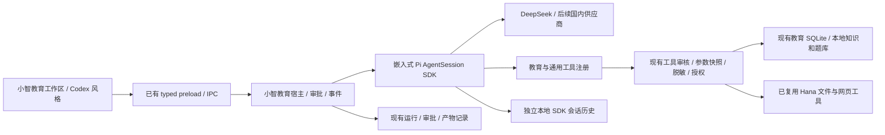

# 小智教育智能体：Pi SDK 基座与需求重新对齐

## 2026-10-03 P06b-B3桌面框架对齐检查点

docs/87–88 Windows原生overlay/Menu、实际导航与现成HeroUI/Pro、ZCode许可原函数适配通过；最终build5窗口21/文件22/真实过程13/审批5/renderer79/主smoke207。运行中Settings→Back同一active run，归档/晚到/重启不增加工具授权。Pi/Hana唯一循环与教育本地事实保持；下一P06c实际DeepSeek模型/设置、完整D1–D7/P07/P08，非Codex同源或全部完成。

## 2026-10-03 最新：P06b-B2本地文件面板通过，下一原生窗口框架

docs/85合同→86验收：xiaozhi.files.v1共享list/preview/失败/版本→独立workspace-files/API→现有production host授予根→typed preload→原Pro FileTree/AppLayout/Resizable+OSS Tabs正式页面。只读text/Markdown/签名图片/真实metadata，最多256项/深度8/1MiB文本/4MiB图片；Hana readonly resolver+workspace-authority/fd前后版本，禁止越界/凭证/链接/hardlink/归档。10秒终态和8个原生槽，取消不释放未结束OS槽。无新表/迁移/依赖/模型工具权限，正文不发送模型或保存偏好。

最终宿主22/22(rGRSMC)、正式页面22/22(taw9qA)、build7 exit0(index--ekkS71V)/renderer79/固定最终out主smoke207/oktrue/原Pro源32、最终审批5/5(f4M5MX)通过。实际tree/tab/text/Markdown/PNG/旧版本拒绝/刷新/缺失/大文件/双视口发送可达/真实拖宽/模式与宽度重启/归档拒绝/未知和归档偏好fallback均验。真实DeepSeek公开过程13/13(PhSxGp，build6)，含active时本地preview；其后只读IPC deadline修订经最终build7/宿主22/UI22/207重验，Pi/renderer无后续变更。图/报告原字节在docs/design/codex-2026-10-03/p06-files；失败和精确先后见86。

UI prefs：xiaozhi.ui.v1保留旧schema1并可选files=true；原Resizable尺寸key独立；xiaozhi.current-session.v1只保存ID，main当前活动列表核验，未知/归档fallback。会话切换/关闭清正文/tabs/请求，不授权私有历史。PDF/Office仅元信息和明确不支持，完整阅读与产物P07仍需完成。

**下一第一动作P06b-B3：读docs/67第1/2/5/8/9、35最新队列、86第6节；图查当前BrowserWindow/Menu与窗口导航，冻结docs/87原生框架合同，再复用现成desktop frame/现有菜单并做含native frame的双视口/缩放实例。** D4.1/D4.2子项通过，原生框架/同DPI/控制输入细节/设置与完整D1–D7未勾；不能称Pro为Codex官方同源。随后P06c国内模型/权限/Skills/偏好、P07Office/PDF/办公联网/图片、P08实际无VPN安装/最终八组实例。总目标active，三元题组暂停，无commit/push/系统网络或真实教师库修改。下方旧“最新/下一”均历史。

## 2026-10-03 最新：P06b-B1壳与资料卡通过，下一真实文件面板

docs/83合同→84验收：正式Pi复用原Pro AppLayout/Sidebar/Sheet/Resizable闭包32文件182153bytes，窄轨62/侧栏304/标题62、近白会话树、居中阅读/输入与紧凑资料卡已接真实会话操作；详情保留模型/预算/记忆/compact。xiaozhi.ui.v1仅保存两个展示布尔，不授予文件/模型权限。新增锁定react-resizable-panels4.11.2/MIT/解压536812bytes，无native服务，不是安装包增量；Pro不是Codex同源。

最终build4 exit0(index-CqWbvGx8)、renderer79、Pro源32、固定out主smoke207/207(oktrue)；正式壳10/10(ca08ah)、真实DeepSeek过程12/12(eDjvkc)、教师审批5/5(WVsGFB)均exit0。搜索/重命名/拖动分类/归档/双视口/重启偏好与main事实回读通过；过程身份顺序/来源/实际时间/compact/停止/发送清空和拒绝零写入/确认一次复制保持。原字节图与报告在docs/design/codex-2026-10-03/p06-shell，精确命令/失败/边界见84。最终diff以收尾日志为准。

**下一第一动作P06b-B2：读docs/67第1/2/5/8/9、35最新队列、83/84第6节，细化版本化文件preview合同；图先追已有main workspace授权/只读/路径/版本，shared→main→typed preload→原FileTree/Tabs/本地preview→真实文件实例。** FileTree源已复制但未接页面，资料卡不算文件面板。原生窗口/菜单、文件面板拖宽、参考DPI/同尺度≤2px仍待验；只勾D4.1，不勾D4/P06b/P06。随后P06c设置、P07办公联网/图片、P08实际无VPN安装/最终八组实例；总目标active，三元题组暂停，无commit/push/系统网络或真实教师库修改。下方旧“最新/下一”均为历史快照。

## 2026-10-03 最新：P06a公开过程通过

docs/81–82完成真实公开text与工具交错、原Pro Group逐call来源/状态/实测时间、真实usage轮次时间及native整理细行，Pi/Hana唯一循环保持。正式DeepSeek过程12/审批5、契约5/source16/build/renderer79/固定out主smoke207通过；无新表/IPC/依赖/工具权限。D1当前测量基线与before/after/live持久化，参考DPI未知，完整视觉不勾。下一第一动作P06b合同/现成布局侧栏tabs/file-tree闭包→现有教育会话与文件权限→窄轨/侧栏/阅读列/资料卡/真实文件面板；P06c设置/P07办公联网/P08实际无VPN安装继续，总目标active。

## 2026-10-03 P05技能框架完成（历史）

docs/79–80完成P05-B3正式管理契约/IPC/preload/本地目录chooser/设置和Hana SkillRow/Badge。实际教师导入默认关闭→启用→native/read→真实compact→编辑/关闭隔离→重启/跨会话/归档再导入/坏源恢复25项全部通过，内建兼容12、API15/host9/build/renderer79/主smoke207通过。Pi0.80.3/Hana唯一循环与教育权限保持，无新依赖；P05既定框架范围完成，Office文件生成仍P07。下一第一动作P06读docs/67原图/矩阵，冻结D1校准合同，再真实过程行/壳/面板/国内模型设置；完整视觉与P07/P08未完成。下面阶段描述均为历史快照。

日期：2026-10-02。用户已明确同意使用 Pi SDK；本修订覆盖 docs/34–47 中“Codex app-server 为默认主引擎”的决策。旧实例证据保留，不扩张为新 SDK 已完成。

2026-10-03最新：docs/64完成原生自动18/18、边界控制7/7、默认策略与手动复验19/19；默认auto开启且要求官方同ID能力/安全缓存，未知关闭，本地回退可用。保留原历史/事实/权限，摘要仍原生，Hana每轮接缝覆盖工具中途整理。下一项B3教育scope/队列编辑撤回，再P05–P08。用户要求先完成目标，不做token成本优化；完整体验和一比一视觉仍未完成。

## 2026-10-03 当前Skills生产接入

docs/77–78完成P05-B2独立技能authority/原生撤销、memory/skills排除编号合并、严格旧A v1迁移、正式有效目录/必要脱敏文本/全局锁与binding4。真实内建12/旧A真实升级7/native22/host9/新旧state15与build/renderer79/smoke207通过。仍嵌入Pi0.80.3/Hana，不接Codex CLI；没有第二模型循环。下一B3正式技能管理typed契约/IPC/现成UI/真实启停编辑摘要撤销，完整P05未完成；之后P06 docs/67原图D1–D7、P07/P08。下方各“尚无/下一条”为历史阶段事实。

## 1. 产品目标

2026-10-03最新：docs/70–71原生记忆隔离基础15/15，Pi branch+append保留原历史，authority/readSelected和被隔离run的protectedContext排除机制已实现；最新smoke207/207。当前尚无正式模型记忆工具，下一条直接接host/session全部准入点/受控工具/UI与真实DeepSeek，B3b2/P04仍未完成；嵌入Pi/Hana与docs/67设计基准不变。

2026-10-03当前：docs/68–69本地教育记忆范围B3b1通过真实18项，原教师事实保持，会话选择默认关闭且显式保存metadata。模型读取仍未接入，下一条B3b2先处理已引用内容在Pi历史/压缩摘要中的撤销隔离与旧SDK兼容，再接受控工具；完整P04和一比一UI仍未完成。docs/67设计恢复基准保持。

2026-10-03最新：B3a按docs/66完成真实queue15/旧v1副本3/边界9，最新build/renderer79/smoke207；B3b显式教育记忆scope下一项，完整P04仍未完成。用户最新Codex实时工作过程、组件与界面基准固定于docs/67及持久原图。继续嵌入Pi/Hana、国内API/教育事实，P06执行前必读；设计不等于已实现。

小智是本项目的教育智能体：帮助教师读取与整理资料、检索知识、备课、题目解析、生成练习草稿及教育办公文件。保留原教育模块、数据来源与教师确认；三元题组的专项扩建仍暂停。通用文件、联网和办公工具为这些任务服务。

Codex 提供桌面布局、连续对话、公开分段说明、计划、工具过程、澄清/审批、停止、恢复、文件产物、Skills 和设置的行为参照。小智身份、提示词、工具和数据权限按教育业务定制。运行基座采用 Pi SDK，直接使用用户自己的国内 API，不要求 OpenAI 登录。

## 2. 当前方式与 Hana 源码证据

| 项目 | 实际方式 | 对小智的决定 |
|---|---|---|
| 此前 Codex 实验 | `@openai/codex` native exe → app-server stdio → DeepSeek Responses → dynamicTools；没有使用 CLI 界面，但仍依赖 CLI 引擎 | 停止默认主链扩建，保留隔离实验作为协议/状态对照；SDK 交付前不删除旧教育入口 |
| Hana 0.449.0 | `lib/pi-sdk/index.ts` 导入 Pi SDK；`core/session-coordinator.ts` 调用 createAgentSession；Agent 提供提示词/工具/记忆，会话冻结模型与目录 | 复用 SDK 和必要适配，不启动 Hana CLI，不整仓迁入其人格/社交/多入口服务 |
| Pi 0.80.3 | MIT；SDK 直接嵌入 Node/Electron，提供会话、流式、工具、steer/followUp、取消、压缩和扩展 | 新默认 Harness，禁止同时保留第二个竞争模型循环 |

核对的 Hana 文件包括 `lib/pi-sdk/session-options.ts`（工具对象 → customTools + 名称 allowlist）、`core/provider-compat/deepseek.ts`（真实推理内容工具历史配对）、`core/agent.ts`（独立身份/工具/记忆）、`core/skill-manager.ts`（SKILL.md 发现）。本地 Hana 快照存在缺文件/patch 脚本缺口，不能直接声称整仓启动可用。

Pi npm 0.80.3 的 gitHead 为 `a23abe4a695df8b69b613f73e9fdda2a8af894d4`。[该版本 SDK 文档](https://github.com/earendil-works/pi/blob/a23abe4a695df8b69b613f73e9fdda2a8af894d4/packages/coding-agent/docs/sdk.md)及 full-control 示例已读取；固定源、许可、npm 元数据和 SHA256 在忽略目录 `apps/desktop/test-results/office-plan/references/pi-0.80.3/source-manifest.json`。不是引用最新版文档直接猜 0.80.3 参数。

## 3. 目标调用链与复用边界

- SDK 负责唯一模型/工具循环；main 负责凭证、权限、运行持久状态和公开事件；renderer 不持有 key 或直接执行工具。
- 复用 Pi full-control 初始化、SessionManager、资源/技能机制，显式独立 agentDir、模型和 customTools。替换默认编码 system prompt，显式禁用 SDK 默认 bash/write/edit 等工具；不加载用户全局 Pi/Codex 配置、OAuth、扩展或项目祖先技能。
- 教育工具接入已有 `ai-harness/tool-registry.ts` 及审核/执行路径，例如 `search_teacher_knowledge`、教研书籍检查/草稿、学习记录分析；不重新造题库/知识库，也不让模型直接 SQL。
- 继续用已复用 Hana 文件 read/stat/list/审批 copy/web_fetch；搜索服务单独验收。Hana 的工具输入快照/结果适配/DeepSeek 协议兼容函数按依赖闭包和许可移植，不复制角色扮演提示词。
- UI 继续采用现有 HeroUI Pro 组件与 finesse 参考，绑定实际 SDK 公开事件。分段说明、计划和工具步骤可展示；私有 reasoning 仅在供应商协议所需的私有历史中处理，不进入 UI 或公共审计日志。
- 模型历史只由选定 SDK SessionManager 管理；SQLite 保留教育事实、宿主 run/审批/产物及可重建投影。旧 Codex/教育图历史只读保留，不自动转换或重放；正式迁移需新库/旧库副本验证。

## 4. 不翻墙与国内 API 的完成标准

1. 安装后的应用启动、本地资料/题库功能不依赖 GitHub/npm/CDN/OpenAI；依赖、字体、图标和技能随安装包本地提供。
2. 首期仅 DeepSeek，main 直连已配置的国内官方 API；模型名称取真实目录与能力，不使用 Sonnet/Opus 的角色映射冒充模型。
3. 推理核心无必须的海外代理、Cloudflare DoH、国外搜索或 OAuth。默认尊重本机正常 DNS/直连；代理为用户显式可选设置，不能作为隐藏运行条件。
4. `api.anysearch.com` 的默认直连可用性未验证，Cloudflare DNS 仅为此前专项配置；二者不作为核心教育任务前置依赖。没有配置且没有直连实测的搜索能力显示待配置，不能假装已经可用。
5. 后续 GLM/通义等供应商按独立 adapter 和官方协议验证；各自凭证、模型、能力与单轮快照分离，失败不自动换供应商。
6. 最终必须在实际关闭代理/VPN的环境，完成“启动 → DeepSeek 流式 → 教育工具 → 草稿确认 → 文件/SQLite readback → 重启”实例。去掉代理环境变量的测试不等于系统 VPN 已关闭；当前机器尚无该完整证明，不宣称“不翻墙验收完成”。不擅自关闭用户系统代理/VPN。

Windows 任意命令/电脑操作仍需独立权限与实际沙箱验证。原 Codex elevated setup 授权不再是 Pi API/受限教育工具的前置条件，也不因选 Pi 自动获得系统修改授权。

## 5. 逐项执行顺序

2026-10-03最新：docs/72完成P04既定控制/预算/原生压缩/教育作用域和队列范围，最后真实记忆26/自动旧副本9、原生17/state13、renderer79/最新smoke207及build/diff通过。下一P05，完整Codex体验与P05–P08未完成；docs/67为视觉和压缩恢复基准。

| 切片 | 实际交付 | 最低实例与冒烟 |
|---|---|---|
| P01，隔离范围已通过，docs/51 | exact Pi SDK + 固定 full-control 初始化/教育身份/私有配置/DeepSeek；复用 Hana 工具适配 | 真实多轮读取教研文本后引用作答、正文 delta、停止、同会话重启/模型固定；禁默认 shell/全局资源；实际 Electron-main |
| P02，正式只读入口已通过，docs/53 | 现有教育知识工具接 SDK，统一小智正式 main → preload → 页面 | 真实 DeepSeek/Electron 11/11、新旧 schema 4/4、组件 79/79、旧入口 smoke 207/207；一比一视觉未完成 |
| P03，授权复制范围已通过，docs/55 | SessionManager + 现有 run/确认记录，持久命令/目录/审批 | 真实 UI/DeepSeek 22/22、复制边界 3/3、迁移 6/6；拒绝/停止零写、批准一次、崩溃不重放/只读核验；完整办公写入仍待 P07 |
| P04，既定范围已通过docs/57–72 | 计划/澄清/steer/followUp/分段、预算/usage、原生手动/自动整理、队列编辑/撤回、授权教育记忆与撤销隔离 | 最新记忆26/自动旧历史9、原生17/state13、build/renderer79/最新smoke207；只代表此控制记忆范围 |
| P05 | 教育 Skills：备课资料整理、知识检索、题目解析与练习草稿、教学办公产物 | A/B1/B2/B3既定技能框架范围按docs/73–80完成；正式管理真实25/内建12，授权导入编辑启停/不可变版本/CAS/原生摘要撤销/输入标签与真实支持矩阵通过。Pi/Hana复用、权限不扩大；Office文件生成仍P07，整体视觉P06未完成 |
| P06 | Codex 风格窗口、侧栏、阅读列、输入/权限/模型、右卡/设置 | HeroUI Pro 现有实现接真实数据；截图与状态对齐，1366/1920 可达；不做空按钮 |
| P07 | 完整联网与 DOCX/XLSX/PPTX/PDF、变更审查/撤销 | 国内直连联网实例、引用；真实办公文件读回/打开与审批；未配置的第三方服务如实标记 |
| P08 | 国内直连整体、旧数据/打包、八组最终实例 | 实际无 VPN 环境、build/组件/专项/必要 Electron smoke/diff；能力矩阵逐项核验 |

旧 docs/35 A/C/O/U/E/V 能力要求继续作为总清单，执行基座和产品落点按本修订；不重置或缩小完整能力目标。P01 不等于完成全部 Harness，P02 完成后才扩后续 UI/业务入口。

## 6. 每轮必须留下的记录

执行前冻结本轮合同；每輪记录：需求与来源、复用文件/版本/许可/差异、实际修改、精确测试与失败、未验证范围、下一步第一项及完成定义。更新 `1.Agent.md`、`2.Memory.md`、`3.Learning.md`、`4.Wiki.md` 和任务台账；合同/验收均留在 docs。不能把下一步的计划写成已实现，不能用隔离脚本代替正式页面验收。
