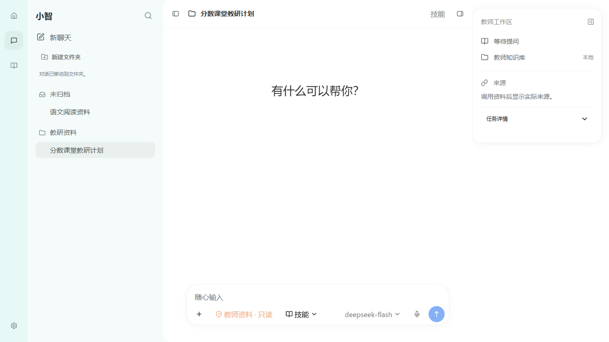
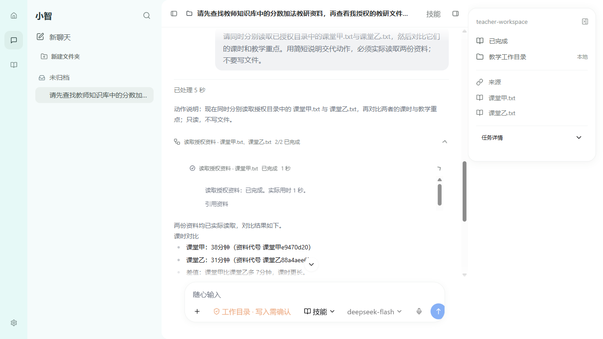

# P06b-B1：Codex 工作区壳与资料卡验收

日期：2026-10-03；M10/M01。合同：docs/83；持续设计基准：docs/67。**本切片通过；完整 P06b、Codex 页面一致性和总目标仍未完成。** 三元题组暂停。

## 1. 实际交付

- 正式 Pi 页面使用原 HeroUI Pro AppLayout、Sidebar、AsideTrigger、Sheet/Resizable 依赖闭包。新增浅青 62px 窄轨、304px 近白会话侧栏、62px 标题区、居中阅读与输入和紧凑资料卡。Home 返回真实教师工作台；聊天开关、Skills、模型设置均连接原有能力。
- 原 ChatListView 继续绑定 SQLite 会话与文件夹。正式页面完成新聊天、标题搜索、Escape 清空、切换、重命名、建文件夹、指针拖动分类和归档；不复制假的账号、通知或远端连接器。非 Pi 入口保留旧侧栏变体。
- PiWorkspaceContext 抽取原检查栏。默认显示本轮真实状态、目录和实际来源；展开任务详情可查看模型能力、用量/预算、教育记忆并执行 native compact。完整 typed callbacks 和 main 授权继续使用原链路，紧凑资料卡不能算文件预览。
- `xiaozhi.ui.v1` schema1 在 renderer 只保存 sidebar/aside 两个布尔展示偏好；坏值回默认。关闭、重开与应用重启保持。无凭证、文件授权或业务事实进入该偏好；没有新表、迁移、IPC、工具权限或第二模型循环。
- 公开工作过程保持“公开说明 → 实际工具 → 回执 → 下一段说明 → 最终结果”，活动中首段可见。展示公开 text、实际来源/状态/时长，供应商内部 reasoning 和私有摘要不显示。

## 2. 源码复用与依赖

HeroUI MCP 已查 AppLayout/Sidebar/FileTree/Tabs 文档；Pro 实现来自 `D:\WorkProject\HeroUIPro\herouipro-v3\src`。原包 `@ag-ui/pro 1.0.0-beta.7`；32 文件共 182153 bytes 的依赖闭包直接复制，源/output SHA 清单为 `apps/desktop/src/renderer/heroui-pro/workspace-source.json`。脚本 `reuse-workspace-components.mjs --verify` 最终 32/32 相同，不覆盖既有适配文件。FileTree 已准备源闭包，**尚未接正式用户路径**。

沿用现有编译 Pro CSS；教育事件绑定与小智作用域 CSS 属项目适配。Pro 许可边界沿现有 README，不宣称 MIT 或 Codex 官方同一份源码。Finesse 固定 AI-console/product 参考继续服从用户 R1/R2。

新增并锁定 `react-resizable-panels@4.11.2`，用于原 AppLayout/Resizable。npm 官方 metadata：MIT、解压 536812 bytes；纯 React/JS/类型，无 native addon/服务。安装命令 `npm install --save-exact react-resizable-panels@4.11.2 --ignore-scripts --no-fund --no-audit` exit0，新增一个包；package.json/lock 更新。此数字不是 Windows 安装包增量，安装包仍 P08。

## 3. 最终命令与证据

cwd 为 `D:\WorkProject\EduProject\apps\desktop`。下列最终进程均 exit0；最终 build 后应用源码固定，UI 重启不重新构建。报告所列检查全部通过，无套内 skipped。

| 命令 | 结果 | 最终证据（相对 cwd） |
| --- | --- | --- |
| `npm run build` | exit0 | `test-results/xiaozhi-agent/pi-shell-build4.log`；index-CqWbvGx8.js |
| `npm run test:renderer-components` | 79/79 | `test-results/xiaozhi-agent/pi-shell-renderer-final.log` |
| `node scripts/xiaozhi-agent/reuse-workspace-components.mjs --verify` | 32/32 | `test-results/xiaozhi-agent/pi-shell-source-final.log` |
| `node scripts/xiaozhi-agent/pi-workspace-shell-ui-smoke.mjs` | **10/10，success=true** | `test-results/xiaozhi-agent/pi-shell-ui-ca08ah/report.json`、`pi-shell-ui-final2.log` |
| `node scripts/xiaozhi-agent/pi-public-process-ui-smoke.mjs` | **12/12，success=true** | `test-results/xiaozhi-agent/pi-public-process-ui-eDjvkc/report.json`、`pi-shell-process-ui-final.log`；真实 DeepSeek，model=deepseek-flash |
| `node scripts/xiaozhi-agent/pi-public-process-approval-ui-smoke.mjs` | **5/5，success=true** | `test-results/xiaozhi-agent/pi-process-approval-ui-WVsGFB/report.json`、`pi-shell-approval-ui.log` |
| `node scripts/electron-smoke.mjs` | **207/207，ok=true** | `test-results/xiaozhi-agent/pi-shell-smoke-final.log`；固定最终 out |
| `git diff --check`（repo cwd） | exit0 | `test-results/xiaozhi-agent/pi-shell-diff-final.log`；现有 LF/CRLF 提示为 warning，无空白错误 |

壳 10 项覆盖实际组件 DOM/选中会话、重命名/main 回读、新聊天/搜索/切换、文件夹和指针拖动/main 回读、两个视口布局与展开控件、Skills 设置、归档/新活动会话、重启偏好/文件夹/归档/会话事实和 Home 返回工作台。壳测试无 provider 请求，不能代替真实过程套件；预算保存、记忆完整行为沿既有验收，本壳套件仅确认展开后控件可达。

过程 12 项保留 native/main/UI 身份与顺序、active 首段、真实知识/目录/双读随机事实、实际时间与来源、失败展开、compact、待回答停止、发送清空和重启回读。审批 5 项核双视口操作、拒绝零写入、确认一次字节相同复制和重启决定不重放。资料均为隔离合成教研数据；目录 chooser 返回受控，不称人工 Windows 选择或真实教师库验收。

## 4. 截图、测量和视觉边界

原字节证据保存于 `docs/design/codex-2026-10-03/p06-shell/`：壳两个视口 PNG/JSON、壳 report、真实过程 after/live PNG/JSON/report。原图 R1/R2 不覆盖。

| 实测区域 | 1366×768 | 1920×1080 |
| --- | --- | --- |
| 窄轨 / 侧栏 / 标题高度 | 62 / 304 / 62 CSS px | 62 / 304 / 62 CSS px |
| 阅读内容列宽 | 694 CSS px | 936 CSS px |
| 输入外容器宽 | 646 CSS px | 880 CSS px |
| 默认资料卡宽×高 | 290×303.46 CSS px | 290×303.46 CSS px |
| DPR / zoom / OS display scale | 约1 / 1 / 1.5 | 约1 / 1 / 1.5 |

已实际查看最终 shell-1366x768 和真实过程 after-1366x768：中文会话标题正常、默认资料卡紧凑、真实双读过程及来源显示；两视口可达断言通过。参考原图没有 DPR/zoom，候选缩放只是假设，**未完成同 DPI 整体叠图、≤2px 或一比一验收**。当前截图为内容区，不包含 Windows 原生菜单/标题框。

## 5. 修订与失败保留

- 首次 build 因侧栏 JSX onKeyDown 少一个闭合括号失败，修正后最终 build4 成功。初版壳 xnQvsl 为 10/10，但实际截图发现会话文字挤成单字、卡片占满窗高，不能用操作通过盖过视觉错误。
- ChatListView.ItemContent 实际委托 ListView，猜旧 class 无效；改实际 data-slot 作用域规则并断言标题宽与无不必要省略。原 AppLayout aside 子元素 height100% 改资料卡 fit-content，增加默认卡高<400断言；最终 ca08ah 10/10 通过。
- 初版过程 aohaXd 未开始检查：旧测试寻找已移除的返回按钮。改真实 `pi-rail-home`，compact 前实际展开任务详情，最终 eDjvkc 12/12。
- 壳 BAkz7X 的重启偏好断言失败；当时多个 Electron 测试共用默认浏览器 profile。OMNI_DATA_ROOT 只隔离业务数据，不隔离 Chromium localStorage。测试改 owned `--user-data-dir` 后顺序运行；最终报告 app.getPath('userData') 确认独立 electron-profile，前后偏好同为 schema1/false/false，ca08ah 10/10。保留旧报告，不将所有旧失败概括成该原因。
- 检索曾猜错 docs67/82 文件名导致只读失败，改实际 rg 文件清单；不视为应用失败。历史失败日志/报告保留，无真实数据清理。

## 6. 当前 Todo 与压缩恢复位置

- [x] D4.1 / P06b-B1：现成 Pro 壳、窄轨/侧栏/标题、阅读/输入容器、紧凑资料卡和实际会话操作/开关/偏好。
- [ ] P06b-B2：共享版本化文件契约 → main 已有 workspace 授权与有界只读/版本/路径 guard → typed preload → 原 FileTree/Tabs/本地 preview → 实例。目录/来源点击不得由 renderer 自授予权限；学生原图只本地预览，不自动发送模型。核文件不存在/越界/变更/取消与重启。
- [ ] P06b 后续：真实文件面板拖宽/模式/偏好；Windows 原生窗口与菜单框架对齐；D1 参考 DPI/同尺度测量。
- [ ] P06c：真实 DeepSeek 模型选择和设置、Skills/权限/偏好入口与完整状态，禁止把不支持的 GPT/推理档位写成可用。
- [ ] P07：正式办公文件生成/联网操作/图片回执；P08：真实无 VPN、Windows 安装、新旧数据恢复和最终八组实例。

下一轮先读根四份文档、docs/67 第1/2/5/8/9、docs/35 最新队列和本文第6节；按 docs/83 的 B2 补齐细化交付合同，再从实际 host 文件授权符号追踪。不能重新选引擎、把资料卡当文件面板或勾完整 D4/P06b。无 commit/push、发布、系统 DNS/代理/VPN 或真实教师库变更，总目标 active。
