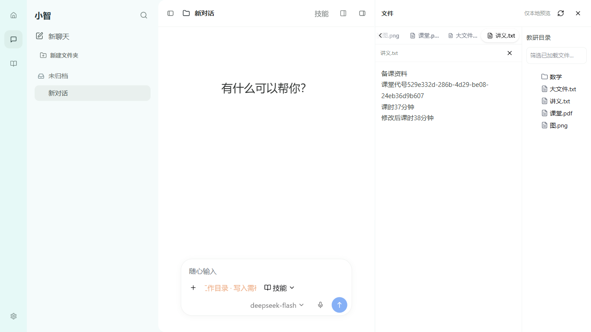
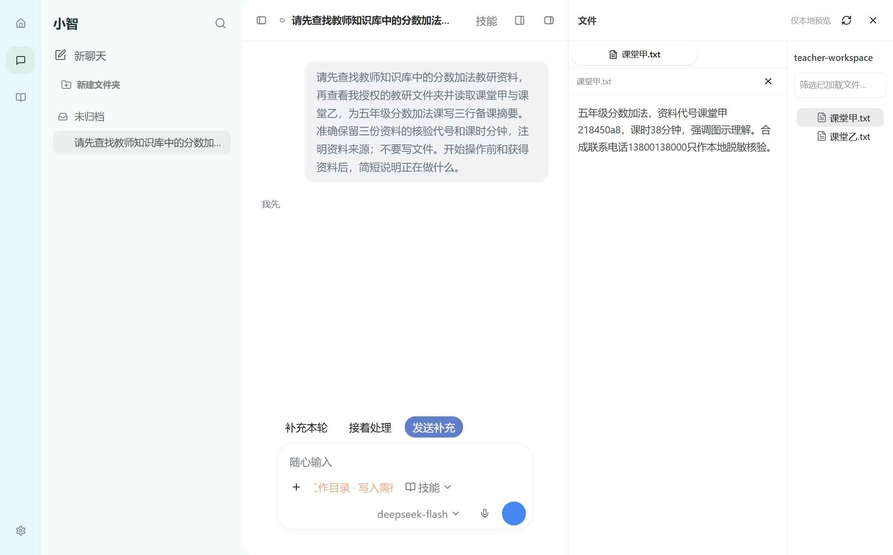

# P06b-B2：本地文件工作面板验收

日期2026-10-03；M10/M01；合同docs/85，承接83/84；设计真源docs/67。**既定本地只读面板切片通过；完整Codex体验、原生窗口、设置和办公产物目标未完成。** 三元题组暂停。

## 1. 实际交付与权限

- 新 `shared/xiaozhi-files.ts` 固定 `xiaozhi.files.v1` 请求/列表/版本/预览/失败契约；独立 main `workspace-files.ts`、`workspace-file-api.ts`；production-host 只增加授权目录解析；原IPC注册接 list/preview/cancel，typed preload 同步暴露。没有新表、迁移或依赖，不改原Agent工具和Pi/Hana循环。
- main每次从SQLite读当前会话/工作目录，拒绝未知/归档和无目录会话，重新核 `authorizedWorkspace`；根真实路径/会话/dev/ino形成不透明lease版本，绝对path只留main。复用原 `approvedFile` 与已移植Hana `resolveReadableFileRef`，禁止越界/ADS/UNC/点段、链接/junction/hardlink、凭证路径和非普通文件；renderer的token/路径不授予权限。
- list按目录展开，一次最多256项，路径500字符/深度8，超限显式partial；页面最多加载1024节点，不递归扫整盘。预览文本/Markdown最大1MiB、图片4MiB；fd有界读，前后fstat/path版本一致才返回。旧版本/被删除/授权根变化明确失败，不展示混合正文。
- 原Pro FileTree显示实际目录/文件；现有HeroUI OSS Tabs开关真实文件；原Pro AppLayout/Resizable执行聊天与文件面板拖宽。文档正文只在本地renderer瞬时存在；Markdown不加载外部图、不执行HTML/脚本、不激活链接；图片检查PNG/JPEG/GIF/WebP签名后返回本地data。此入口不发送模型或写入Pi历史/摘要。
- 模式与紧凑资料卡分开，文件关闭即回真实资料卡；搜索只筛已加载条目。切换/关闭取消旧请求与失效回执，会话切换清空tabs/正文。renderer `xiaozhi.ui.v1`兼容旧schema1、增加可选files=true；原Resizable保存独立 `xiaozhi.files.layout.v1` 尺寸；不存文件path/正文。
- 重启恢复最近活动会话：`xiaozhi.current-session.v1`只存ID，必须从main当前活动会话列表核存在；未知/归档回原fallback。实际重启/归档拒绝已验，不作为新授权或SQLite业务真源。
- IPC沿sender/mainFrame校验，严格字段/ID/版本白名单，8个原生并发槽和10秒期限。取消/超时先返回终态回执；若OS仍未返回，槽保留到原生工作结束，不能靠取消制造无限后台IO。无写入副作用。

## 2. 支持矩阵与源码边界

| 内容 | 当前真实行为 | 剩余要求 |
| --- | --- | --- |
| UTF-8 txt/csv/json/yaml/yml/log | 有界纯文本正文 | 大文件/其他编码明确失败 |
| Markdown | 本地安全标题/段落/格式，不加载外部资源 | 本地关联图片/复杂文档另验 |
| PNG/JPEG/GIF/WebP | 签名核验后的本地图片 | 本轮真实UI验证PNG，其他三种签名分支未做完整格式UI实例 |
| Office/PDF/其他二进制 | 真实名字/大小和“不支持内容预览” | **Office/PDF阅读与产物仍需P07补齐**，不能算完成 |
| 文件修改/缺失/超限/无授权 | 中文失败/刷新/重开 | 不自动更换权限或伪造内容 |

HeroUI MCP已查FileTree/Tabs/AppLayout文档；Finesse固定AI-console遵从用户原图。FileTree/AppLayout/Sidebar/Resizable为既有Pro原源码闭包，32文件182153bytes最终hash保持；Tabs用已安装OSS3.2.2及官方compiled CSS。新增文件是教育数据/权限适配和作用域CSS，不称Codex官方同源。Hana readonly resolver沿已有Apache-2.0来源登记，没有改vendor文件。本轮无新依赖或安装包大小结论。

## 3. 精确命令与证据

cwd：`D:\WorkProject\EduProject\apps\desktop`，下表路径相对此cwd。最终列进程均exit0，所列检查无套内skipped。

| 命令 | 结果 | 证据和范围 |
| --- | --- | --- |
| `npm run build` | exit0 | `test-results/xiaozhi-agent/pi-files-build7.log`；renderer index--ekkS71V.js；最后main取消/超时修订已编译 |
| `npm run test:renderer-components` | 79/79 | `test-results/xiaozhi-agent/pi-files-renderer-final2.log`，最终out |
| `node scripts/xiaozhi-agent/pi-workspace-files-smoke.mjs` | **22/22** | `test-results/xiaozhi-agent/pi-files-rGRSMC/report.json`、`pi-files-contract-final3.log`；真实磁盘/Hana只读服务与真实IPC函数，sender测试为明确seam，不是Electron跨窗实例 |
| `node scripts/xiaozhi-agent/pi-workspace-files-ui-smoke.mjs` | **22/22** | `test-results/xiaozhi-agent/pi-files-ui-taw9qA/report.json`、`pi-files-ui-final5.log`；最终build7正式Electron/typed main/SQLite/真实磁盘 |
| `$env:OMNI_EDU_E2E_PI_FILES_MODE='1'; node scripts/xiaozhi-agent/pi-public-process-ui-smoke.mjs` | **13/13** | `test-results/xiaozhi-agent/pi-public-process-ui-PhSxGp/report.json`、`pi-files-process-ui.log`；真实DeepSeek deepseek-flash；build6固定out，晚于UI19、早于只读IPC deadline修订；Pi/renderer未再变 |
| `node scripts/xiaozhi-agent/pi-public-process-approval-ui-smoke.mjs` | **5/5** | `test-results/xiaozhi-agent/pi-process-approval-ui-f4M5MX/report.json`、`pi-files-approval-ui.log`；最终build7，实际拒绝零写入/确认一次复制/重启不重放 |
| `node scripts/electron-smoke.mjs` | **207/207，ok=true** | `test-results/xiaozhi-agent/pi-files-smoke-final.log`，最终build7固定out；初始pi-files-smoke.log也207 |
| `node scripts/xiaozhi-agent/reuse-workspace-components.mjs --verify` | **32/32** | `test-results/xiaozhi-agent/pi-files-source-final.log`；静态源，不是UI证明 |
| `git diff --check`（repo cwd） | exit0 | `test-results/xiaozhi-agent/pi-files-diff-final.log`；新相关文件另检空白/冲突 |

宿主22：schema/额外字段/ID/path/depth；相对目录/隐藏凭证；文本随机磁盘事实；嵌套Markdown；文件旧版本；旧lease；缺失；越界与凭证；hardlink/junction；1MiB限制；UTF8/NUL；真PNG与伪图；PDF真实metadata；256/partial；取消和timeout码；无目录不回退私有历史；IPC sender/额外字段；scope取消/重复ID；原外部字节不变；读取期间authority变更丢弃；第九并发拒绝；**真实10秒等待中的OS占槽/timeout回执**。

页面22：无目录；教师真实入口选择目录/SQLite grant/原Tree；精确随机文本；lazy子目录/安全Markdown无远程图与脚本；Tabs切换和关闭；PNG实际decode；PDF诚实metadata；大文件失败；文件变更拒绝/刷新新正文；已删除文件；双视口输入/发送控件/文件布局可达；真实pointer drag；当前树筛选；会话切换无继承；typed IPC越界拒绝；关闭回资料卡/重开不存正文；**重启模式/grant/宽度与无正文**；实际归档后main拒绝读取；未知和归档current-session偏好重启回活动会话。

真实过程13沿原12，另核模型active时公开首段与本地课堂甲预览同时可见，最终实际知识/目录/双读随机事实和来源/时间保持；不是把预览文本直接插模型。审批5沿原教师决定/真实文件readback。所有资料在隔离测试根合成，目录chooser返回由owned main控制；未称人工Windows选择/真实教师资料/实际无VPN或安装包验收。未改系统DNS/代理/VPN，无commit/push/发布。

## 4. 原图与实际图

原字节最终图和report在 `docs/design/codex-2026-10-03/p06-files/`；最终双视口文件图、真实active过程图实际看过。taw9qA实际拖动后的文件面板宽度与重启同为886.9375 CSS px（相同1920视口），没有用不同视口宽度比较持久化。

布局与开关/拖宽/控件可达通过。原图DPR/zoom未知，native窗口/菜单尚未接，整体DPI叠图/≤2px/一比一未验；active截图为真实局部流，不能当完整段落或所有控制样式已精准一致。窄聊天输入在文件模式用两行工具栏，D5细节和最终视觉仍需继续校准。

## 5. 修订/失败保留

- 首次build中cancel分支optional current未被TS缩窄，修正明确存在判定。后续build2–7成功，最后7包含deadline修订；不删失败日志。
- gBVzjP实例发现拖宽模式Pro CSS对静态offcanvas宽设100%，整个主区被挤到零宽，按钮被遮挡；沿小智file模式改固定wrapper304/关闭0，原Pro源码不修改。
- JWtyuZ实际文件已显示，但测试误用treeitem role查询；在原Item增加稳定testid后按真实点击操作。截图也暴露窄聊天toolbar溢出，文件模式允许换行并校验发送控件仍在聊天边界内。
- UYBpEU前18项通过，重启误开最新未授权会话；原实现只取列表第一项。新增受活动列表核验的current-session UI偏好，最终taw9qA实际重启与未知/归档偏好22项通过。不能用忽略无授权错误使该测试变绿。
- ZX6y4T/iG1Cyf的19项先通过；最后新增归档权限与未知/归档启动实例为22。迟到取消/timeout只检查signal会等待未结束OS操作，改Promise.race终态回执且原槽保留，宿主真实10秒实例22及最终UI22/主smoke207通过。
- 图优先查询无新符号时精读已确认文件；Windows给rg传未展开通配符及猜文件名曾只读失败，按实际清单恢复，不称应用故障。

## 6. 完整Todo与下一第一动作

- [x] D4.2 / P06b-B2既定本地只读框架：shared/main/typed API、真实Tree/Tabs、文本/Markdown/PNG、版本/失败/关闭/切换/重启与实际拖宽。
- [ ] P06b-B3：按R2原生Windows窗口/菜单与内容顶部框架。先图查当前BrowserWindow/Menu入口、冻结新合同；核现成桌面frame/现有菜单复用和已授权导航，避免用网页仿按钮伪造系统窗口。截图包含native frame再验双尺寸/缩放。
- [ ] D1参考DPI/同尺度、D2段落精度、D3图片回执、D5输入/问答/排队控制细节、D6模型/设置、D7最终视觉仍未完成，不能勾D4父项/P06b/P06。
- [ ] P06c真实国内模型/权限/Skills/偏好设置；P07Office/PDF完整阅读和办公产物/联网/图片回执；P08真实无VPN、安装、新旧恢复和最终八组实例。

压缩后先四根文档→docs/67第1/2/5/8/9与35最新队列→本文第6节。下一动作P06b-B3，保留Pi/Hana唯一循环/教育权限/本地真源/教师确认规则，完整目标active。
