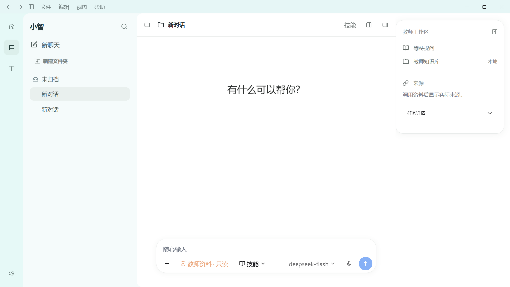
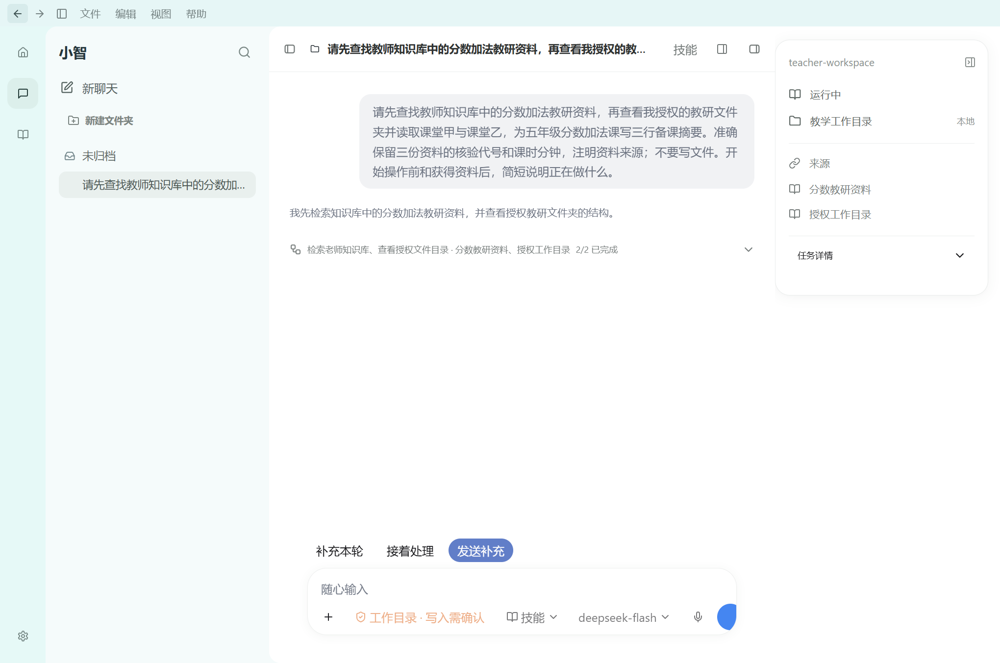

# P06b-B3 原生窗口框架验收

日期：2026-10-03；M10/M01；合同 docs/87、视觉真源 docs/67 R2。本轮既定框架通过，完整目标仍 active，未证明整体一比一。

## 1. 实际交付与复用

- BrowserWindow 在 Windows 使用 hidden + native titleBarOverlay。React 只有导航/菜单触发，系统最小化/最大化/关闭不是网页仿按钮。36px 浅青顶部、白工作区圆角，内容高度扣标题栏，拖拽/no-drag 区明确。
- HeroUI MCP 核 138 组件无 OS frame；已有 OSS 3.2.2 Button 接真实原生 Menu，原 Pro AppLayout/Sidebar/FileTree/Resizable 来源 32 文件保持。Finesse 0.20.0 AI-console/product 检查，用户原图优先。
- ZCode Apache-2.0 overlay 两原函数经 AST 提取，完整许可及源/output hash 在 main/desktop-chrome。48px 改 36px。已核其 desktopZoom 自有 level 是 1.1 步进；本宿主传 Electron native getZoomLevel，所以适配 1.2 ** level。菜单沿原 Electron role 模式改小智产品动作。没有新依赖/表/migration/工具或 provider 权限。
- 后退/前进使用最多 80 项窗口内 view/session ID 历史，活动会话列表核验；归档移除历史，晚到 New Chat 不越过已卸载页面改导航。设置/新聊天/侧栏/文件是真实 App/Pi/SQLite 操作，不提交模型任务。
- menu IPC 固定四组/有界坐标/主窗口主 frame；另一实际 renderer 同 preload 仍拒绝。文件面板继续旧 main grant、学生图片本地、AI 写入教师确认。
- 官方机制核验：[Electron 标题栏](https://www.electronjs.org/docs/latest/tutorial/custom-title-bar)、[原生 Menu](https://www.electronjs.org/docs/latest/api/menu)。它们支持所用机制，不是 Codex UI 源码证据。

## 2. 最终构建与验收命令

以下 cwd 均 `D:\WorkProject\EduProject\apps\desktop`，最后生产构建为 build5，asset `index-0ZSlNuuJ.js`；其后只补测试/文档/来源记录，没有生产代码修改。

| 精确命令 | 结果与证据 |
| --- | --- |
| `npm run build` | exit0，pi-chrome-build5.log；首次 TS 错误与 build2/3/4/5 均保留 |
| `npm run test:renderer-components` | 79/79，exit0，pi-chrome-renderer-final2.log |
| `node scripts/xiaozhi-agent/pi-native-chrome-ui-smoke.mjs` | 21/21，exit0，U0IKI2；pi-chrome-ui-final3.log |
| `node scripts/xiaozhi-agent/pi-workspace-files-ui-smoke.mjs` | 22/22，exit0，hSjImY；pi-chrome-files-final.log |
| `$env:OMNI_EDU_E2E_PI_CHROME_MODE='1'; node scripts/xiaozhi-agent/pi-public-process-ui-smoke.mjs` | 13/13，exit0，EVLDFB；真实 DeepSeek，pi-chrome-process-final.log |
| `node scripts/xiaozhi-agent/pi-public-process-approval-ui-smoke.mjs` | 5/5，exit0，MSCy5n；真实 DeepSeek，pi-chrome-approval-final.log |
| `node scripts/electron-smoke.mjs` | 207/207、ok=true、exit0，pi-chrome-smoke-final.log；固定最终 build5 out |
| `node scripts/xiaozhi-agent/reuse-window-chrome.mjs --verify` | 2 复制文件及菜单/zoom 引用源 hash，exit0；仅静态来源证明 |
| `node scripts/xiaozhi-agent/reuse-workspace-components.mjs --verify` | 32/32，exit0；原 Pro 闭包未改 |
| `git diff --check`（repo 根） | exit0，pi-chrome-diff-final.log；另核本轮新文件空白与冲突标记 |

没有把此前 B2 host22 重跑成新 host 结果，本轮文件 main/API 未改；正式文件页面22 已对最终 build5 复验。没有 mock provider 或用 build 替代实例。

## 3. 真实实例范围

窗口21含：真实 native overlay/原生 popup、实际 edit roles、真正 Electron sendInputEvent Ctrl+N 只创建一次、两会话前后导航、设置返回同一 ID、侧栏共用偏好、文件无授权失败、恶意 group/坐标拒绝、实际第二 renderer 拒绝、双外窗尺寸与安全区/发送可达、125% native zoom 高度、原生最大化/恢复、无新模型 turn、副页面新聊天单次消费、晚到结果不覆盖设置、归档历史跳过且不会后退死循环、重启只恢复已核活动会话、显式回滚到系统框架。

真实过程13是在公开正文已经可见且 run active 时，实际原生 Settings 菜单离开 → 顶栏 Back 返回；EVLDFB 的 beforeRun/afterRun 均 `run_93eb2d9b-4fe7-4fee-b94c-c7cc64dbb2ab`，activeBefore/activeAfter 均 true、轮次数未增。其余原有12核 native/main/UI公开内容与顺序、工具/失败/时间、compact 私有摘要不显示、问题/停止、发送清空和重启保持。原过程API/模型循环没有改成另一实现。

审批5保留真实待确认控件、拒绝零效果、批准一次真实文件复制、重启决策/文件 readback 无重放。正式文件22 保留真实 tree/tabs/text/Markdown/PNG、版本/权限、失败与真实拖宽及重启。

## 4. 实际窗口/图像测量

OS display scale 1.5，真实窗口 DPR=1.5、zoom=1；本轮使用 BrowserWindow.setContentSize 改实际窗口，没有用 emulated viewport 代替外窗。desktopCapturer 仅保存匹配 own getMediaSourceId 的窗口缩略图，按实际 display scale 请求尺寸；无全屏/其他应用图片保存。缩略图尺寸不是 R2 原图的元数据。

| CSS 内容 | 实际外窗 DIP | 窗口 PNG | overlay CSS 安全区 | body scrollHeight |
| --- | --- | --- | --- | --- |
| 1366×768 | 1368×769 | 2052×1154 | x0 / width1229 / height36 | 768 |
| 1920×1080 | 1922×1081 | 2883×1622 | x0 / width1783 / height36 | 1080 |

125% zoom 下 innerWidth1536、overlay width1427/height36 CSS，main overlay 45 DIP；菜单仍在 safe area 内。保留 native-maximized 与 native-zoom125。当前已真实查看带 native 控件的窗口截图；原图 DPI/zoom 未知，整体叠图≤2px未验。

原字节选择复制到 `docs/design/codex-2026-10-03/p06-native`，不复制 profile、业务数据库、native JSONL 或密钥。

## 5. 失败与修订

- 首次 build1 的 HeroUI onClick event 类型与 HTMLButtonEvent 不同；改官方 onPress/PressEvent target，build2 通过。
- WwLtM3 的 Playwright CDP keyboard 不触发原生 Ctrl+N，不能声称产品快捷键坏；改真正 Electron sendInputEvent，后续实际单次创建通过。
- qBAjkx 的 second-window test 误从 getLastWebPreferences 取 preload，实际没有 omniEdu；按已知 out/preload/index.cjs 创建真实副 renderer，后续主 frame/sender 拒绝通过。
- bkeSP6 等待不存在 office-send testid；改现有 prompt-input-send slot。截图同时发现旧100vh优先级让标题栏额外增加36px，修作用域高度及原 Pro sidebar provider min-height，实际 body不溢出。
- YOJ7QA 在 Electron evaluate 误用 require，ESM evaluation不可用；返回 own PNG 字节给 Node 写 owned 测试输出，不输出 base64/其他窗口内容。
- 初步5hCakt19通过；XNuChc 同 scale capture19、179beb归档20；最终 U0IKI2 21增加实际晚到 New Chat/Settings 与重启事实核验。历史失败保留，不概括全部为同一问题。
- ZCode 自定义 zoom1.1 与 Electron native1.2 核清并登记必要适配，不把“公式等价”写成其原公式未改。一次 cleanup patch 锚点失败未写，重读真实版本后适配 active guard。

## 6. 限制与下一动作

- [x] D4.3 / P06b-B3 既定原生框架专项：实际窗口/菜单/导航、缩放/安全区、过程与文件兼容。
- [x] 最终构建/renderer79/主smoke207/原Pro来源32/窗口源审计和diff通过。
- [ ] 完整D4/P06b/P06与D1–D7仍未完成，不能用本轮框架专项代表精准视觉全交付。
- [ ] native caption buttons/OS menu item 尚无人工逐点击证明；当前验证的是实际 native buttons 图像、窗口 API状态、原生 popup指针及真实菜单 callback/accelerator，不夸大成所有OS操作实录。其他OS没有验收。
- [ ] 下一第一动作 P06c：四根文档→docs/67第1/2/5/8/9与35最新队列→本节；图查当前模型菜单/配置/能力核验/设置真源，冻结docs/89。使用现成 Hana 设置布局/已有HeroUI组件接真实国内模型列表、默认DeepSeek、当前会话固定模型、权限/Skills/偏好与重启，不能伪造 GPT 模型或推理档位。
- [ ] D1同DPI、D2段落字形间距、D3图片回执、D5输入/控制、D6设置、D7精准整体；P07 Office/PDF/办公联网/产物，P08实际无VPN/安装/最终八组继续。

无提交/推送、系统网络或真实教师库改动；Pi/Hana唯一循环、本地真源、必要脱敏与教师确认保持。完整目标 active。
