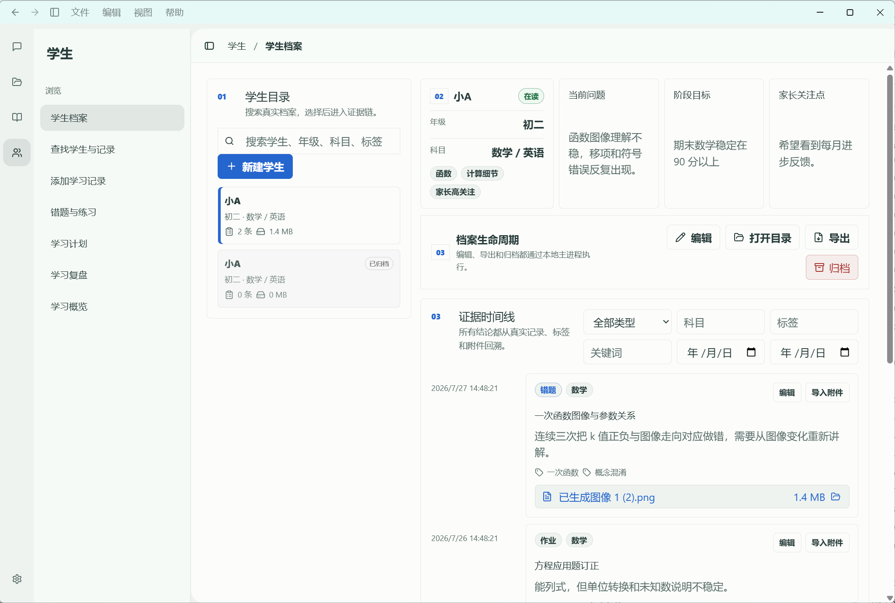

# 当前页面设计基准

## 2026-10-06 DT-05 学生练习集合与传统来源读回（当前）

新增核对练习使用现有HeroUI Pro ChatTool与HeroUI Button/Modal/当前来源链和主题；沿用最大420内部题目滚动区及会话保留草稿。练习角色/观察可编辑、正文只读，确认/拒绝留卡底；来源Modal只读核对初稿/最终快照，关闭可达。无新页面shell或静态demo。

Evidence：固定build-c 341文件/SHA 15cba713c2dea8db351973b488c9314909caf31e5ea55d837c525159b0545207，默认out逐文件一致；build/typecheck exit0、统一145/145（education-boundary-wraImL，新增18项）、组件156/156、当前唯一Pi/真实DeepSeek9/9（education-journey-ADH5Jm，3次启动/rendererErrors=0）、旧真实题目核对数据副本3/3（5RLgDA，3题/33→33模型消息，0新增事实）、相关旧业务smoke207/207均当前固定build-c。八张实际Electron浅暗1366×768/1920×1080图逐张查看；核对/拒绝/关闭可达、长内容内部滚动、无横向溢出。完整命令、源码/报告SHA、SQLite读回、失败留存与视觉边界：apps/desktop/test-results/goal/dt05-practice-20261006/closeout.json。领域故障回滚使用真实SQLite测试ports；原writer保存由真实页面证明，不冒称生产OS强杀。

1366核对图定位卡底，1920可见教师最终13厘米与观察；Modal保留答案和说明，长来源在内部滚动。完整Codex视觉/原生动态另按Master继续。

Doing/Next：Current Phase=Phase4/5 DOING；Current Task=DT-05练习集合限定接受、学习路径/实际结果续接DOING；完整Goal ACTIVE。下一唯一教育任务先冻结现有练习→路径/实际学习结果的兼容合同，再将已确认练习接现有学习计划/精通路径与教师实际作答/成绩记录，唯一Pi/DeepTutor重新评估并继续下一轮练习。完整DT-05/Golden C/F后依次MA-01至05→JOIN→Phase6/7/8。完整Codex像素/原生动态、全部DeepTutor模式、课堂、长期偏好、日常人工、安装/无VPN与既有audit5发布门禁仍OPEN。

以下旧记录保留历史；当前状态以上述记录为准。

## 2026-10-06 DT-05 教师出题核对与题本保存（当前）

复用现有合法HeroUI Pro ChatTool核对卡与HeroUI Button/表单/来源链，不新造页面。每题独立scroll区域最大420；字段/答案/解析完整编辑，确认/拒绝在卡底，中文错误后可“重新读取”。会话级OfficeComposerState保留最新编辑；加载锁同步更新，晚到响应不可覆盖新草稿。

Evidence：固定341文件/SHA e80b3052e86609b0156b7f91f735b534b9ba47c92d04a9cd83b81abdb0190ab2；原源码verify/build/typecheck exit0、统一127/127、当前组件150/150、当前唯一Pi/真实DeepSeek教师核对10/10（education-journey-R7dHLl），3次启动、rendererErrors=0。浅暗1366×768/1920×1080四图实际逐张查看：确认/拒绝与输入可达，窄窗题目字段在内部滚动区，无横向溢出。相关历史回归207/207是在build-a、最终元数据/摘要绑定/重试修复之前，不能当成最终构建全部回归。精确命令、SHA、版本、失败留存、SQLite读回与视觉范围：apps/desktop/test-results/goal/dt05-review-20261006/closeout.json。

1366窗口图定位卡底，字段正常内部滚动；1920图能看见教师13厘米最终答案。视觉限定接受本卡，完整Codex像素/原生动态依旧OPEN。

Doing/Next：DT-05仍DOING、完整Goal ACTIVE。下一唯一教育任务先冻结练习集合的旧数据兼容合同，再把已核对题目接入现有exercise_sets/question_bank_usage及跨入口谱系读取，贯通传统练习、学习路径和实际结果；完整DT-05/Golden C/F后再MA-01至05→JOIN→Phase6/7/8。完整Codex像素/原生动态、日常人工、安装/无VPN、既有audit5发布门禁及其余Master未完项保持OPEN。

以下旧记录保留历史；当前状态以上述记录为准。

## 2026-10-06 DT-05 真实题库来源接缝（当前）

现有合法ChatSource/ChatSources/ChatTool以及HeroUI Button/Modal复用；本地题目来源Chinese题干/答案/解析、语义浅暗色与pre-wrap，加载/失败/陈旧反馈。组件卸载或来源切换的generation令牌阻止晚到响应覆盖。

固定337文件/SHA 674fc8daf1620bfcba385a31f4fe12da9d8326c1993314d292367c494e9134d3；build/typecheck0、统一99/99（pvBYRJ）、renderer146/146、Pi协议8/8（CKxuuD）、当前唯一Pi/真实DeepSeek题库6/6（yTcdQR）、相关历史回归207/207。rendererErrors=0；浅暗1366×768/1920×1080共4张来源页图实际逐张查看，中文题干/答案/解析与关闭控件可达，无横向溢出，仅接受本来源对话框，不接受完整Codex像素/原生动态。精确命令/源码SHA/构建/报告/失败留存：apps/desktop/test-results/goal/dt05-question-20261006/closeout.json。

视觉仅接受上述来源对话框，完整Codex布局像素/原生动态与日常人工仍OPEN。

以下旧记录保留历史；当前状态以上述记录为准。

## 2026-10-06 DT-04 学生计划与实际结果续接（当前）

沿用户确认的新学生页与五空间，学习计划替换旧入口内容，复用Pro EmptyState/PiTrainingPlan/HeroUI Buttons和现有语义色。教师中文结果表单两列，窄容器单列；保存/取消、历史提示、来源、继续与实际结果可滚动到达。计划卡独立滚动最多480px，结果显示原计划版本以免将旧结果误当新计划完成。继续动作生成可编辑草稿并消费一次，绝不自动发送。

gsPCmm最终构建计划/表单/重排后结果三个锚点×浅暗×两尺寸12图全部逐张查看；1366表单及保存/取消同时可见，1920内容最大1080px。无横向溢出、两主题字段与历史结果可读；日常人工、原生动态与完整Codex像素体感保持OPEN。截图及SHA见dt04-workspace closeout/visual-inspection.json。

以下旧记录保留历史；当前状态以上述记录为准。

## 2026-10-05 十四天训练组件

沿用用户确认新五空间、Pro核对卡/工具过程/历史与当前浅暗色变量。卡内扩展训练标题/起始日期、十四天知识点/活动/数量/难度/说明；确认/拒绝复用原卡。窄窗条目单列、正常滚动后核对按钮可达；不造新工作台。2yywL7三锚点×浅暗×两尺寸12图逐张查看，JiqkVv只见标题图不作页尾证明。不接受完整Codex像素、动画与原生体感。

以下旧记录保留历史；当前状态以上述记录为准。

## 2026-10-05 当前包切片与取消门禁

余额复用现有HeroUI SettingsSurface/Stack/Inline/Button，不新增布局或组件库；当前浅暗1366/1920四图实际查看，余额结果、能力状态与按钮可达；细节可折叠。学习取消四图保留中文未确认可重核反馈与89%草稿。仅接受本轮界面，不宣称Codex像素/动态一致。

## 2026-10-05 DeepTutor功能对齐与学习会话恢复（已验收子集）

用户确认新版学生页基准保持，本轮没有新UI或第二页面。当前学习核对浅暗双尺寸四图实际查看：表单教师中文/来源/本地反馈保持，1366暗图确认按钮在卡内下方需滚动。原生恢复修复只在main；本轮图审不接受完整Codex动态/像素效果。完整模式差距见Goal能力矩阵；当前只有部分DeepTutor能力融合。

## 2026-10-05 DT-03 跨会话学习核对历史（已验收子集）

新增学习历史位于问小智既有资料侧栏，保持用户确认学生页基准与五空间。复用授权Pro ChatSources/Disclosure，确认结果与此前结果使用现有浅暗变量；四张实际图已逐张查看，滚动后卡片无横向溢出。该验收限定历史控件可达/数据/双尺寸，不是完整Codex像素/动态验收。证据 apps/desktop/test-results/education-journey-1DXgrz/report.json。

以下保留历史，当前状态以上述记录为准。

## 2026-10-05 用户确认的新版学生页

原图：`codex-clipboard-1cd19f53-5c46-40ef-99d6-7391de621202.png`。原始文件逐字留存；SHA256 `3035a549b892a8a437c75d26f3e5fc7908c5a7c03c64a444dd39d3e5ca4652af`。该图是学生页布局基准；截图中的小A、记录和附件不是生产初始化数据。

### 保留的页面结构

|区域|设计约束|现有实现|
|---|---|---|
|桌面标题与菜单|浅青色桌面框架；返回、前进、侧栏与菜单沿用统一宿主|DesktopFrame / desktop-chrome|
|最左图标栏|问小智、我的资料、教学内容、学生、设置五个空间；学生当前态明确|ProductRail|
|学生分类侧栏|学生标题、浏览分组、档案/查找/记录/错题/计划/复盘/概览；当前页有淡色底|ProductSpaceShell + product-spaces|
|主区标题|学生 / 学生档案；侧栏展开收起入口|ProductSpaceShell|
|目录|搜索、新建、真实学生列表；选中边线与状态标记|现有 App 学生目录|
|档案摘要|四块：身份年级科目标签、当前问题、阶段目标、家长关注点|StudentProfileLifecycle|
|档案操作|编辑、打开目录、导出、归档；错误/取消/成功有明确回执|StudentProfileLifecycle|
|证据时间线|类型/科目/标签/关键词/日期筛选；真实记录、标签、附件与编辑入口|现有 App 证据时间线|

增加的“问小智”入口保留上述结构。从所选在读学生新建有明确学生范围的 Pi 对话；普通新聊天不自动继承学生。来源导航返回真实记录。禁止另造一套学生页或用历史 legacy-test 截图指导正式布局。

### 视觉和交互约束

- 沿用当前 HeroUI / AppLayout / Sidebar 与项目主题；淡色层次、细边框、圆角、留白、蓝色主操作、红色归档操作一致。变化应在已有组件和主题中落地。
- 1366×768 与 1920×1080 的浅暗两种模式均验；主区纵向滚动允许，不能出现水平溢出、不可达操作或被侧栏遮住的内容。高 DPI 的物理截图尺寸与 CSS 窗口尺寸分别记录。
- 思考与工具执行期间显示简洁进展说明、真实工具活动和结果来源；采用交错执行的反馈，不展示内部原始推理，不伪造工具成功。
- 真实保存回执、未知/空状态和失败必须与事实一致。完整 Codex 体验、所有控件或像素一致尚未整体验收，不能以单张截图宣称完成。
- 深色归档行对比度、偶发英文公开过程、流式队列鼠标稳定性仍属于 Phase3 欠项，本轮新版识别不关闭它们。

### 版本与验收规则

日常入口为根目录 `启动小智.cmd` 或桌面目录 `npm start`：成功构建当前源码后启动 `out/main/index.js`。正式 renderer 必须使用同一 out 内的文件，不跟随遗留开发服务器 URL。历史回归页面、归档生成文件与隔离验收构建只用于证据。

现有 `scripts/daily-entry-smoke.mjs` 已补充新版学生结构、真实界面创建学生/记录、SQLite readback 与冷重启断言；本轮报告 `apps/desktop/test-results/daily-entry-jYAstN/report.json`：8/8，success=true，exit0；4张学生浅暗双尺寸截图已实际查看。正式日常进程路径已核，但隔离实例不能代替日常数据库/窗口的人工验收。

后续能力顺序：DT-03 可纠正掌握度/错因/评分/复习 → DT-04 两周训练 → DT-05 题目与学习路径 → MA-01至05互动课堂 → JOIN。主合同及完整完成定义仍以 `docs/goal/XIAOZHI_CODEX_GOAL.md` 为准，完整 Goal ACTIVE。

## 2026-10-05 学习核对链补充

用户指定学生页参考图和结构保持。核对表单复用当前Pi工作台Pro工具卡与主题，中文版原证据/学习结果/错因/反馈/说明/确认拒绝均真实接同库事务。当前构建ee4872bd4f5e66c8ddee8906fc7da5a766d47168f23721fc6fbdb50de9400c67的四张浅暗双尺寸核对图见apps/desktop/test-results/education-journey-GwcHvH，已实际查看；这组是聊天核对图，不能替代新版学生页既有图审或日常人工。完整像素/所有组件一致仍未全部接受。
