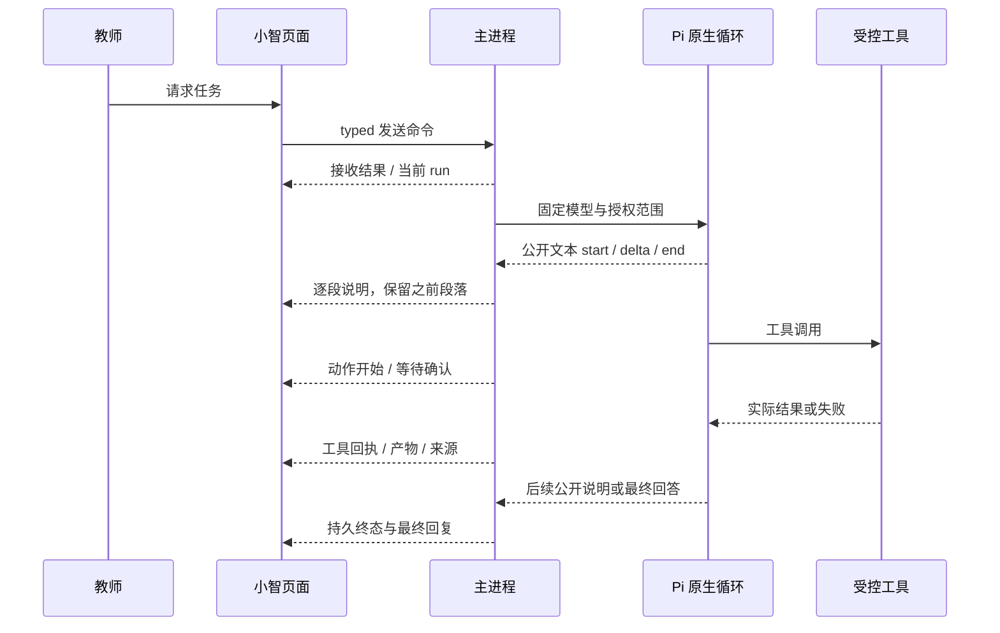

# 小智 × Codex 桌面：实时过程与组件设计基准

## 2026-10-04 当前恢复检查点：自然办公文件与真实可编辑Word

160/161复用现有原Pro审阅/文件预览与Pi/Hana正式工具，未加新组件或改vendor。原FILE提示词C14，真实diff/拒绝/新任务重审/批准/Office表格和本地typed产物/冷恢复；两尺寸确认与面板已查看。拒绝仅阻止同run自动重放，新的教师要求重新读版本/新审阅/新确认；公开过程按实际tool与分段，不填私有推理。

WPS副本实际编辑保存重开，26段2表/2页A4与原稿一致；第4周负责人段跨页不称所有版式优化。MCP/Finesse沿已有参照，无新调用/新copy，不伪称Codex专有同源。协调器各8/renderer79/build2/main2 207与四C首次失败/main1超时保留161；完整同DPI/Skills设置仍未验。

下一唯一四根→本文§1/2/5/8/9→35→161→CFG-01/02可见导入验证保存/真实调用/冷重启，owned配置副本不靠env；然后缺参照Skills模型权限/全D/P08最终八组。62244/out保持，原用户反馈/人工/noVPN安装未关闭，整体active；以下FILE下一历史。

## 2026-10-04 当前恢复检查点：自然浏览器截图可查看

158/159原Hana450截图命名+原安全browser/DOM→capture公开引用/现有工具durable facts→typed预览→原Pro附件与既有OSS Modal，本地真实截图有加载/错误/本地重试/关闭，缩略图contain。工具组保留细行/公开说明，非图片已上传或模型私有思考。NET-01/02原文C13，A21/renderer79/main207；同isolatedbuild4ddacc…和两图实际核，未更新日常out或判完整同DPI。

下一唯一四根→本文件§1/2/5/8/9→35→159→FILE-01/02/03/04自然办公闭环，先查原源冻结合同；然后CFG/Skills设置/全D/P08最终八组。Skills/模型权限设置参照已异步请求，独立功能继续；原用户反馈/日常/noVPN未签认，完整active。

## 当前恢复检查点：2026-10-04 E持久目标原组件贯通

156/157原Pro ChainOfThought/OSS3.2.2 Button/Modal/TextArea/Checkbox/Label绑定main SQLite/CAS/真实goal/run/evidence/result。MCP最新结构核对，Checkbox Control+Label在Content内，局部横排CSS不改vendor。目标条显示公开objective/状态/下一步/真实证据，暂停结束不嵌套按钮，原段落/工具过程交错。只教师逐项审阅可完成，不能模型一句完成或fake timer。

原Pi1.0.2继续，无第二scheduler；C自然工具继续与A纯文本边界分别记录，一native teacher不混同provider custom映射。最终A24/C18/renderer79/main207/同构建web19，323文件out与隔离SHA同；已查看最终1366验收卡和1920等待条。有限C不是全页同DPI/Codex专有同源，R1/R2/§1/2/5/8/9保持。Finesse无新增callable，沿原闭包，不虚构新调用；实际Pro MCP参照source-only保存。

下一唯一四根→本文指定节→35→157→测试说明书NET-01完整日期/NET-02自然请求及可交付截图；原browser capture:true不能当教师拿到/模型已看图。新切片先合同/原组件/typed/失败冷恢复/双尺寸，再全D/FILE/CFG/Skills同DPI/P08日常无VPN安装最终八组。62244/out保持；原用户反馈/人工未签认，整体active/NOT_ACCEPTED、三元暂停、无子agent/commit/push。以下155生产未接为历史。

## 当前恢复检查点：2026-10-04 E原生执行前置

154/155原Pi1.0.2 BoundaryResult现成继续：真实公开说明→原工具/结果/下一段，原custom目标context区别于teacher消息/批准；checkpoints绑定原native assistant/tool entry。19仅原源/A调度夹具/B官方API+Hana行为，未接生产goal或新组件，不称新UI/同DPI/完整Codex对齐。没有新Pro/Finesse调用，R1/R2/§1/2/5/8/9及原组件保持。

下一四根→本文指定节→35→109-E→154/155，冻结生产E真实SQLite/CAS/criteria/evidence/run与typed/原goal组件及暂停恢复/结束、原extension/main生命周期，查MCP与源码后直接绑定真实状态；原Hana fail-open JSON/paused恢复不当正式真源。真实C门禁后再全D/P08/最终八组/日常人工。user33640/out保持，整体active/NOT_ACCEPTED，三元暂停，无子agent/commit/push。

## 当前恢复检查点：2026-10-04 D4实际已查看图像

152→153按actual received版本事实，每turn最后received工具组后只出现一次原Pro ChatTool“已查看N张图像”；重复同图不翻倍、不同图/版本独立，准备/OCR/本地预览/失败拒绝停止不计。原ChatAttachment/Group和既有Modal显示本机确切版本完整contain图，历史无版本仅诚实说明，实际changed错误可本地重试。vendor body/CSS不改，无新依赖或假计时过程；R1/R2/§1/2/5/8/9保持。

Pro MCP实际list/chat-attachment/chat-tool参照已保存；原源6、native19、最终UI17、history三组各4、renderer79/主207 exit0。最终build4/index-Ge0jlXMa.js，实际1920双图缩略图完整；单次隔离C非全页同DPI或Codex官方专有同源码。Finesse沿现有闭包，无新可调用接口不虚构。source-only p07-image-views不含原图/DB/native/key/profile/binary。

下一四根→本文§1/2/5/8/9→35→109-E→152/153，查现成持久目标/继续源码并冻结E合同，再全D/P08/最终八组。日常用户原失败/人工/无VPN安装仍NOT_ACCEPTED；user33640/标准out保持，三元暂停，无子agent/commit/push。以下150/D4下一位置仅历史。

## 最新恢复检查点：2026-10-04 D3-C正式公开图片

150→151原Pi/Hana媒体与当前已发送附件版本事实、原ask_teacher/现有教师用途卡、ChatTool/Group/Sources绑定实际image_delivery。模型简短说明→工具内真实确认→实际provider请求→视觉回答/source；准备/发/收到/失败/停止分开，只有有效响应才received/source，不输出隐藏推理、不把历史/summary当新上传授权。学生原图仍本地OCR校正。原R1/R2与§1/2/5/8/9保持设计真源。

Pro MCP实际ChatTool/Group文档已保存，原五源核验6/renderer79不改vendor或CSS。正式MmeMRW13/原utility-native13/cap8/auto11/最终隔离build3主207 exit0，原图随机码/3红2蓝左右严格JSON/实际官方200、公开分段/原nativeprefix、拒绝/停止/冷恢复新确认、两native可达。实际看question1366/receipt1920；不是全页同DPI、Codex官方专有同源或视觉准确率保证。首次模型漏末位码严格失败保留151。Finesse沿既有闭包，无新接口假调用。

**下一四根→本文§1/2/5/8/9→35→150/151冻结D4真正图像查看计数/来源缩略图，再E/全D1–D7/P08。** user33640/标准out保持，source-only档案p07-public-image-delivery无DB/native/key/raw图/binary；总体active、三元暂停、无子agent/commit/push。以下“正式仍text/下一D3-C”为历史。

## 最新恢复检查点：2026-10-04 D3-C真实媒体前置

148→149原Pi1.0.2/官方DeepSeek与原Hana450 normalize/prepareSingle/适配函数真实传图10严格验证码/图形/左右；官方模态字段补齐、旧cache未知保持，能力8/边界11/build isolated/renderer79/主207 exit0。没有本轮新UI/Pro/Finesse调用或Codex同源码/像素声明；原R1/R2与§1/2/5/8/9不变。正式仍text/blockImages=true，模型预验/本地预览/工具开始不能记正式已查看。

下一冻结正式D3-C附件当前版本与明确公开/无学生信息用途确认→fresh模型能力→原Pi媒体→provider交付/返回分开receipt、停止/冷恢复。复用ask_teacher及原Pro确认，不手搓假图卡，不从旧native/summary自动重传/恢复权限。学生图仍本地OCR校正脱敏。然后D4/E/全D1–D7/P08；完整active，用户33640窗口/out保持，三元暂停无子agent/commit/push。

## 最新恢复检查点：2026-10-04 D3-B本地OCR校正

最终实际源收尾为build4/Ehpu4X11/main4 207/web边界2BmCtG13，正式out/已验隔离325文件SHA一致/index-ih2qhlIf.js，两最终native图再查看。保留web错误分类另有变化，下面oS1Mij/build3是之前构建证据，不把旧SHA当最终产物。source-only/MCP与原notice档案见147§5，未知Finesse接口仍不虚构。

146→147原Pro附件预览/OSS3.2.2 Modal/TextArea/Button直接绑定实际OCR私有receipt与教师校正，原MCP三组件文档已核、原Pro五源byte-identical；没有重写vendor或新增Finesse可调用接口/Codex官方同源码声明。公开仍原R1/R2/§1/2/5/8/9：公开说明→实际read tool→真实必要脱敏校正来源→后续说明/结果，不展示隐藏推理或伪“已查看图片”。citation如实写教师校正文字/图片未上传。

初次11项UI操作全过但截图Modal贴顶/按钮无背景；实际CSSOM诊断base盖住components。HTML仅预声明原Tailwind properties/theme/base/components/utilities层序，原组件CSS保持；最终oS1Mij11测两native实际padding/背景/完整边界，1366/1920两图实际查看正确，不代表整个Codex同DPI像素一致。

最终native10/正式官方DeepSeek-Pi11/Pro6/renderer79/同build最后主207 exit0，独有校正码37/8、学生脱敏、真实child取消/冷恢复/原DB SHA/nativeprefix保持。完整失败和约258.26MiB独立运行时边界147；中间旧无凭证路径一次FK失败不能抹去，根因未明。

**下一四根→本文§1/2/5/8/9→35→130/132/141/143/146/147，D3-C公开图明确用途/授权与官方DeepSeek能力/原Hana-Pi实际视觉，再D4真正provider交付回执/计数、E/全D1–D7/未知参照/P08。** 学生原图沿已过本地OCR校正，提交后的校正历史新版本重加图，不能假装原地可撤回。整体active，三元暂停，无子agent/commit/push；下方旧“下一”仅历史。

## 最新恢复检查点：2026-10-04 D3-B/C引擎预验

144→145只完成真实OCR原源/引擎比较前提，未增加UI或伪“已查看图片”。原PsOcr中文/数字/时长通过，OFFICE失败，严格3/4脚本exit1保留；当前Pi文本input/blockImages拒绝仍在。下一先RapidAI/RapidOCR实际比较与许可/Windows体积，再冻结生产校正事实/sharedIPC/原Pro教师校正/脱敏用户链；随后明确公开图Pi视觉与D4实际provider交付回执。原R1/R2/§1/2/5/8/9仍真源，不把本地缩略图/metadata/工具开始当实际模型视觉。

用户当前browser/最新Pi自动压缩/无预算/cache已140→141；本轮官方release仍1.0.2/450且原browser/cache核源exit0，没有重新宣称旧15/11/8/6/79/207是本阶段新测试。没有HeroUI/Finesse新组件调用或Codex同源码/像素完工声明。65252复查已不在、未强杀原因未知；未改真实profile/out。总目标active，下一144/145→实际RapidOCR比较→生产D3-B，而非再次回凭证/发送/浏览器。

## 最新恢复检查点：2026-10-04 D3-A附件实际正文

142→143已发送附件list/read真实事件→原Pro ChatTool/Group/Sources/Attachment历史与Modal；五格式必要脱敏正文真实到达模型，按文件独有随机码和37/8验收。列表/本地预览不是正文或看图回执，图片/扫描仍needs_ocr。公开说明用自然资料名称与读取步骤，不展示ID/revision；预览改“原文件保存在本机”避免实读后失实。原R1/R2与§1/2/5/8/9仍真源，无隐藏推理或静态假过程。

原Pro五源不改、MCP工具/附件/Disclosure已查询、Finesse沿既有闭包无新可调用接口；actual native14/正式旧副本UI13/原nativeprefix1/Pro6/renderer79/最后主207 exit0，两native/最终1920图已看，319构建文件SHA一致。透明动画/术语/定位/状态及观察GC失败修正见143，不称全Codex像素/官方同源/OCR视觉/无VPN或安装通过。

**下一四根→本文§1/2/5/8/9→35→130/132/139/141/142/143，冻结D3-B/C本地OCR/教师校正与明确公开图Pi视觉合同，再D4真实图片查看计数/缩略图、E与全D1–D7/P08/未知参照。** 用户默认新版窗口65252保持，不重写其out/凭证作测试；整体目标active，三元暂停，下方旧下一为历史。

## 最新恢复检查点：2026-10-04 附件发送与真实浏览器/自动上下文

138→139 D2-C已贯通原Pro附件发送/输入清空/历史/本地副本预览及实际恢复，不再沿用旧暂阻发送。140→141新增右侧原Pro browser-show按钮/真实owned浏览器窗口/页面标题与来源、实际运行用量及输入缓存比例；正式累计预算卡隐藏，未知计数不写零。压缩进度/完成来自Pi1.0.2实际事件，私有摘要与隐藏推理不公开，不新增假thinking或已查看图回执。

原R1/R2与§1/2/5/8/9仍设计真源；五个原Pro附件文件byte-identical，Finesse既有0.20闭包保持，无新调用或Codex官方同源宣称。浏览器公开说明→真实动作→后续说明，教师确认沿现有真实question/typed回答，停止始终可达；写入拒绝无效果、截图本地、旧页面ref不重用。

最新浏览器native15/UI11、官方自动上下文8/旧副本正式UI6、缓存四请求及renderer79/最后主207 exit0见141。两native尺寸已验证，browser1366/auto1920实际查看；不称全页同DPI像素、安装/无VPN或完整附件模型视觉。**下一四根→本文§1/2/5/8/9→35→132/139/141冻结D3模型按ID实读/学生本地OCR校正脱敏/明确公开图Pi视觉，之后D4/E/全D1–D7/P08/未知参照。** 目标active、三元暂停，下方旧下一仅历史。

## 最新恢复检查点：2026-10-04 D2-B正式附件入口

132§3/136→137，**原R1/R2及§1/2/5/8/9仍设计真源**，公开说明→真实动作→后续说明，不隐藏推理/伪回执。Pro MCP附件/Prompt/Modal与CSS已查询，原附件五源byte-identical/实际Name-Preview-Remove/Group，原PromptInput.Attachments/HeroUI Modal/Markdown绑定真实草稿与本地预览；Finesse沿0.20.0闭包无新增接口，不称Codex官方同源。

原host owner/native单文件/strict typed贯通两native与四图片缩略/Office/取消移除重启；Pi原utility decode/文档图像共8 actual children。UI fVx03J24/live rsEirD6（compact只准入/草稿保持）/Office23/边界10 doubles/源码6/owner6/renderer79/最后主207 exit0/index-CKw3Alzb，四张最终图与1366卡片/1920预览已看。取消信封错误19项后失败与最终24保留137，不称全页像素一致。

**下一四根→本文§1/2/5/8/9→35→132§4 D2-C实际发送/持久准入/message-run-submitted/ledger历史与恢复**；草稿当前暂阻普通send，manual compact与running文字queue-stop保持，无模型已查看图像回执。随后D3本地OCR/明确公开图Pi视觉/D4真实查看/E/全D1–D7/P08/未知参照。目标active、三元暂停，旧档案/root凭证135保持，不回已过底座无限验。

## 最新恢复检查点：2026-10-04 真实profile凭证修复

用户补充故障134→135优先恢复当前连接；**原R1/R2与§1/2/5/8/9仍设计真源**，没有新界面或原组件body/CSS变化。123测试helper在测试profile加密真实DB导致真实profile不可读，原结论已更正；当前正确OmniEduAgent profile/原service/Windows codec/CAS保存revision2/default deepseek-flash，另进程READONLY解密/官方目录和短连接200。实际teacher DB不init/recover，不发真实teacher消息。

实际native profile4/正式隔离UI12（原9+异profile不可读→独立验证不保存→明确保存同profile重启）/边界19/renderer79/最后build+主207终态exit0见135；双native设置清框图已实际查看，原Pi回复和composer空。不是全Codex像素/真实teacher UI/无VPN/安装证明，旧失败档案保持。

**下一四根→本文§1/2/5/8/9→35→109-D/130/131/132/133/135，直接132§3 D2-B正式附件入口**：原host owner/native picker/strict typed/preload→原Pro Attachments/ChatAttachment/Group与本地预览/图片原生解码缩略图/Office，目录入口独立，已有绑定可目录外。§4 D2C发送身份/消息-run恢复后D3/D4/E/全D1–D7/P08/未知参照；总目标active、三元暂停，不回已过凭证/底座无限验。

## 最新恢复检查点：2026-10-04 P07-D2-A（本节优先）

132→133完成本地单文件入站/private复制与SQLite恢复；**原R1/R2与§1/2/5/8/9继续设计真源**。Pro MCP本轮list138与chat-attachment/prompt-input/modal docs，原ChatAttachment五文件与CSS/util/Finesse0.20.0闭包不改；按实际Name/Preview/Remove和单独ChatAttachmentGroup，不猜新版Info/Group复合API，不称Codex官方同源。

真实Electron无窗口main/native Store20/三OS forced exit恢复、D1 13/4/renderer79/最后build+主207有限证据133；仅底层PNG/text本地preview，现没有renderer/typed/chooser/start改变。不能显示“已查看图像”或把副本/metadata当模型视觉，Office/原生图解码/缩略图与正式页面仍待。失败utilityProcess/namespace/原生exit134保留，不缩小完整D1–D7目标。

**下一四根→本文§1/2/5/8/9→35→109-D/130/131/132/133，直接132§3 D2-B正式入口。** 原host owner/native picker/严格typed与preload→原Pro输入附件、图片缩略图/本地预览/移除；“+”选文件、工作目录独立，支持已有绑定对话目录外单文件。实际解码/Office与双native页面/重启后§4发送身份与消息-run一致，再D3/D4/E/全D1–D7/P08/未知参照；整体active、三元暂停，下方旧下一历史，不回基础无限验。

## 最新恢复检查点：2026-10-04 P07-D1（本节优先）

130→131仅本地附件底座完成，**原R1/R2与§1/2/5/8/9仍设计真源**：公开说明→实际工具/回执→下一说明→结果，不暴露隐藏推理或伪造“已查看”。Pro MCP实际查chat-attachment/prompt-input/disclosure/modal，已有原ChatAttachment5文件byte-identical，本地实际Name/Preview/Remove接口，不能套新版Info/size示例；CSS/util闭包及Pro许可保持。Finesse沿已登记0.20.0/ai-console，无新增可调用接口或Codex官方同源声明。

基础shared/state/service/SQLite增量migration，真实文件边界13与Electron native OmniEduStore4已验、renderer79/同构建主207。实际DeepSeek合成RGB图直接HTTP200仅能力探测，当前生产Pi图像/学生OCR/附件发送/缩略图/查看回执均未接；本轮无renderer设计变化，不声明附件界面或全页一致已验。旧no-provider外键失败图已看/131保留，同构建复验通过原因仍未定。

**下一四根→本文§1/2/5/8/9→35→109-D/130/131，冻结132 D2正式附件纵向合同。** native单文件chooser支持冻结目录外的具体附件，先定独立只读附件暂存与原源hash/version/SQLite绑定/恢复，不改Pi原workspace/相邻文件权限或云授权；原Pro附件/PromptInput位置接真实数量/缩略图/打开/移除与发送事实，再真实1366/1920与重启验。D3/D4真实图/OCR/查看后E/全D1–D7/未知官方参照/P08继续，总目标active、三元暂停，下方旧下一历史。

## 最新恢复检查点：2026-10-04 P07-C（本节优先）

128→129有限联网/真实来源通过，**原R1/R2及§1/2/5/8/9继续设计真源**：公开说明→实际工具/回执→下一说明→结果，非隐藏推理或伪过程。Pro MCP查chat-source/chat-tool/dropdown/switch，原ChatSource/ChatSources/ChatTool/Group和HeroUI/Hana设置直接绑定safe source/observedAt/read-search/empty/error；右栏实读优先3条/原查看全部，Switch原Content，原Pro5源byte-identical，无新依赖、无Codex官方同源声明，Finesse沿既有0.20.0闭包。

实际DeepSeek自然搜索→MOE正文→分段回答/空composer与双native来源时间，最终UI9uZomc15；旧native续问3/边界13/源码8/renderer79/最终build+主207/index-CMajNv0Z。xwjMYj11后空白重启失败保留，最终构建完成后同链15通过，原因未定；构建/UI串行。安全取网与应用级阿里显式配置不等于无VPN或完整视觉功能对齐。

**下一四根→本文§1/2/5/8/9→35→109-D冻结130附件图像合同。** 原Hana附件/native chooser/Pi能力/本地OCR/授权接原组件真实计数/缩略图/查看/产物历史，学生图保持本地。之后E/全D1–D7/未知官方Skills设置参照/P08实际无VPN/Windows安装，总目标active、三元暂停，不回B/C无限验。

## 最新恢复检查点：2026-10-04 P07-B3c（本节优先）

126→127完成有限Office B最后实际WPS版面，**本文原R1/R2及§1/2/5/8/9仍为设计真源**：公开说明→真实工具/回执→下一说明→实际交付，不暴露隐藏推理、不伪造实时过程或称Codex官方同源。新修仅现成Office generator排版/Pi原Unicode工具，不重做Pro/HeroUI界面。

- [x] 实际95页图（85WPS+10Hana PDF）、长标题/八列表/长文100行/996字/双空格和手动换行、真实COM内容/数值文字/公式字面量与原hash；用户原WPS PID保持，只有新owned空实例。PPT原autoPage/续页标题，XLSX行高裁切按图修；极端行高明确失败不裁正文。真实UI20/最终生成12/renderer79/Pro32/原Hana2+4/read4/最后主207精确证据127。
- [x] 结合117/125/127完成109有限Office B；此95页合成范围不代表任意教师资料、微软Office本体、Codex像素或全功能一致。LO技能canonical缺soffice保留日志，实际WPS不是模拟替代。
- [ ] **下一四根→本文§1/2/5/8/9→35→109-C冻结128国内联网/真实来源。** 原Hana搜索/取网→Pi原唯一loop→安全真实来源/失败取消→原Pro出处行，先比较匿名国内来源；不以当前代理环境可达当无VPN。
- [ ] C后D附件图像/E持久goal/全D1–D7/未知官方Skills设置参照/P08中国API实际无VPN/Windows安装继续，总目标active、三元题组暂停。下方旧下一历史，不重验已过B无限循环。

## 最新恢复检查点：2026-10-04 正式Office用户链（本节优先）

原R1/R2及§1/2/5/8/9继续为真源：公开说明→实际工具/教师决定→后续说明→真实产物，不公开隐藏推理或伪进度。124→125沿原Pi/Hana单循环/once/wait，原Pro ChatTool/Markdown及HeroUI Tabs/结构化TextField/Input/TextArea/Button本地拟内容、教师修改/确认/拒绝/来源/打开；Pro MCP实际查四组件，Finesse沿已登记0.20.0组件闭包与ai-console，不另换模板，不称Codex官方源码。

实际状态生成/保存来自ledger，原native身份/prefix保持，teacher正文本地不上传，completed只报告核过的文件事实。真实DeepSeek NFyGeK20/两native1366/1920/四格式/新版本源冲突/停止/secondary denied/两真kill-restart/只读verify bytes+mtime保持；基础17/原SDK8/host6/renderer79/Pro32/Hana源2+4/read4/最后同源码主207 exit0见125。局部可达/原源验证不是全页像素一致。

**下一唯一第一动作四根→本文§1/2/5/8/9→35→118/120/124/125，冻结126实际Office-WPS-A4版面合同**，不触用户现有WPS窗口，合成文档/长表真实打开、Excel行高与PPT布局、PDF分页尾部，有问题修原库配置再验。B3/B尚未完成；C/D/E/全D1–D7/P08/未知官方Skills设置参照/总目标active保持，三元题组暂停。下方旧下一历史，不回到已通过的凭证或Office基础无限重验。

## 最新恢复检查点：2026-10-04 凭证恢复与B3b基础（本节优先）

原R1/R2及§1/2/5/8/9仍为真源：公开实时说明→真实工具与教师决定→后续说明→实际产物，不暴露隐藏推理、不伪造进度。122→123只复用原HeroUI/Hana模型设置，MCP查button/text-field后接独立验证与合法候选；真实隔离9/两content尺寸可达和主207不宣称设计一比一验收。实际provider配置修复200，新默认deepseek-flash，既有native绑定不改。

120→121只Office状态/来源/正式fact与实际保存基础17，动态PDF后四格式12/原文本20/renderer79/Pro32/Hana原源2+4/主207通过；未接正式Office生产工具/typed教师审阅。下一120§4/5.2细化124后沿原Pi-Hana once/teacher wait/宿主owner、typed review-revise-decide/原Pro ChatTool-CodeBlock/现有Tabs-FileTree完成拟内容编辑拒绝确认保存打开与来源，再实际Office-WPS-A4。当前run计划不是持久goal，完整D1–D7/未知官方Skills设置参照/C/D/E/P08与总目标active；下方旧下一历史。

## 最新恢复检查点：2026-10-04 P07-B3a（本节优先）

118完整合同→119只main四格式生成基础。**原R1/R2、§1/2/5/8/9的公开实时说明→真实工具→教师决定→后续说明→实际交付和组件映射继续为设计真源**；后台buffer不伪造页面工具或已交付产物，旧export入口未替换。

- [x] Hana PDF四原body+docx/ExcelJS/PptxGenJS现成源，无新手写格式writer；实际生成12 IWDeHt、四库独立中文/尾部/100末行/数值+文字公式、DOCX A4/XLSX2sheet/PPTX28slides/PDF10页A4和PDFium尾图、字体缺失/实际hidden destroy/取消held deadline。协议17/renderer79/原Pro32/Hana源2+4、原读取DeepSeek17、最终主207 exit0，详119。
- [ ] **下一四根→本文§1/2/5/8/9→35→109/118/119，冻结120 B3b正式产物/教师审阅。** 原artifact事实/private draft/确认revision/源版本谱系/原Pi-Hana能力增量/typed→生成/exclusive保存/readback/原Pro审阅打开；新增UI需按既有官方MCP/本地源及Finesse闭包复用，不换聊天模板。
- [ ] B3c真实provider/两native/拒绝编辑确认/冲突停止/退出恢复/实际Office-WPS-A4，完整B3/B仍未完成。完整D1–D7/官方Skills设置未知参照/C/D/E/P08保留，总目标active；当前run计划不冒充跨run目标，不以生成器通过称功能或像素一致。下方旧下一历史。

## 最新恢复检查点：2026-10-04 P07-B2（本节优先）

116→117正式office_read_document已进入原Pi/Hana唯一循环，原提取/AnyDoc/utility与原Pro过程、来源和文件面板保持。**本文原R1/R2及§1/2/5/8/9仍为设计真源**：公开说明→真实工具回执/真实safe来源→下一说明→交付；不暴露隐藏推理，不以最终答案拆分假装边做边说，不称Codex官方同源。

- [x] 有限B2：实际DeepSeek UI17 b27lxm，四格式/已知姓名与手机email脱敏/实际提取行引用/两native人工对照/同history范围续问prefix/300文件明确路径/真实failed/model+preview共8actual child第9busy/停止exit/原bytes/重启；旧copy模型13/文件UI25/B1预览23、基础6/FSdouble8/hostdouble4、renderer79/原Pro32/Hana源4/协议17及最后主207 exit0。详见117及p07-office-document-tools原字节档案。
- [ ] **下一四根→本文§1/2/5/8/9→35→109/116/117，冻结118 B3受控Office产物。** 复用当前export/产物事实/worker与Hana可用源、教师确认/版本谱系/实际打开及Office-WPS-A4之后才完整B。工具引用是提取行，不是原PDF页；读取不等于导出，模型必要正文不等于公开原文。
- [ ] 完整D1–D7/官方Skills设置未知参照、C国内联网/D附件图像/E持久goal、P08实际无VPN/国内API/Windows安装/最终八组继续，总目标active。当前run计划不冒充跨run目标；下方旧下一历史，不回到已过阅读/文本A/Office读取无限循环。

最新工具组件继续绑定main真实事实，未知字形/DPI/完整页状态不因通过局部可达性测试而成为一比一证据。

## 最新恢复检查点：2026-10-04 P07-B1（本节优先）

114→115直接Hana提取/AnyDoc0.1.2+独立Electron utility→typed→原Pro FileTree/OSS Tabs/Markdown本地正文。**本文原R1/R2及§1/2/5/8/9仍为设计真源**：公开说明→真实动作/回执→下一说明→交付；Office preview不产生假模型过程、隐藏推理或Codex官方同源声明。

- [x] 有限B1 UI23 iJFcl1：真实四格式/中文/表格/两页、扫描/不可解码/损坏/超大/版本/取消/实际utility kill和held-dispatch deadline/原bytes/两native/重启。协议17、旧文件22/UI25、renderer79/原Pro32/source4/build3/同源码主207，原字节115与p07-office-documents。
- [ ] **下一四根→本文§1/2/5/8/9→35→109/114/115，冻结116 B2正式Pi Office读取/必要脱敏/真实来源/native能力增量和自然DeepSeek任务。** 当前preview不是agent新工具、资产ready或导出；B3受控产物/实际Office-WPS-A4之后才完整B。
- [ ] 全D1–D7/未知官方Skills和设置参照、C国内联网/D附件图像/E持久goal、P08实际无VPN/中国API/Windows安装/最终八组保持；总目标active，三元题组暂停。下方旧下一历史，不重验已过A/阅读。

## 最新恢复检查点：2026-10-04 P07-A正式审阅（本节优先）

112→113把原Pi编辑/Write基础接入同一正式循环与teacher wait、main-frame typed、真实原Pro ChatTool/CodeBlock/OSS Tabs/Button、现有FileTree面板。仍按原R1/R2及本文§1/2/5/8/9：公开说明→真实工具/差异→教师决定→下一公开说明/交付；不提供隐藏推理、静态假进度或把Pro称Codex官方源码。

- [x] 有限文本A1/A2/A3：本地实际原文/修改后/原Pi行号diff审阅，安全change摘要、本地revision/teacher wait、新建编辑/拒绝/保存/当前版本打开/显式撤销与只读核验；旧snapshot指纹保持，状态来自实际ledger/文件，不伪造计数。before/diff不自动进模型，完整patch仅本地。旧打开preview更新即失效。
- [x] 最终自然DeepSeek UI16 HXcPmt，actual1366/1920控件可达，修改/打开/undo/冲突/停止/真实pending退出/重启及SQLite回读；原copy同历史模型13，基础20/协调8/host6/renderer79/原Pro32及最终宿主切点/主207证据以113和p07-text-review manifest为准。Hi5An0过度澄清11后超时保留，office指引明确本次匹配替换含全文；原任务/断言保持，不能用成功抹失败。
- [x] build7真实恢复UI9 hWop58：教师确认后真实main文件效果已完成/记录未提交时退出，恢复不确定卡→两native可达的“核验现有文件”→只读分类；实际bytes/mtime不改、撤销文件不重建。不能只以A1service或脚本成功报告代替此教师状态。
- [ ] **下一第一动作四根→本文§1/2/5/8/9→35→109 B/113，冻结114 Office/PDF正文与产物合同**，核Hana与现有parser/export及Windows/许可/体积后纵向贯通真实UI/文件及Office-WPS-A4实例。A限UTF8 .md/.txt，B/C国内联网/D附件/E持久目标/P08与全D1–D7不可因压缩丢失。
- [ ] 原参照DPI/字体及未知官方Skills/设置展开状态仍未齐；已请求但未答，不能宣布全页像素一致或全功能完成。当前run计划不冒充持久goal，原Pi/Hana、中国API、本地优先/教师确认/教育谱系不偏离。

设计基准仍本文件原图/组件映射/状态矩阵。总目标active、三元题组暂停，下方旧下一历史，不回到阅读或A1无限重测。

## 最新恢复检查点：2026-10-04 P07-A1（本节优先）

110→111原Pi编辑/Write/内存operations/diff/patch与本地version ledger/CAS/atomic安装/undo基础20项通过，四个真实子进程退出/只读verify/旧库全行保持。renderer未改，原Pro32/Finesse/R1/R2及公开text→真实tool→下一说明→final保持；原主207/build通过只兼容证明。

- [x] A1具备真实拟结果/差异/批准后实际FS效果及精确撤销、源版本冲突/恢复基础。before/after私有字节只本地ledger，不自动发模型或造假修改计数。
- [ ] **当前页面尚未接正式编辑工具/teacher wait/审阅/修改胶囊/undo，完整A和D父项不能勾完成。** 下一四根→本文§1/2/5/8/9→35最新→109/110-A2/A3/111，冻结112正式Pi工具/旧native快照增量能力/主frame typed与全局owner/原ChatTool-CodeBlock审阅及真实变更入口；不改旧创建snapshot，复用现成执行/审批机制。
- [ ] 自然任务真实DeepSeek和actual native1366/1920、拒绝/批准一次/打开/撤销/冲突/stop/kill/restart/权限和压缩实例完成才完整A，再109 B/C/D/E、全D1–D7和P08。未知官方Skills/设置参照仍待答，不妨碍独立能力。

本文原图/时序/组件映射/状态矩阵仍为设计真源；组件必须绑定实际事实，不能用服务测试、源hash或局部通过替代完整教师体验。总目标active、三元题组暂停，下方旧“下一”均历史。

## 最新恢复检查点：2026-10-04 P06d-F（本节优先）

107→108确定native smooth上读后继续到底的竞态已修复，原Pro32/Finesse/R1/R2保持。**压缩后仍按本文件原图、公开时序、组件映射及状态矩阵执行，未完成项不会因通过局部测试消失。** 公开说明→真实工具→下一公开说明→最终交付来自真实事件，不能合成隐藏思考、假进度或把Pro/Hana/ZCode称Codex官方同源。

- [x] 仅原容器短wheel/阅读键盘监听instant当前位置结束在途动画，经原scroll更新/取消RAF；不preventDefault/算wheel距离/加第二follow。Root标准tabIndex=0，编辑输入不干预，hidden/unmount清理。原书签/session范围和壳锚点保持。
- [x] 最终index-BM1rsdTp，actual native1920与1366各16阅读，原流式顶部/中段段落身份offset、原回底/实际中断/下一wheel、native PageDown/Home、文件设置阅读草稿与session隔离；真过程17/审批5/菜单10、renderer79/原源32+2、同源码主207通过。hJmnW6确定反例、0Veaft新夹具修正及全原字节档案p06-native-reading见108。
- [ ] 旧Qx/ehqyar缺时序不宣称精确同源；若复现用有界实际命令诊断，保留失败和原stream断言。完整D1–D7/P06精度未通过，原图DPI/字形未知；已异步请求官方Skills/设置截图未答，不凭等待造参照。
- [ ] **下一四根→本文§1/2/5/8/9→35最新→108/109，冻结110 P07-A真实文本产物/编辑/审阅/版本撤销。** 直接复用Pi原编辑/custom EditOperations/diff，经Hana原目录/审批/幂等→main/typed/原组件→自然任务拒绝/批准/冲突/停止/重启/撤销实例。当前run计划不冒充持久goal。
- [ ] 109完整保留P07-B OfficePDF/C国内联网/D附件图像产物/E持久目标；P08实际无VPN/自有中国API/Windows安装/旧数据/最终八组。全目标active，三元题组暂停，下方旧“下一”均历史，不重新选引擎或无限循环已通过的阅读切片。

## 最新恢复检查点：2026-10-04 P06d-E（本节优先）

105→106交付壳锚点/文件设置阅读切片。**本设计基准继续固定R1/R2、第1/2/5/8/9和现成组件来源；未完成项不得因压缩或局部通过消失。** 公开段落→实际工具→下一段公开说明→最终结果来自真实事件；不显示隐藏推理，不把Pro/Hana/ZCode称为Codex官方同源。

- [x] 当前rail52/sidebar254/main左306 CSS，native36+壳顶8/header52；sidebar #f6fdfc/框 #e6f9f7。原R2 2559×1529/current2558×1529的row500主白区均物理x459及平色相同。原DPI/字体未知，完整字形/换行/圆角/全页精度仍待验。
- [x] 原Pro32未改；OfficeReadingPosition只经ref/onScroll补session单书签、段落身份/块/相对位置，文件/设置返回同阅读与未发草稿，换会话清空，不入DB/模型/授权。Hana现成sticky hook核验，不安装第二跟随循环。
- [x] 固定build2/index-TO1Rvh_r、renderer79/源overlay2+Pro32；reading13两轮7Fav0X/qxTanz/files25 nGMR4b/真过程17 X1Bkph/菜单10 JqTRNn/过程审批5 VdPg8z/旧审批22 se4WUl；最后同源码主207 oktrue exit0。精确命令和原字节档案p06-shell-reading见106。
- [ ] **下一四根→本文§1/2/5/8/9→35最新→106§3，冻结107先定位流式阅读间歇漂移。** ehqyar/QxVuUo早期失败，Qx same-thread scrollTop0→380/块0→5并非仅数值变化；原因未明，后两完整轮通过不能删除失败或称稳定性解决。追scrollTo/scrollTop setter/wheel/DOM/delta后修，原段落身份/位置断言保持。
- [ ] 完整D1–D7/P06；P07正式持续goal/真实变更撤销/OfficePDF/国内联网/附件图像产物；P08实际不翻墙/自有中国API/Windows安装/旧数据/最终八组仍未完成。总目标active、三元题组暂停，下方旧下一均历史。

压缩恢复时必须先读本节，再读原图/公开时序/组件映射/状态矩阵；不能重新选框架或用新聊天模板替换用户参照。仅限定壳和书签交付，不以两轮成功把仍未确认的漂移写成已修复。

## 最新恢复检查点：2026-10-04 P06d-D

103→104整体D1–D7差距表/压缩恢复五项与原ZCode窗口尺寸机制、schema1本地几何、normal/最大化恢复；原源/Apache hash登记，UI metadata不授予权限。修复settings保留实例导致pending新聊天漏消费与hidden晚到fresh导航。公开说明→真实工具→后续说明→最终答复仍native实际事件；原Pro32/Finesse/用户截图保持，不称Codex官方同源。

- [x] D4.5限定窗口恢复：三次normal1280×781/x25y20 exact，最大化还原、坏/未知/非法/超限/写失败/rollback原字节与实际贴屏1706×1019在1707×1019内。
- [x] 最终build5/index-DC37aI59，native31 OUBtNz/files25 XuZm2g/menus10 dpbdKr/真DeepSeek过程17 E13656/renderer79/state8/原尺寸2+overlay2+Pro32/同源码主207 oktrue exit0/diffcheck0；原字节p06-full-gap，四次native失败及舍入界限见104。
- [ ] **下一四根→本文§1/2/5/8/9→35最新→103/104§4，冻结105 P06d-E壳锚点与长阅读合同。** 原R2 2559×1529/current native2558×1529 row500：主白区x459 vs549，sidebarRGB246/253/252 vs245/251/251；当前rail62/sidebar304 CSS。先归一化宽度/底色校准，再两native窗口/真实长历史stream上读和回底/文件设置焦点/多行IME/等待错误实例。未知原DPI不掩盖可见结构差，也不能条件换算为已确认CSS元数据。
- [ ] 完整D1–D7/P06、持续goal/真实变更办公PDF联网图像产物P07、实际无VPN/国内API安装/最终八组P08保持未完成；总目标active，三元题组暂停。下方旧下一均历史。

固定R1/R2的原SHA与第1/2/5/8/9仍是设计真源；窗口专项和图像平色测量不是全页精准/完整harness通过证明。

## 最新恢复检查点：2026-10-03 P06d-C

docs101→102完成native公开计划步骤/当前run任务摘要、失败原任务草稿恢复、现成文件Tabs顶栏/树开关/错误刷新/min pane。原Pro32/安装HeroUI组件不改、无新依赖表通道授权；不把当前run计划或ChainOfThought当持续goal/隐藏推理。

- [x] D2.3 原controls.steps/status及可展开当前任务摘要，旧字符串fallback；D4.4 原文件tabs/路径/树/读取层级、树开关/min pane360与重启；D5.3 partial失败明确准备草稿，不覆盖新输入或自动重放。
- [x] 最终index-CM_ZZWMG，control21 PlN0zo/files25 Q5P82h/process17 QEPFHQ/failure7 y3CQ82/menus10 hzdKGx/build/renderer79/Pro32/同源码主207 oktrue exit0，81原字节p06-plan-files-failure。真实预算失败不是断网，文件无provider/PDF正文；边界/四次文件失败见102。
- [ ] **下一四根→本文第1/2/5/8/9→35最新→102第5节，冻结103 P06d-D综合完整D1–D7差距审计。** 核壳/资料卡/长任务与全部等待失败输入/原生窗口恢复/文案焦点滚动/settings和Skills缺失参考，不以小切片代替整体验。当前BrowserWindow固定1360×900启动，任意旧窗口几何恢复未证。
- [ ] 独立持续goal/真实变更与图像产物要main持久事实与工具，纳入P07相应harness能力，不以UI计划条替代。完整D1–D7/P06/P07/P08与整体目标active，三元题组暂停。

R1/R2、原文件SHA和下方公开事件时序/组件映射继续为真源；参考DPI/官方未见状态仍不能伪造同源或≤2px证明。下方旧恢复位置为历史。

## 最新恢复检查点：2026-10-03 P06d-B

docs99→100完成控制卡/权限模型Popover/侧栏局部与设置往返切片。原Pro32/现成HeroUI继续复用：问题纵向编号选择→明确发送，审批/queue真实终态收起，失败/不确定展开；Stop实际12px方块、自由答15px/400、侧栏21/15px。原typed/main/Pi/SQLite/授权不改。

- [x] D5.2 控制卡/真实权限模型菜单与草稿连续性；D4.3 侧栏局部字号/实际搜索，不能勾D4/D5父项或完整页。
- [x] 文件重排问题/queue编辑草稿保留；实际Settings/back丢草稿已修，AI/settings仅同实例保留，hidden portal/命令关闭，返回活动列表/main权限模型与prefs刷新。其他教师业务页仍卸载。
- [x] 最终index-Og7f867L，control20 PXoiay/queue16 KwUErj/menus10 1eDv07/settings26 QcXMZd/approval5 DTwvhU/history-model12 3I0Jce/build/renderer79/Pro32/最后同源码重建主207 oktrue exit0。73原字节图/metrics/report/log/source在p06-control-surfaces，失败/精确命令/边界见100。
- [ ] **下一四根→本文第1/2/5/8/9→35最新→100第5节，冻结101 P06d-C剩余计划/目标区域、文件壳/资料卡、等待错误明确重试、极窄分栏。** 先trace真实事实与原Pro/Hana，避免造持续目标/变更摘要，1366先1920后正常UI实例。
- [ ] 完整D1–D7/P06/P07/P08与总目标仍active；参考DPI未知/部分官方状态未见，不能称全部同源或全页≤2px。下方旧恢复位置均历史。

原R1/R2、设计token、公开事件映射和不可偏离决策继续为压缩后的真源：分段公开说明来自实际text事件，与真实tool回执交替；不暴露隐藏推理/私有摘要或合成假过程。P07办公正文/PDF/图片/真实产物和P08实际无VPN/安装独立验收，三元题组暂停。

## 最新恢复检查点：2026-10-03 P06d-A

docs/97→98完成阅读/过程/输入布局切片：实际内部正文16px/1.7/深灰、节点间隔24px、实际动作图标/耗时来源与失败展开；输入去叠加padding/max928，长模型/技能名称可查。文件分栏重排导致输入丢失的实例问题已用壳外session-keyed临时Context修复，换会话清空，原Pro32不改。

- [x] D2.2 阅读/过程局部文字与留白；D5.1 输入边线与默认/长技能toolbar专项。实际1366/1920边线差6.67/2.33CSSpx，不能勾D2/D5父项或未知DPI全页≤2px。
- [x] 最终index-D4i0noIl，build/renderer79/真实过程17 QrIEtt/布局9 jVR4nR/审批5 NbmawZ/最终npm test:smoke主207 oktrue exit0。30份原字节p06-chat-reading，精确失败与范围见98。
- [ ] **下一四根→本文第1/2/5/8/9→35最新→98第4节，冻结99 P06d-B控制卡/侧栏/权限模型弹层对照合同。** 计划/问题/审批队列/错误重试、真实等待回答/拒绝确认/补充编辑撤回/停止重启；1366先1920后。设置往返草稿与极窄分栏另核，不能拿文件开关结果替代。
- [ ] 完整D1–D7/P06、P07办公文档联网图像产物、P08实际无VPN/安装/最终八组仍未验收。总目标active，下面旧恢复位置均历史。

原R1/R2与已冻结映射继续为真源，公开分段说明必须来自实际执行；禁止隐藏推理、假进度/时长/状态或最终答案拆分。已复用Pro/Hana源码不等于Codex官方组件同源。

## 最新恢复检查点：2026-10-03 P06c-C

docs/95→96完成统一设置功能专项：native/rail同一入口、六个真实分类与Hana原能力搜索、原模型/Skills内容内嵌、目录与scope、展示prefs、只读归档和本地备份治理。原源Row/Section/搜索AST/导航CSS与Apache hash可复验；OSS SearchField/Switch/Button与原Pro32保持。最终build-final3/index-CQ0eiDPc，设置26/原Modal25/localjob7/modelhost6/renderer79/最终主207通过，范围与失败见96，原字节p06-settings。

- [x] P06c-C功能专项与A/B分项完成；不以统一设置取代D1–D7精准视觉或勾P06父项。
- [ ] **下一P06d四根→本文第1/2/5/8/9→35最新→96第4节，原R1/R2对照当前最终页面逐组件列差距，冻结97视觉合同。** 读取区/公开过程与工具组/壳与资料卡/输入框待办权限模型菜单逐项；1366再1920，实际过程/工具/澄清/确认/停止/重启验收。
- [ ] 完整精准D1–D7/P07/P08继续；目前780设置内容、局部导航和全部动作可达是几何事实，不是未知DPI全页≤2px或Codex官方组件同源。窄composer先前必要两行仍需D5校准。

用户原R1/R2截图、边执行边更新的公开分段说明→真实工具回执→下一步→最终答复继续为真源，不展示隐藏推理、不造状态或将最终答案切成假过程。原图/既有映射/验收维度均保留，下方旧检查点仅历史，总目标active。

## 最新恢复检查点：2026-10-03 P06c-B2/B3

docs/93→94完成正式同历史模型切换专项：经main双源origin/current，旧创建snapshot保留，当前请求/compact使用选择；memory/Skills隔离分支精确restore receipt/无消息SDK bootstrap归属，不复活旧内容；typed原菜单与schema5/CAS/全局锁/恢复贯通。最终build-final2/index-C46Ivngh；真实模型12/审批停止切换13/host9/组装10/Skills22/真实auto7/renderer79/固定out主207通过，静态Hana3/原Pro32保持。图report/source原字节在p06-model-switch-production，失败与mock/live范围见94。

- [x] P06c-B2/B3既定功能专项；不勾D5/D6/P06父项。
- [ ] 下一C完整设置导航/搜索/权限/目录/Skills/偏好/归档备份：四根→本文第1/2/5/8/9→35最新→94第4节，图查实际入口与Hana设置源码/现成HeroUI，再冻结95。
- [ ] 精准D1–D7/P07/P08继续。稳定1366图发现长权限+Pro挤住Send，adapter flex/span省略/必要换行已修且完整按钮矩形重验；当前窄工具栏可能两行，须D5后续视觉校准。来源不等于Codex同源，未知原图DPI不能称全页≤2px。

用户原图R1/R2、实时公开分段text/真实工具回执/等待澄清与审批、唯一Pi/Hana循环继续为设计真源；不展示hidden reasoning、不把最终答案一次性输出当过程。下方旧检查点均历史，整目标active。

## 最新恢复检查点：2026-10-03 P06c-B1

docs/91冻结B完整合同，92仅B1基础通过：Pi实际setModel、同JSONL/session/header/messages/snapshot、durable ledger/intent、单SQLtrigger提交binding、native精确回执/五阶段恢复；Hana0.449.0原容量guard AST源3。最终build3/native26零请求/迁移10/state18/host6/renderer79；main最终确认见92。原报告/source在p06-model-switch；无视觉改动/新UI实例，正式历史菜单仍锁定/schema5仍封闭。

- [x] B1主进程基础；不能勾完整模型切换B、D5/D6/P06。
- [ ] 下一B2读本文第1/2/5/8/9→35最新→91/92第4节并冻结93。main核原origin identity、authority隔离分支模型restore receipt/不复活内容、目标实际请求与compact/global lock/官方目录/typed menu/恢复/schema5；再B3正式同历史Flash↔Pro/provider/重启/停止/撤权实例。
- [ ] C完整设置、D1–D7精准视觉/P07/P08继续，用户R1/R2原图及公开分段过程基准不变，完整目标active。

## 最新恢复检查点：2026-10-03 P06c-A

docs/89→90完成模型设置基础：官方目录/安全Key/默认及空会话真实菜单选择、旧binding保持、主frame/CAS/全局锁、坏密文故障可从表单恢复。Hana0.449.0 SettingsPrimitives/CSS原字节+LICENSE/hash与现成HeroUI/Pro接typed数据；最终build4、真实18、state18/host6/能力11/renderer79，最终其他门禁见90第2节。图report在design/codex-2026-10-03/p06-models。来源证明不等于Codex同源或完整精准视觉。

- [x] P06c-A：模型/设置纵向基础与双viewport实例，不能勾D5/D6父项。
- [ ] 下一P06c-B：原生同会话history模型切换，读本文第1/2/5/8/9→35最新→90第4节，先核Pi/Hana并冻结91；当前A已有历史菜单锁定。
- [ ] P06c-C完整设置导航/搜索/Skills/权限/偏好/归档备份；之后D1–D7精准字形间距、输入控制、图片与参考DPI对照。P07/P08及总目标active。R1/R2、公开分段过程与组件差距基准不变。

## 最新恢复检查点：2026-10-03 P06b-B3

docs/87→88完成Windows原生titleBarOverlay/Menu与真实导航、现成HeroUI触发/原Pro壳、ZCode源适配；最终build5窗口21/文件22/真实DeepSeek13/审批5/renderer79/主smoke207/源2+Pro32通过。原字节截图与报告在design/codex-2026-10-03/p06-native；DPR1.5/zoom1和实际外窗/内容/native PNG均记录，125% overlay同步。公开过程Settings→Back前后同一active run。

- [x] D4.3：实际native窗口/菜单/视图与会话导航、归档移除/晚到结果、双真实窗口尺寸、缩放与原过程/文件兼容。
- [ ] D4父项/P06b/P06与D1–D7精准视觉仍未完成；截图未知参考DPI、OS菜单项/native窗控没有人工逐点击，不扩大专项范围。
- [ ] 下一P06c冻结89：当前模型/官方能力/配置/设置图查→Hana布局与原HeroUI→默认DeepSeek/实际模型菜单、权限/Skills/偏好和重启。之后精准D1–D7、P07/P08。

本文R1/R2及第1/2/5/8/9继续为真源；下一入口88第6节，不重复选引擎。ZCode/HeroUI复用不等于Codex官方同源，公开过程不显示隐藏reasoning。

## 最新恢复检查点：2026-10-03 P06b-B2（覆盖下方旧下一步）

docs/85→86贯通本地文件共享契约/main权限/typed API/原Pro FileTree/Tabs/拖宽与瞬时preview，实际宿主22/UI22/最终build7/renderer79/主smoke207/审批5/源32通过，真实DeepSeek13验证active时本地preview；后仅只读IPC deadline修订独立复验。图在design/codex-2026-10-03/p06-files，失败/范围见86。

- [x] D4.2：实际授权本地文件tree/tab/text/Markdown/PNG/版本和失败、拖宽/关闭/切换/重启与归档权限。
- [ ] D4父项/P06b：native窗口/菜单框架仍未完成；Office/PDF完整阅读P07继续，不能用unsupported metadata勾选。
- [ ] D1同DPI、D2段落精度、D3图片回执、D5输入/控制样式、D6设置、D7整体精准视觉按下方原门禁继续。

下一第一动作P06b-B3图查实际BrowserWindow/Menu并冻结87，再现成桌面frame/原菜单接入和包含native frame的实际截图；其后P06c/P07/P08。原图R1/R2、公开text而非隐藏reasoning、Pi/Hana唯一循环/本地真源/教师确认保持，非Codex官方同源，完整目标active。

## 最新恢复检查点：2026-10-03 P06b-B1（覆盖旧下一步）

本文仍是R1/R2完整设计真源。docs/83→84完成原Pro工作区壳/窄轨/侧栏/标题/居中阅读输入/紧凑资料卡/真实操作和偏好；源闭包32、壳10/真实过程12/审批5/build/renderer79/固定out主smoke207通过。当前图/测量在design/codex-2026-10-03/p06-shell，公开过程语义及内部reasoning不显示的边界保持。

- [x] D4.1：实际Pro布局、真实会话操作、资料卡/详情、侧栏/资料卡开关和重启展示偏好。
- [ ] D4父项：真实文件tree/tab/preview/拖宽与原生窗口/菜单框架仍未完成。
- [ ] D1同DPI/D2精准字形间距/D3图片回执/D5控制与输入精度/D6设置/D7整体视觉仍按下面原门禁验收，不能因D4.1通过勾父项。

下一第一动作P06b-B2，读docs/83及84第6节，按实际文件host权限做shared→main→typed preload→原FileTree/Tabs/本地preview和用户实例；其后原生框架/P06c/P07/P08。HeroUI源码复用不等于取得Codex官方组件源；参考DPI未知，不宣称一比一。下方P06a“下一P06b”是历史阶段。

日期：2026-10-03。版本：1。所属：M10/M01，P04/P06 与 docs/35 的 U01–U06。

**用户冻结要求：边分析边执行、真实分段过程、Codex 同款页面与组件外观/交互；教育与办公定制，Pi/Hana 为基座，用户自己的国内 API。** 本文是设计与验收约束，页面一比一实现尚未完成。三元题组仍暂停，暂不以每轮 token 成本优化阻塞功能。

## 0. 上下文压缩后的恢复入口

每次开始或恢复小智工作，先读根目录四份协作文档，再读本文第 1、2、5、8、9 节及 docs/35 当前执行队列。不要仅根据上一段摘要重新选择框架或换视觉方向。

- 模型/工具循环只有嵌入式 Pi SDK；Hana 提供已登记来源的适配，教育 SQLite/本地文件继续事实真源。
- Codex 是完整功能、外观和交互参照。当前只使用 DeepSeek；不得在菜单写成 GPT 或将不支持的推理档位伪装成可用。
- 本文两张原图优先于泛用聊天模板的默认样式；后续用户新图明确替换时新增版本和差异记录，不覆盖本版图片。
- 新切片仍需先冻结交付合同，再贯通 main → typed preload → UI → 真实实例；不得凭此设计稿勾选实现完成。
- 每轮在 2.Memory.md 写真实状态和下一项；3.Learning.md 写失败；4.Wiki.md 写稳定口径；规则变更写 1.Agent.md。

## 1. 固定截图、来源及核验范围

原图已从用户临时附件按原字节复制到仓库，避免临时文件清理后丢失参照：

| ID | 本地文件 | 原始物理像素 | SHA-256 |
| --- | --- | --- | --- |
| R1 | `docs/design/codex-2026-10-03/process-reference.png` | 912 × 1104 | `f8dc2005f6fe9a52d9f6223ab9b43123f668d45ea20265fb2499cdc9c25d65b2` |
| R2 | `docs/design/codex-2026-10-03/workspace-reference.png` | 2559 × 1529 | `27e994ccee801aad556e4c65e4d10bbce5ac044de9d99fd83b3b47a641ee0843` |

R1 是局部裁剪，R2 是完整桌面截屏。两图没有应用版本、OS 缩放、DPR 或 CSS 视口元数据，不能把物理像素当 CSS px，也不能把聊天显示时缩成 2048px 的图作为原图测量。本文锁定用户当前可观察版本；“最新版”更新不能凭记忆改变这份基准。

官方公开[功能说明](https://developers.openai.com/codex/app/features)与 [app-server 文档](https://github.com/openai/codex/blob/main/codex-rs/app-server/README.md)用于功能/事件参照，不用于推断桌面 React/CSS 实现。此前固定协议来源见 docs/37–39。本轮尚未核验到这些桌面 UI 的可直接复用组件源码，**不得将 HeroUI Pro 组件声称为 Codex 官方同一份源码**。同款目标以外观、状态、行为和真实数据逐项验收；找到可复用源码时记录文件、版本、许可、依赖、hash 和适配。

## 2. “边思考边做”的精确定义

用户看到的是实时公开工作过程：**当前判断/下一步说明 → 真实工具动作 → 可核验回执 → 新判断/下一步 → 最终交付**。公开说明讲清当前目的、已经发现的事实及为何调整步骤；最终回复独立包含结果和必要限制。供应商私有 thinking/reasoning、隐藏提示词和未经投影的原始 payload 不进入这个过程区。

### 2.1 必须采用的时序

- 每段公开文本按实际 assistant 消息身份追加；同消息 delta 只合并至该项。后来的最终回答不得覆盖前面说明。
- 工具开始、等待、结束与说明按实际顺序排布；工具失败后继续/停止取实际运行结果。
- 如果模型直接给最终回答，就显示最终回答，不强行拆成虚假的三阶段。多步任务在教育 system prompt 中要求简洁公开动作说明；说明不是启动工具的权限来源。
- 工具开始时 host 可立即展示“正在读取资料”等确定性状态，必须绑定真实 call ID。工具结果写入后才显示“已读取”；文本说“准备检查”不能变成“已检查”。
- 不能用固定计时器、打字机回放、预生成整段再分片或杜撰工具行来制造实时过程；精度来自真实事实和操作顺序。
- “思考中”仅表示等待当前模型响应。不得合成隐藏推理、进度百分比、工具次数或已处理时长。

### 2.2 公开事件映射与渲染合同

| 实际来源 | 页面元素 | 身份/一致性规则 |
| --- | --- | --- |
| Pi assistant start / text_delta / end | 单独公开说明或最终正文 | session/run/segment；只接公开 text；增量正文与持久 readback 一致 |
| main tool start / complete / error | 细灰过程行、可展开详情 | run/call ID；不能只凭模型文字判成功 |
| 多个实际连续工具回执 | 一行汇总，可展开逐项 | 只汇总已发生事件，保留每项状态/来源；失败不被成功总数掩盖 |
| 澄清控制事实 | 原地问题卡、选项、自由回答 | 本会话/run/control；回答接收与 SDK 消费分别显示 |
| 文件审批事实 | 原地确认卡 | 来源/目标/版本可审查；批准后真实提交与 readback |
| instruction queued/dispatching/applied/withdrawn/interrupted | 输入附近待处理列表及历史回执 | queued 可编辑；dispatching 锁定且不能标送达；消费后 applied；已执行不能撤回 |
| native compact 真实状态 | 带压缩图标的细灰行 | 开始、完成、失败分别显示；摘要保持私有；失败不标已整理 |
| 实际可公开图片/文件产物 | 数量 + 展开箭头 + 缩略图/文件入口 | 不把本地学生原图自动上传；可预览内容沿原权限 |
| host 提交终态/usage | 已处理时长、最终状态、可展开用量 | SDK end 不等于 durable 提交；未知不填 0 |

现有 pi-session.ts 过滤 text_delta 并按 assistant_start/end 分段，OfficeConversation 按投影顺序渲染；docs/82及108已验真实分段、工具组/逐项展开、来源/耗时、真实轮次时长及压缩。docs/113已验有限文本修改/审阅/撤销回执，115已验本地Office预览。**尚缺**正式Office读取/导出、图片数量/缩略图完整工具链、持久目标及全页精准匹配；局部完成不能勾D1–D7父项。

## 3. 截图逐区分析与布局

### 3.1 R1 过程区域

1. 顶部低对比度“已处理 …”与细分隔线形成轮次摘要。
2. 正文说明是深灰文字、白底、完整段落；不是每句话一个大气泡或大卡片。
3. 集成/文件/命令回执是小线性图标 + 细灰一行文字，与说明交替，阅读起点基本一致。
4. “已查看 1 张图像”有下拉箭头，展开后出现小缩略图；动作成功依据文件/图像事实。
5. “正在压缩上下文 · 可能需要几分钟”是当前运行状态，不是最终完成提示。
6. 留白主要来自段落和过程行之间，不给每次读取动作加粗边框、彩色背景或大块原始 JSON。

### 3.2 R2 整体工作台

| 区域 | 截图观察 | 实现约束 |
| --- | --- | --- |
| Windows 顶部框架 | 后退/前进、侧栏切换、文件/编辑/视图/帮助，原生窗口控件 | Electron 顶部布局、拖拽区与点击区分开；每个菜单接真实动作 |
| 最左窄图标轨 | 浅青背景，分组线、蓝点、底部用户入口 | 与线程侧栏独立开关；不借此引入学校管理模块 |
| 项目/会话侧栏 | 近白背景，顶栏产品名/通知/搜索，新聊天，分组与选中行 | 使用现有会话事实，当前行淡色圆角；搜索、归档、焦点真实 |
| 白色工作区 | 顶部外角圆润，标题行高度固定 | 布局不用多层厚卡片拼出；背景与边线保持低对比 |
| 中央阅读列 | 助手无气泡，正文/回执对齐；文档打开后仍可阅读 | 根据侧面板可用宽度收窄；独立滚动，阅读历史不抢滚动 |
| 底部任务与输入 | 变更摘要胶囊、持续目标条、圆角多行输入；附件、权限、模型、语音、发送 | 样式匹配，未接 STT 不能可点假装成功；当前 DeepSeek 如实显示 |
| 右侧工作面板 | 文档 tabs、路径面包屑、正文、查看源代码、打开；右边文件树 | 与“资料/来源浮动卡”是不同模式，不能用固定设置栏替代 |
| 分隔线/拖拽 | 聊天与文件预览之间竖分隔 | 拖动宽度、关闭面板、恢复阅读列；尺寸与偏好持久回读 |

图中没有当前展开的设置页/Skills 页，不能从这一张图猜完整设置组件。其余菜单状态仍进入 docs/35 逐项核实；不用不存在的截图伪造一比一证据。

### 3.3 原始像素锚点与设计 token

R2 的人工观察初值（允许用于测量准备，**不是最终 CSS 值**）：外框顶部约 y=66；窄轨 x≈0–78；线程侧栏 x≈78–459；聊天面板 x≈459–1383；右侧面板 x≈1383–2559；标题底边 y≈144；聊天正文起点 x≈497。实现前以原图重新校准边线，不将这些约数升级为已验收。

原图 R2 的 (2,2) 实测背景 `#e6f9f7`，正文采样为 `#ffffff`。字体族、精确字号、阴影、圆角不能从位图确认，以下仅为初始实现 token，最终用叠图修订：

| Token | 初值 | 验收依据 |
| --- | --- | --- |
| 阅读正文 | 16 CSS px、行高约 1.65–1.75 | 校准 DPI 后与 R1/R2 字形高度、换行、基线比对 |
| 过程回执 | 14 CSS px、灰色，图标 16px | 图标/文字基线、左边缘、段前段后距离 |
| 主文字/辅助文字 | 当前 #303332 / #777d7c 起步 | R1 的公开说明保持深灰；辅助回执单独淡灰 |
| 浅青壳 / 白工作区 | #e6f9f7 / #ffffff | 原图颜色，避免当前偏蓝或偏绿 |
| 细边 / 蓝按钮 | #eceeed / 当前 #3b7ff0 起步 | 原图采样与重建对比；禁止整段饱和蓝背景 |
| 输入/面板圆角 | 当前约 20–28 CSS px 起步 | 校准后比对轮廓，不宣称初值即精确 |

所有 token 放在 AI 工作区作用域，禁止改全站按钮样式以修复一个聊天组件。

## 4. 组件复用表与当前差距

| 目标组件 | 已有实现/来源 | 下一步适配及真实数据 |
| --- | --- | --- |
| 滚动对话容器 | 本地 Pro ChatConversation + OfficeConversation | 保留手动阅读、回到底部、独立面板滚动；接历史分页 |
| 用户消息/助手正文 | Pro ChatMessage + StreamMarkdown | 用户淡中性气泡；公开说明深灰无气泡；与真实分段绑定 |
| 输入栏 | Pro PromptInput + OfficeComposer | IME/Enter/Shift+Enter、发送清空、重试草稿；按钮状态按 main 回执 |
| 工具细行 | Pro ChatTool trigger/group 的可复用能力 | 默认细行，实际 group/展开明细；不每步做大卡片 |
| 计划 | Pro ChainOfThought | 显示公开计划，折叠进度；组件名不意味着读取隐藏推理 |
| 澄清/审批 | PiControlCards / PiCopyApproval + Pro ChatTool slots | 选项/自由回答/批准/拒绝与等待/完成/中断真实对应 |
| 队列 | PiControlCards + 正式 mutation | 编辑/撤回/送达状态已贯通；尺寸/按钮/输入位置需匹配目标 |
| 左侧会话树 | AiConversationSidebar事实逻辑 + 已接原Pro AppLayout/Sidebar | 实际搜索/新会话/归档和窗口导航已验；壳rail52/sidebar254与底色有限核验，不称Codex官方同源 |
| 模型/权限菜单 | OfficeComposer原Dropdown/permission slot + 正式PiModelSettings | 已接官方DeepSeek目录、安全Key、默认模型、同历史原生切换及设置回读，见90/94/96；假GPT档位不可新增 |
| 文件 tabs/tree/preview | 已接原Pro Tabs/FileTree/AppLayout与本地bounded预览 | 正式typed权限/文件版本/打开/树开关/窄面板/重启已验，见86/102/108；Office正文/正式读取和有限文本编辑审阅已验113/115/117；B3Office产物待118 |
| 图片缩略图/变更摘要/目标条 | 目标截图确定，生产对应组件仍待专项 | 只展示真实产物/变更/持续目标；办公 diff 使用实际版本 |

已复用的 Pro 源码、BEM CSS、compose/style/icon 依赖按 `apps/desktop/src/renderer/heroui-pro/README.md` 保留。MCP 提供的文档/CSS不冒称 Pro 实现源码；公开访问不足时沿项目已有本地源 fallback。finesse AI-console 参考保留来源记录，用户截图决定最终视觉；不再另选相冲突的大卡片聊天模板。

初始对比截图`apps/desktop/test-results/xiaozhi-agent/pi-queue-ui-WSHNBC/queue-1920x1080.png`只属历史基线：真实CSS1920×1080、PNG2880×1620，不能用截图文件名推定像素。最新原字节证据在`design/codex-2026-10-03/p06-native-reading/artifacts.json`；壳与书签前一证据见106。

- 已有实际native框/窄轨/侧栏/紧凑资料卡/可切换文件面板；有限主白区x459和壳底色匹配，正文16px/27.2px与真实过程组/展开、耗时、压缩细行已接。完整字形、换行、圆角及所有状态仍需D1–D7整体比对，原图DPI未知。
- 问题/审批/队列卡与输入、设置返回草稿已有真实专项；精准外观和全部极窄状态不能只凭控件可达宣告一致。修改样式只在office adapter，不强压全局CSS或改原Pro源码。
- 图片数量/缩略图、真实文件变更摘要/审阅撤销、跨run持续目标还缺对应完整生产能力；按109的P07顺序建设，不造假计数/胶囊/目标时长。
- 官方Skills/设置页及展开菜单未见完整参照，已请求用户补图；现有六类设置和真实Skills功能继续，不能自行猜“一比一”证据。
- 两native尺寸阅读16与过程17/审批5/菜单10仅对应108切片。旧Qx/ehqyar精确归因未确证；实际无VPN/联网故障/Office/WPS/安装需各自实例。

## 5. 状态与交互矩阵

| 状态 | 过程区 | 输入/控制 | 事实门禁 |
| --- | --- | --- | --- |
| 新会话/空 | 干净空态，无伪历史 | 可输入，模型/权限真实 | 不自动拿别会话长期记忆 |
| 发送接收中 | 保留待发送用户项 | 清空发送草稿，防重复点击 | main 确认失败可恢复独立重试草稿 |
| 模型响应中 | 公开文本 delta 即时呈现；无文本时真实等待行 | 停止可达，可追加待处理指令 | 不伪造模型文本/已完成工具 |
| 工具执行中 | 细行动词“正在…”及实际状态 | 允许阅读和补充；必要操作锁定 | call 身份、权限、取消信号 |
| 等待回答/确认 | 原地卡，真实问题/目标/来源 | 回答/批准/拒绝；停仍可达 | 等待不假完成；迟到请求按 main 拒绝 |
| 待处理/交付中 | 可编辑 → 开始交付锁定 → 实际送达 | 与真实 queued/dispatching/applied 对应 | CAS/revision，撤回不可仅改样式 |
| 正在整理上下文 | 图示细行，当前状态 | 停止可达，主进程决定准入 | 原生摘要与真实 usage；不泄露私有摘要 |
| 成功 | 所有段落/回执保留；最终答案清晰独立 | 发送恢复；产物可打开 | host durable 完成和实际文件一致 |
| 错误/部分成功 | 保留已完成动作、明确未完成处 | 允许明确重试，不能自动重放写入 | 稳定用户错误说明；不裸露 fetch failed 堆栈 |
| 停止/退出恢复 | 标中断，已有结果保留 | 教师主动续问或新任务 | 不重放旧指令/审批，不把停止标成功 |
| 面板打开/关闭/调宽 | 聊天与预览互不遮挡 | 焦点/键盘/滚动位置合理 | 真文件与版本；不存在不可达输入栏 |

过程回执可折叠，当前等待问题、审批、失败不能被默认折叠隐藏。工具详情不默认显示原始 JSON、数据库字段、credential 或 hidden thinking。教师可查来源/必要参数/结果摘要。

## 6. 实施顺序与纵向切片

1. **基准与已交付基础**：D0原图/设计、教育记忆scope、Pi/Hana Skills、公开过程、工作区/文件壳、模型切换和六类设置已有对应专项，真实状态见69–108；不能因基础完成勾全页一致。
2. **已验有限P07-A/B1/B2**：113原Pi编辑/教师审批/实际保存与审阅撤销；115本地Office正文预览；117正式Office工具/必要脱敏/真实来源/同native历史。119已验B3a生成基础（非teacher UI）；下一120 B3b正式产物/确认谱系接线，再B3c Office-WPS-A4；页面绑定实际文件事实。
3. **P07-B/C/D/E**：本地OfficePDF/可打开导出、国内联网/引用、附件图像/真实回执、持久目标与原生继续。全部保留，不能以A代替办公功能全范围。
4. **D1–D7整体收敛**：沿用户R1/R2，补齐能力相关状态和未知Skills/设置参照，逐组件同语义/实际尺寸/字体/间距校验；已有原Pro/Hana源继续，不换聊天模板。
5. **P08最终**：实际无VPN/国内API、Windows安装/包内依赖、新旧数据与最终八组；真实办公文件另验Office/WPS，不以源码或构建通过代替。

用户新要求允许提前做视觉测量/组件来源准备；不以“要等所有办公工具”无限延期页面改造，也不提前添加空按钮。若改变此顺序必须记录依据与具体切片，不忘记其他未完成项。

## 7. 验收实例与精度门禁

### 7.1 真实过程实例

- 教师自然请求“整理教研资料并写备课摘要”：公开准备说明 → 实际授权文件/知识工具 → 完成回执和引用 → 后续判断 → 最终结果。无需教师在 prompt 指定工具名。
- 同轮多个助手段落 + 多个真实工具，逐项对照 native 公开 text、main 持久投影与 UI；最终回答不覆盖前文、重连不重复，切会话不串。
- 必要问题/复制确认等待中追加两条指令，编辑一条、撤回另一条；只消费有效版本，停止迟到零执行。
- 打开真实可公开图片与办公文件：数量真实、缩略图可达、文件面板可开关/调宽；本地学生原图不自动上云。
- 原生自动整理：开始/完成/失败准确，真实耗时/usage，重启保留，旧效果不重放。
- 模型/网络故障：已完成工具仍显示，明确部分/失败；不把 `TypeError: fetch failed` 当唯一用户说明。

### 7.2 视觉实例

- 先记录窗口内容区、Windows 缩放、DPR、zoom、字体与截图像素；统一 DPR/视口后做叠图与区域 diff，不以文件名或猜测 CSS 宽度替代。
- 原始参考比例、1366×768、1920×1080；左侧开关、右预览开关/拖拽、长中英文、长任务、输入多行均验证。
- 静态结构（边线/左右锚点/标题/输入壳/面板）沿 docs/35 的目标误差 ≤2 CSS px；字体抗锯齿差异单独标注，不作为忽略结构偏差的理由。
- 同语义合成内容比较换行、字号、行高、颜色、图标基线、圆角、内外间距；原始参考个人项目列表不复制成小智业务数据。
- 每个可点组件至少有一条真实动作路径或如实不可用状态；loading/empty/success/cancel/error/partial/retry 有反馈；键盘/IME/焦点/阅读不抢滚动。
- 保留截图、浏览器尺寸、动作、SQLite/文件 readback、report 与失败；build 通过和“看着相似”不能代替两类验收。

## 8. 固定 TodoList（每项按证据更新）

- [x] D0.1 保存 R1/R2 原始文件、尺寸和 SHA-256。
- [x] D0.2 公开过程时序/组件来源/差距/状态/精度门禁写入持久设计文档。
- [ ] D1 同 DPI/CSS 视口校准两图，生成区域测量表与叠图基准。
- [x] D1.1 当前双视口实际 DOM/DPR/zoom/字体/窗口/PNG 基线与参考区域表，docs/81–82；原图 DPI 未知，父项同 DPI 叠图仍未完成。
- [ ] D2 简洁公开动作说明、真实分段、工具行/组/展开详情精准对齐。
- [x] D2.1 实际公开分段/连续工具组/逐项展开来源与状态，真实 provider 12 项；精准字形/间距和所有说明中文仍待。
- [x] D2.2 局部正文16px/27.2px与24px留白、实际动作来源耗时及失败展开，97→98；108真实公开过程17复验。不是整个D2精准一致。
- [x] D2.3 原native plan steps/status、当前run任务摘要，docs101→102；不是独立持久goal。
- [ ] D3 图片数量/缩略图、真实轮次时长与压缩状态细行。
- [x] D3.1 main 实测工具耗时、usage 轮次时长及 native compact 细行/重启保持，docs/82；图片数量/缩略图未完成。
- [ ] D4 窗口壳、窄轨、侧栏、标题、阅读列、资料卡/文件面板。
- [x] D4.3 侧栏局部21/15px和实际搜索，两viewport DOM，docs99→100；完整壳/资料卡/文件边线层级仍待P06d-C。
- [x] D4.4 原文件Tabs顶栏/树与路径层级、实际树开关/min360/双native窗口/重启360，docs101→102；任意窗口恢复和完整页仍待。
- [x] D4.5 原ZCode尺寸机制与本地几何、三次exact恢复/最大化/坏配置/越界/回退，docs103→104；完整壳锚点/真实硬件多屏与D4父项仍待。
- [x] D4.6 原图壳锚点/平色有限匹配，105→106；rail52/sidebar254/main左306CSS，near-reference实际row500白区x459，原DPI/字形未知不称全页通过。
- [x] D4.7 session段落书签/文件设置返回，107→108原生smooth中断和实际键盘阅读，actual native两尺寸各16；旧Qx/ehqyar缺时序保留未确证同源，不放宽原stream身份/offset断言。
- [ ] D5 输入、模型/权限/附件、队列、澄清/审批、错误/重试同款样式与实际状态。
- [x] D5.1 阅读/输入边线与长名称状态保留，docs97→98；不是整个D5完成。
- [x] D5.2 编号问题明确发送、审批/queue真实控制和轻量回执、权限模型原Popover、文件与设置草稿连续，docs99→100；错误重试/极窄分栏与缺失参考状态仍待。
- [x] D5.3 真实partial失败准备草稿、保护已有新输入、教师编辑后明确发送，docs101→102；不自动重放/不是断网专项。
- [ ] D6 Skills/设置/搜索/归档等缺失参照状态核对并绑定真实能力。
- [ ] D7 真实过程实例 + 双视口/叠图 + 必要冒烟；全部差距逐项关闭。

## 9. 不可偏离的决策

不要将本目标降级成只改颜色、换大卡片模板、静态 demo 或最终答案一次性显示。不要将 Pi 改回 Codex CLI/第二循环，不把 Hana 人格记忆搬来覆盖教育事实，不用全局数据库 latest run 作为本会话记忆。不要把 Pro 来源、计划文档、公开协议文件存在或单个子项通过称“完全与 Codex 一致”。

**2026-10-03继续位置：docs/74完成内建A，docs/75–76完成管理B1，docs/77–78完成生产B2独立技能authority/旧v1迁移/原生旧说明与摘要隔离/双方排除IDs合并/必要脱敏guard/全局锁/v4；最终真实内建12/旧A升级7/native22/host9/state15/build/renderer79/固定outsmoke207通过。下一直接B3 shared管理契约→main/native chooser→typed preload→Hana SkillRow/Badge与已查HeroUI Modal/Switch正式设置→真实导入启停编辑/旧摘要撤销/重启/双视口，preview先await初始化。管理UI与完整P05仍未完成；之后P06从D1校准按D1–D7实施。固定Finesse与参考third_party/finesse、用户原图优先；HeroUI不称Codex同源。进入P06前必读本文第1/2/5/8/9节与docs/35；D1–D7仍未完成，P07/P08继续。**

## 2026-10-03 最新继续位置：P06 D1

覆盖第9节历史B3继续位置：docs/79–80已完成正式技能管理与P05既定框架，真实管理25/内建12/build/renderer79/主smoke207通过。官方OSS3.2.2 compiled CSS修复未处理@apply和Switch.Content结构，Hana SkillRow/Badge按源码复用；这些不是Codex官方同源或完整视觉证明。**下一先冻结D1校准/组件闭包合同，记录当前窗口/DPR/zoom/字体与原图未知元数据，做区域测量和差距，再按P06a公开过程、P06b框架/面板、P06c设置实施。D1–D7仍未勾。** 固定参考和Finesse保持，P07/P08继续。

## 2026-10-03 最新继续位置：P06b

docs/81–82完成D1.1实际测量基线与P06a：公开深灰说明/真实工具细行及Pro Group/逐项来源/状态/实测时长、真实usage轮次时间和整理细行，旧v1与重启保持。正式DeepSeek过程12/审批5、契约5/Hana静态16/build/renderer79/固定out主smoke207通过。第2/4节“尚缺工具组/耗时”保留为设计初始差距，已由本段覆盖；D1同DPI与D2精准视觉/D3图片等父项仍未完成。原图无DPR，当前Windows scale1.5与测试DPR约1不同，不能声称≤2px。before/after/live/测量表与报告保存在design/codex-2026-10-03/p06-baseline。

**下一第一动作冻结docs/83 P06b框架/面板合同，核Pro app-layout/sidebar/tabs/file-tree源码闭包，接当前教育会话事实与main文件权限；做窄轨/侧栏/标题/阅读列/输入和紧凑资料卡、真实文件面板不同模式及开关/调宽/回读。** P06c设置/P07办公联网/P08实际无VPN安装继续，总目标active。具体证据和边界以docs/82为准。
