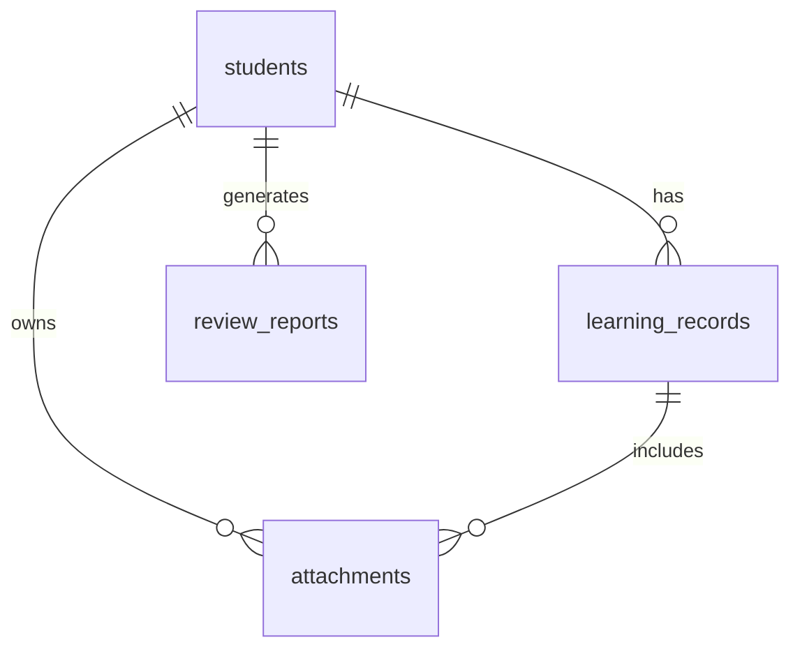

# 学生档案数据模型

## 1. 设计原则

学生是系统的一等实体。所有资料、记录、附件、错题、复盘都应围绕学生归档。

设计原则：

- 一个学生一个长期档案。
- 数据本地存储。
- 大文件放文件系统，数据库只存路径和元数据。
- 每条学习记录都可以被时间线、搜索、复盘引用。
- 模型要支持后续扩展到团队协作，但第一版不实现团队权限。

## 2. 核心实体

### students

学生基础档案。

字段建议：

| 字段 | 类型 | 说明 |
|---|---|---|
| id | string | UUID |
| display_name | string | 学生显示名，可用昵称 |
| real_name | string nullable | 真实姓名，可选 |
| grade | string | 年级 |
| school | string nullable | 学校，可选 |
| subjects | string json | 关注科目 |
| goals | text | 学习目标 |
| current_issues | text | 当前主要问题 |
| parent_concerns | text | 家长关注点 |
| teacher_notes | text | 老师备注 |
| tags | string json | 标签 |
| status | string | active / archived |
| created_at | datetime | 创建时间 |
| updated_at | datetime | 更新时间 |

示例：

```json
{
  "id": "student_001",
  "display_name": "小A",
  "grade": "初二",
  "subjects": ["数学", "英语"],
  "goals": "期末数学稳定在 90 分以上",
  "current_issues": "计算粗心，函数题读题慢",
  "parent_concerns": "希望看到每月进步反馈",
  "tags": ["计算弱", "函数", "需要督促"],
  "status": "active"
}
```

### learning_records

学生学习记录。系统最核心的数据沉淀都在这里。

字段建议：

| 字段 | 类型 | 说明 |
|---|---|---|
| id | string | UUID |
| student_id | string | 所属学生 |
| record_type | string | class / homework / exam / mistake / communication / summary |
| subject | string | 科目 |
| title | string | 记录标题 |
| content | text | 老师录入内容或 OCR 文本 |
| summary | text nullable | AI 或规则生成摘要 |
| tags | string json | 标签 |
| occurred_at | datetime | 事件发生时间 |
| created_at | datetime | 创建时间 |
| updated_at | datetime | 更新时间 |

记录类型建议：

- `class`: 课堂表现
- `homework`: 作业情况
- `exam`: 试卷/考试
- `mistake`: 错题
- `communication`: 家长或学生沟通
- `summary`: 阶段总结

示例：

```json
{
  "id": "record_001",
  "student_id": "student_001",
  "record_type": "mistake",
  "subject": "数学",
  "title": "一次函数图像错题",
  "content": "学生在判断 k 值正负与图像走向时出错。",
  "tags": ["一次函数", "概念混淆"],
  "occurred_at": "2026-07-28T19:00:00+08:00"
}
```

### attachments

附件元数据。附件原文件放在本地文件系统。

字段建议：

| 字段 | 类型 | 说明 |
|---|---|---|
| id | string | UUID |
| student_id | string | 所属学生 |
| record_id | string nullable | 关联学习记录 |
| file_name | string | 原始文件名 |
| file_path | string | 本地实际路径 |
| file_type | string | image / pdf / docx / txt / other |
| file_size | integer | 字节数 |
| content_hash | string nullable | 文件哈希 |
| extracted_text | text nullable | 后续 OCR 或解析文本 |
| created_at | datetime | 创建时间 |

### review_reports

阶段复盘报告。

字段建议：

| 字段 | 类型 | 说明 |
|---|---|---|
| id | string | UUID |
| student_id | string | 所属学生 |
| subject | string nullable | 科目，为空表示全科 |
| start_date | date | 复盘开始日期 |
| end_date | date | 复盘结束日期 |
| report_type | string | monthly / midterm / final / custom |
| title | string | 报告标题 |
| content_md | text | Markdown 报告正文 |
| source_record_ids | string json | 引用的记录 |
| created_at | datetime | 创建时间 |
| updated_at | datetime | 更新时间 |

### tags

标签字典，可选。第一版也可以直接用 JSON 数组，不单独建表。

建议常用标签：

- 基础薄弱
- 计算粗心
- 审题问题
- 概念混淆
- 公式记忆不牢
- 表达不规范
- 阅读速度慢
- 注意力波动
- 家长高关注

## 3. 关系设计



## 4. SQLite 建表草案

```sql
CREATE TABLE students (
  id TEXT PRIMARY KEY,
  display_name TEXT NOT NULL,
  real_name TEXT,
  grade TEXT,
  school TEXT,
  subjects TEXT NOT NULL DEFAULT '[]',
  goals TEXT,
  current_issues TEXT,
  parent_concerns TEXT,
  teacher_notes TEXT,
  tags TEXT NOT NULL DEFAULT '[]',
  status TEXT NOT NULL DEFAULT 'active',
  created_at TEXT NOT NULL,
  updated_at TEXT NOT NULL
);

CREATE TABLE learning_records (
  id TEXT PRIMARY KEY,
  student_id TEXT NOT NULL,
  record_type TEXT NOT NULL,
  subject TEXT,
  title TEXT NOT NULL,
  content TEXT,
  summary TEXT,
  tags TEXT NOT NULL DEFAULT '[]',
  occurred_at TEXT NOT NULL,
  created_at TEXT NOT NULL,
  updated_at TEXT NOT NULL,
  FOREIGN KEY (student_id) REFERENCES students(id)
);

CREATE TABLE attachments (
  id TEXT PRIMARY KEY,
  student_id TEXT NOT NULL,
  record_id TEXT,
  file_name TEXT NOT NULL,
  file_path TEXT NOT NULL,
  file_type TEXT NOT NULL,
  file_size INTEGER NOT NULL DEFAULT 0,
  content_hash TEXT,
  extracted_text TEXT,
  created_at TEXT NOT NULL,
  FOREIGN KEY (student_id) REFERENCES students(id),
  FOREIGN KEY (record_id) REFERENCES learning_records(id)
);

CREATE TABLE review_reports (
  id TEXT PRIMARY KEY,
  student_id TEXT NOT NULL,
  subject TEXT,
  start_date TEXT NOT NULL,
  end_date TEXT NOT NULL,
  report_type TEXT NOT NULL,
  title TEXT NOT NULL,
  content_md TEXT NOT NULL,
  source_record_ids TEXT NOT NULL DEFAULT '[]',
  created_at TEXT NOT NULL,
  updated_at TEXT NOT NULL,
  FOREIGN KEY (student_id) REFERENCES students(id)
);
```

## 5. 后续扩展预留

后续可以增加：

- `knowledge_points`: 知识点实体
- `mistake_items`: 结构化错题
- `student_metrics`: 阶段指标
- `ai_tasks`: AI 分析任务队列
- `sync_devices`: 多设备同步
- `users`: 团队账号

第一版不要提前实现这些表，避免过度设计。

